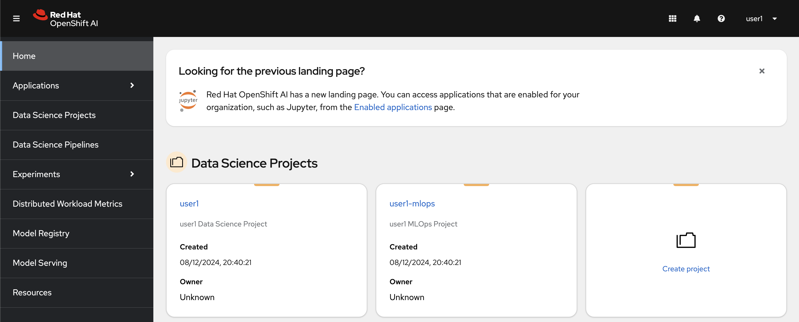
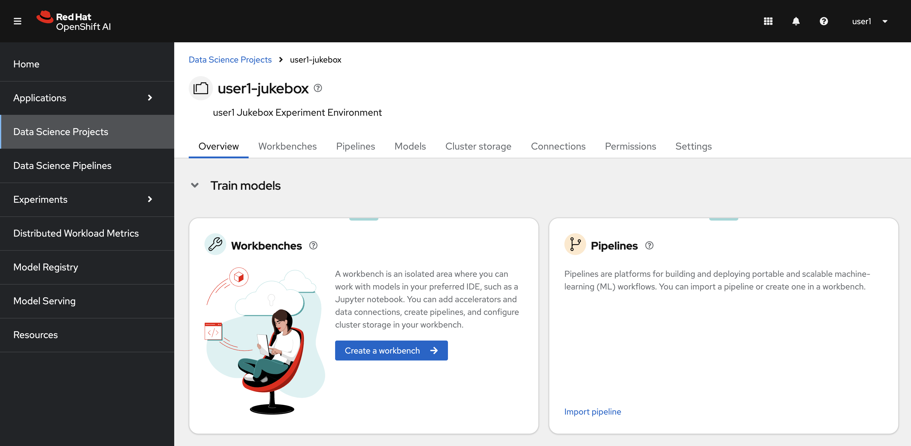
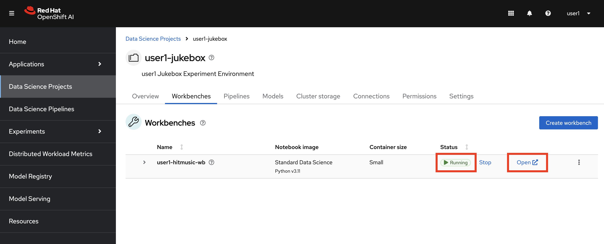
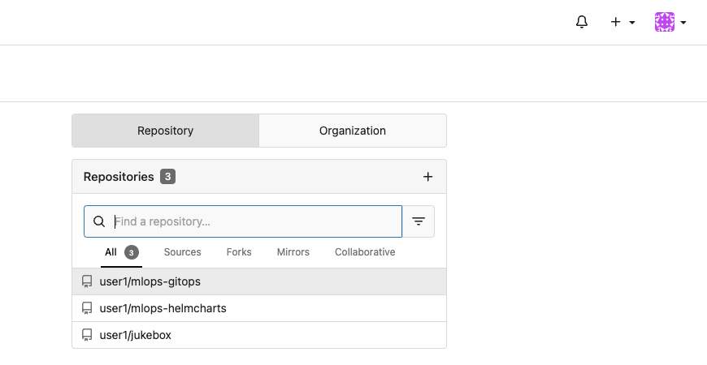

## Data Science Project

1. Login to [OpenShift AI](https://rhods-dashboard-redhat-ods-applications.<CLUSTER_DOMAIN>). The link and the credentials will be provided by your instructor. You'll see there are already two `Data Science Projects` created for you. 



2. Click on the <USER_NAME>-jukebox project. This project will be the place where we start experimenting, training and deploying our model.




3. Let's create a notebook. Click `Create a Workbench`. OpenShift AI Dashboard is pretty intuitive, isn't it? :)

   Select a name you want, could be something like `<USER_NAME>-hitmusic-wb` 🎺

    **Notebook Image:** 

    - Image selection: `Standard Data Science`
    - Version selection: `2025.1`
  
    **Deployment size**
    - Container size: `Small`

    **Environment variables**
    - No need to add one at the moment.

    **Cluster storage**
    - Leave it as max 20 GiB.

    **Connections**
    - Select `Attach existing connections`
      From the dropdown menu, select `models` and click `Attach`
       

    And finally, hit `Create workbench`.

4. When the status of the new workbench indicates 'Running', click on the name of the workbench to access.

    
<!-- 
   It will open up the Jupyter Notebook UI. You need to use your credentials again to log in. If you see the below screen, click `Allow selected permissions`. That will redirect you to your Jupyter Notebook.

     -->

5. There are a couple of Git repositories already set up under your username in Gitea server. You can verify them by logging in Gitea [here](https://<GIT_SERVER>):

    ```bash
    https://<GIT_SERVER>
    ```
6. Use the same credentials to login and verify that you have 4 repositories waiting to be user for the upcoming exercises. Spoiler alert: be on the watch out for GitOps 🦄🔥

  

7. Now, we'll begin by cloning the `Jukebox` repository, which contains the model source code. Go back to your Jupyter Notebook, click the Git icon, and copy the GitHub link to **clone** the repository.

    ```bash
    https://<USER_NAME>:<PASSWORD>@<GIT_SERVER>/<USER_NAME>/jukebox.git
    ```

    

    After cloning the repository, you should see the `jukebox` folder in the left-hand panel.

    

8. Before we get hands on and start experimenting, let’s learn about the storage environment available for us in the next chapter. 🫡