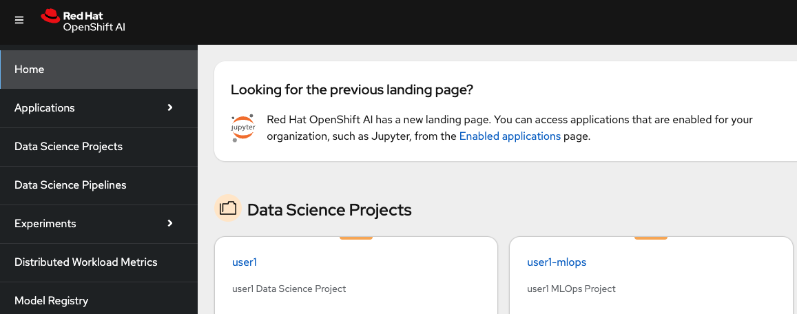

## Data Science Project

1. Login to OpenShift AI. The link and the credentials will be provided by your instructor. You'll see there are already two `Data Science Projects` created for you. 



2. Click on the <USER_NAME> project. This project will be the place where we create our Jupyter Notebook environment, train our model and deploy our model.


3. Let's create a notebook. Click `Create a Workbench`. OpenShift AI UI is pretty intiutive, isn't it? :)

   Select a name you want, could be something like `hitmusic-wb` 🎺

    For Notebook Image: 

    - Image selection: `Standard Data Science`

    - Version selection: `2024.1`

    - Container size: `Small`
    - Cluster storage: Create new persistent storage with size `20 GB`. 
    
    - Check `Use a data connection` and choose the second option `Use existing data connection`
    
      From the dropdown menu, select `models`
       

    And finally, hit `Create workbench`.

4. When the status of the new workbench indicates 'Running', click `Open`.

    

   It will redirect you to the Jupyter Notebook UI. You need to use your credentials again to log in. If you see the below screen, click `Allow selected permissions`. That will redirect you to your Jupyter Notebook.

    

5. Clone the Git repository that has model source code. Click the Git icon from the top of the left menu and , copy the GitHub link to clone the repository.

    ```bash
    https://<GIT_SERVER>/<USER_NAME>/jukebox.git
    ```

    

    And now, your working environment is ready to get your hands dirty with some data!💥💪

    

    But first, let's setup our own Git repository and see what type of S3 storage environment we have for experimentation 🫡