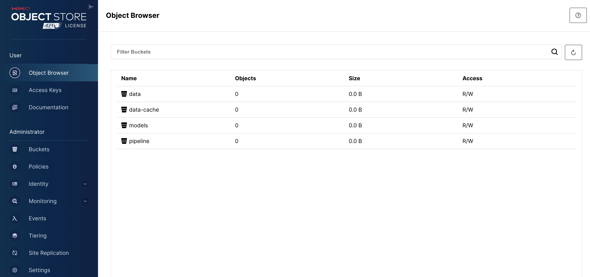
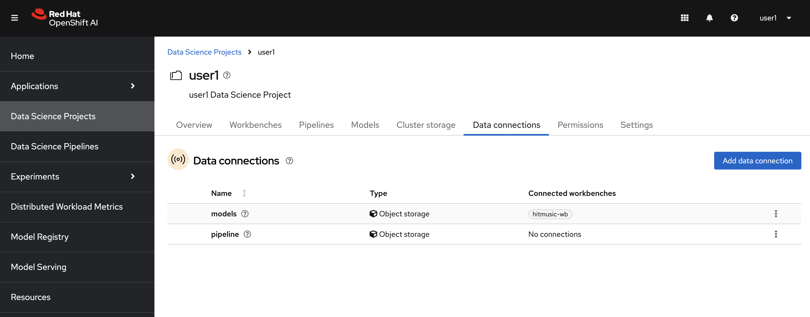

## Object Storage

Object storage provides a flexible and scalable way to store large amounts of unstructured data efficiently, making it a popular choice for cloud storage, content distribution, and for our usecase as well! We will use object storage to store our datasets and model artifacts.

### Walk through the Object Storage

> MinIO is one of the most popular object storage out there. It is tailored for cloud-native setups so it is fairly quick to spin up an instance for experimentations. It is also compatible with Amazon S3 API, accessible via a RESTful HTTP API, making integration with cloud-native applications and automation pretty straightforward.

1. For simplicity, a MinIO instance is already installed in your dev environment for you. You can access MinIO via UI and check that there are already two buckets created for you. Below is the link to your MinIO instance. Go to URL and use `minio` as username, `minio123` as password.

    ```yaml
    https://minio-ui-<USER_NAME>.<CLUSTER_DOMAIN>
    ```



The `models` bucket is where we will store our models, and the `pipeline` bucket is to store Data Science pipeline artifacts.

2. If you go back to OpenShift AI UI, you'll also see that two `Data Connections` are already created for you. The `Data connections` are the objects that store MinIO configuration and bucket information. They are actually OpenShift secrets, defined in your Data Science project with the special annotations to be visible on this UI. You can see the details by clicking the three dots on the right hand side > `Edit data connection`.

Data connections also help us to expose bucket information to our notebooks, allowing us to use this information without hardcoding it into our code.



You selected `models` data connection while creating the workbench as we will interact with this bucket during our experimentation phase.


 🪄🪄🪄 Now that we have the essential tools to start our journey, let's dive into our dataset! 🪄🪄🪄