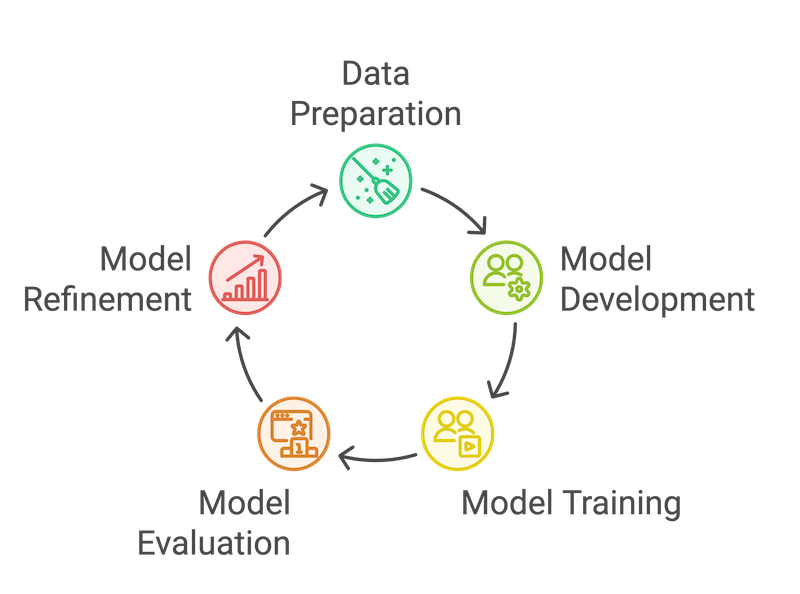
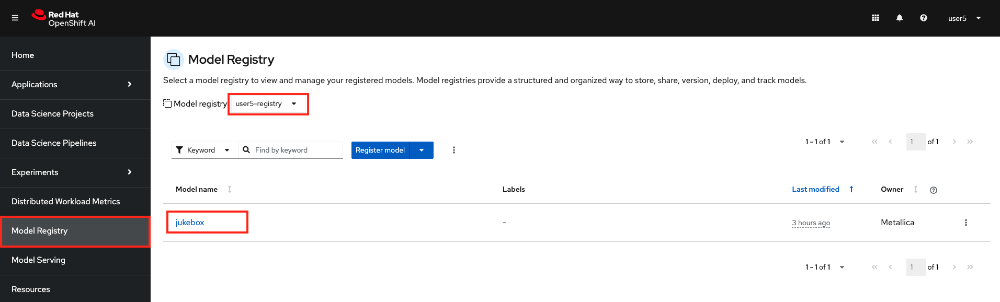
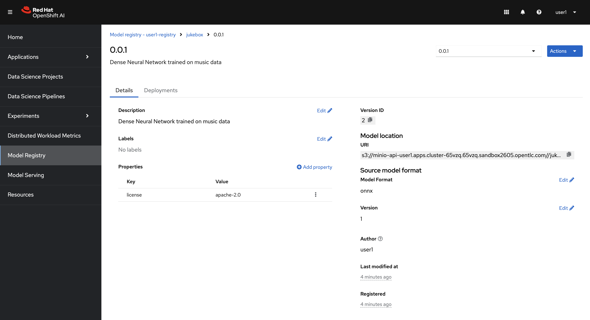
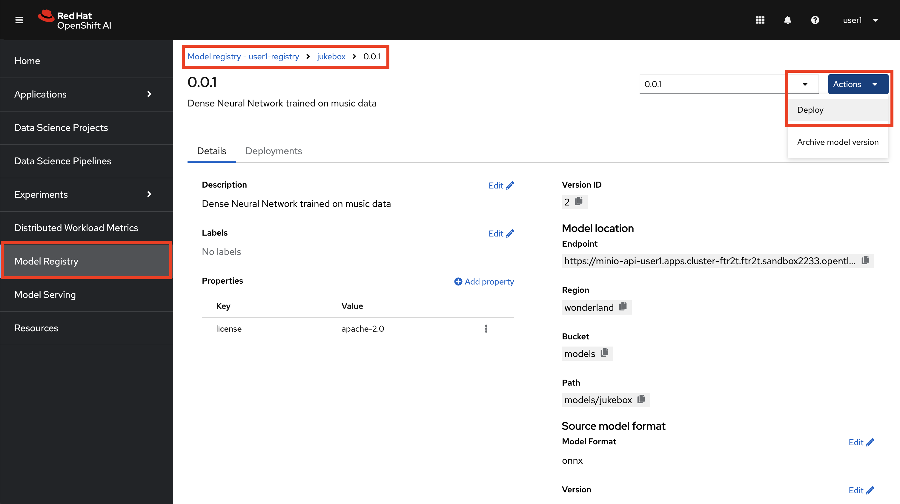
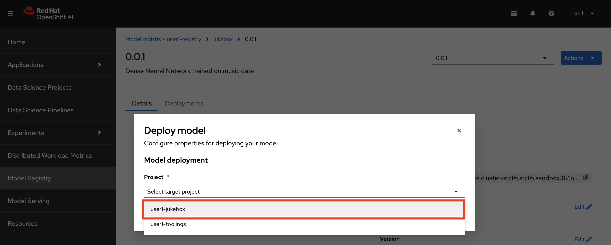
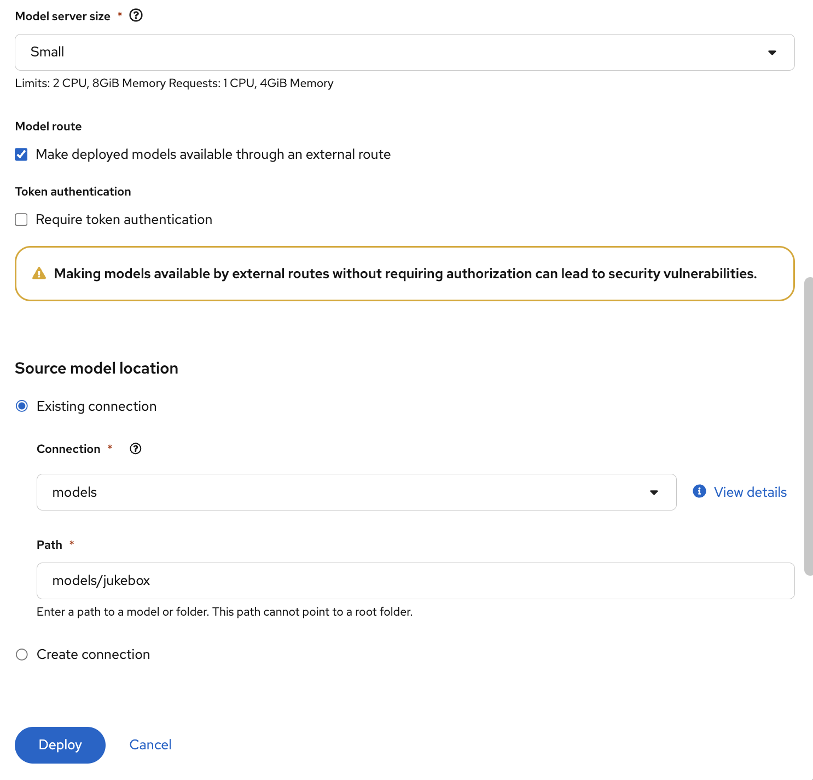
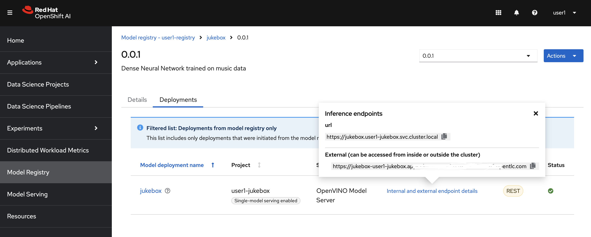

## Data Science Inner Loop

As in traditional software development world, here the inner loop represents the iterative process of building, testing, and refining machine learning models.

This inner loop is essential in data science because it allows for continuous improvement and optimization of machine learning models. The main stages we usually see in building ML models are as below:

- **Data Preparation**: Gathering, cleaning, and transforming data into a suitable format for model training.
- **Model Development**: Selecting and implementing appropriate machine learning algorithms.
- **Model Training**: Feeding the prepared data into the model and adjusting its parameters to learn patterns and relationships.
- **Model Evaluation**: Assessing the model's performance using metrics like accuracy, precision, recall, and F1-score.
- **Model Refinement**: Iterating on the previous steps to improve the model's accuracy and generalization capabilities.

1. Let’s gain hands-on experience with these stages by following the steps outlined in the notebooks cloned into your workbench. We'll begin by exploring the dataset, which is the first step in any data science project. Start with the `jukebox/1-data_exploration/1-data_exploration.ipynb` notebook.

    

    In a notebook, each box is called a `cell`. There are three kinds of cell: code cells, where you can write and execute code; markdown cells, where you can add documentation; and raw cells, which we don't need to worry about here. 

    To execute a code cell:

    1. Select the cell.
    2. Click the ▶️ button on the top bar or press Shift+Enter.
    3. The cell will run, and its output will appear directly below it. This action also moves the cursor to the next cell for smooth progression.

> When you execute a cell, you'll see a `[*]` at the beginning of the cell, indicating that it's running. Once the execution is complete, the brackets will display a number, such as `[21]`, which represents the order in which the cell was executed.

1. Now it's time to start running the notebooks! Our goal is to build a model that predicts which countries might like a song based on its characteristics, such as danceability or acousticness.

    You will execute the following notebooks in order:

    1. `jukebox/1-data_exploration/1-data_exploration.ipynb`: Analyze the datasets we have 
    2. `jukebox/2_dev_datascience/1-experiment-train.ipynb`: Build the model  
    3. `jukebox/2_dev_datascience/2-save_model.ipynb`: Store the trained model   

    Some instructions before you start:
    - Execute the cells **sequentially, one at a time**.  
    - **Read all instructions carefully**, including those at the end of each notebook, which guide you to the next step.  

    Once you've completed the last notebook, your model should be uploaded to the `models` bucket in MinIO. Then, return here to continue with the next steps! 😁 

    OK, Let's start with the first one: `jukebox/1-data_exploration/1-data_exploration.ipynb` 🏃💨

    **....**

    **...**

    

2. Welcome back! 👋 You should now have a trained model saved in MinIO, ready to be served using OpenShift AI.

    

Before we deploy and test the model, let's get familiar with Model Registry!

## Model Registry
You can view your registered models in OpenShift AI Dashboard and able to deploy the model from there. 

1. Go to `Model Registry` and make sure you are in the right Data Science Project.

2. Click on `jukebox` and list the versions available. For now, we only have `0.0.1` version.

You can see information like where the model is stored, version, details about model and so on. Right now we don't have much information as we are still in the experimentation phase. Once we are in the outer loop, we will populate more and more metadata about the model such as which training data was used to generate this model, what was the accuracy level of this model, which pipeline run generated the model. Basically we will treat Model Registry as our ✨canonical✨ metadata source. But for now, let's go and deploy the model and verify that it works inside a container and able to return us some prediction.

## Model Serving

Now that we have our model artifacts saved in a bucket, we can deploy it in our data science project. The beauty of OpenShift AI, along with the underlying KServe technology, is that we don’t have to worry about the containerization of the model or the runtime. It abstracts away these complexities. All we have to do is select the right runtime for our model and point where the model is.

Let's give it a try:

1. Go to Model Registry and find the model you just registered. Click `Actions` > `Deploy`.
   
    

2. Select `<USER_NAME>-jukebox` as your target project to deploy the model.

    

3. Update the form with the following information:

- Model deployment name: `jukebox`
- Serving runtime: `OpenVino Model Server`
- Model framework (name - version): `onnx - 1`
- Model server replicas: `1`
- Model server size: `Small`
- Model route:
  -  Select `Make deployed models available through an external route`
  -  **Uncheck** Require token authentication for now

    ..leave the rest as it is and hit `Deploy`

    
    

1. It might take some time due to all the things OpenShift AI does in the background (pulling the runtime image, downloading your model from the bucket, copying the model to the correct folder, and starting the runtime). But eventually, you’ll get an endpoint that allows you to interact with the model!

    

2. Copy the **External URL** and return to your Workbench. Open the `jukebox/2-dev_datascience/3-request_model.ipynb` notebook and follow the instructions to make some sweet predictions 🎶

    
