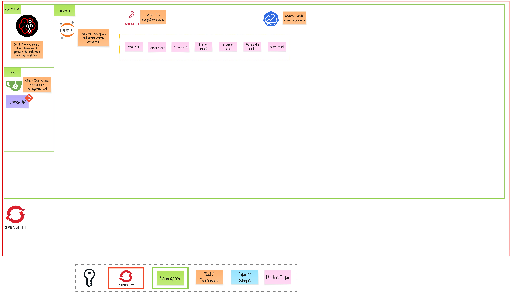

# Exercise 1 - When the Music Starts
> Get familiar with OpenShift AI, set up the development environment

## 👨‍🍳 Exercise Intro

In this exercise, we will walk through a `Data Science Project`, get familiar with the required toolings for experiment we set out to do and create workbench & set up Git repository.

## 🖼️ Big Picture

## 🔮 Learning Outcomes

- Get familiar with OpenShift AI and its components
- Set up the environment to start experimenting

## 🔨 Tools used in this exercise
* [Jupyter Notebook](https://jupyter.org/) - A web-based interactive development environment for notebooks, code, and data 
* [Minio](https://min.io/) - Open Source object storage system 
* [Kubeflow Model Registry](https://www.kubeflow.org/docs/components/model-registry/) - Provides a central index for Machine Learning model metadata
* [KServe](https://kserve.github.io/website/master/) - A model inference platform on top of OpenShift