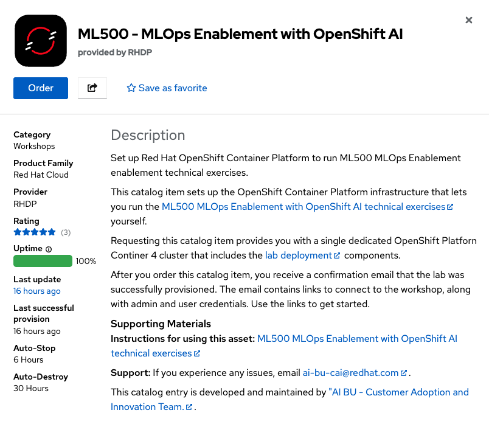

## ML500 Cluster Setup

<p class="warn">
    ⛷️ <b>NOTE</b> ⛷️ - You need an OpenShift 4.16+ cluster with cluster-admin privilege.
</p>

Just like we practice throughout the course, we keep the cluster configuration as code in a GitHub repository: https://github.com/rhoai-mlops/deploy-lab

This repository has three parts:
- A Helm chart to deploy operators for installing in products OpenShift AI.
- A Helm chart to configure logging stack, user workload monitoring and so on.
- And lastly a Helm chart for the student environments.


## Installation
First step is installing the base operators.

```bash
git clone https://github.com/rhoai-mlops/deploy-lab.git
cd deploy-lab/operators
helm dep up
helm upgrade --install ml500-base . --namespace ml500 --create-namespace
```

When the above is successfull (which might take time up to 15 mins), you can run the following for the second part of the installation:

```bash
cd ../toolings
helm dep up
helm upgrade --install ml500-toolings . --namespace ml500 --create-namespace 
```
Again, this could also take some time 🙈

Lastly, deploy the student content:

```bash
cd ../student-content
helm dep up
helm upgrade --install ml500-student-content . --namespace ml500 --create-namespace --set cluster_domain=<CLUSTER_DOMAIN> --set attendees=5 # number of users you want to create
```

If you are not sure what is your cluster domain, here is a one lines you can use to get it:

```bash
oc get ingresscontroller default -n openshift-ingress-operator -o jsonpath='{.status.domain}'
```

## Verify The Installation
Log in to the cluster via UI and use `htpasswd` login with your student username and password. You should only see `<USER_NAME>` and `<USER_NAME>-toolings` namespaces. 


## Getting the Necessary Links
The necessary links such as OpenShift console, OpenShift AI Dashboard, Gitea are embedded in the top right of this page under `Quick Links`.

## Red Hat Product Demo System

This is currently only available to Red Hat Associates. You can order up your own ML500 environment in [RHPDS](https://demo.redhat.com/catalog?search=ml500). This will provision for you the latest OpenShift & ML500 workshop environment. You can select cluster size, number or users and region.

