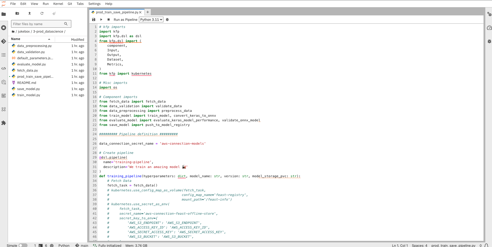
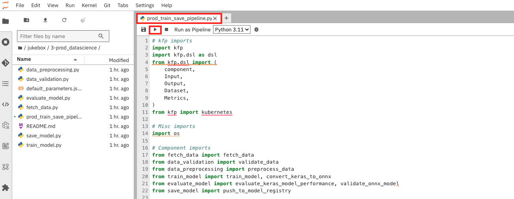
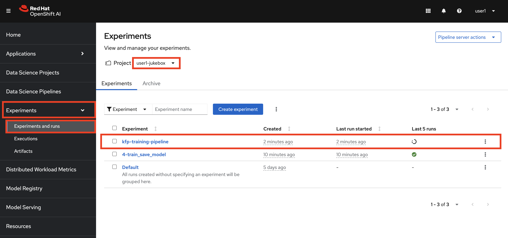
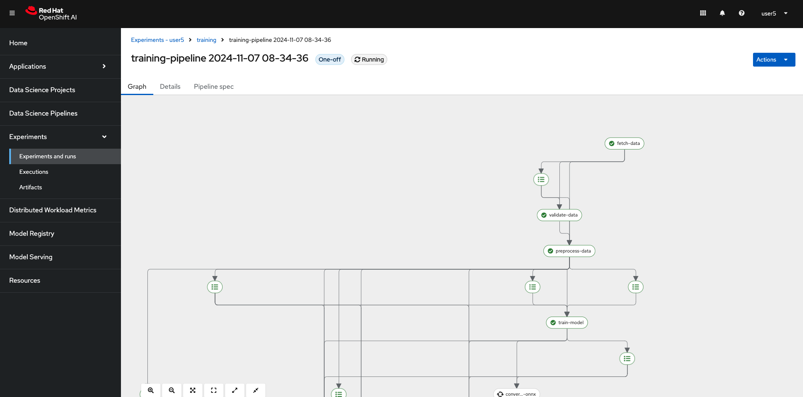

## Kubeflow Pipelines (KFP)

Kubeflow Pipelines (KFP) is a platform designed for building and deploying portable, scalable machine learning pipelines using containers (and no, it's not related to Kung Fu Panda 🐼). KFP provides advanced capabilities such as versioning, metadata tracking, and resource management, which enable teams to monitor and optimize their pipelines efficiently—features that we currently lack in Elyra.

While Elyra was great for quick experimentation, KFP offers the robustness we need for running pipelines continuously. With KFP, we can have better logging, error handling, retry logic, and other production-level features. Essentially, this will become our production-grade training pipeline. And it will be automatically triggered based on source code updates, the arrival of new data, or alerts signaling unusual model behavior. (spoiler, spoiler🤭🤭)

The pipeline steps look like this:  


1. First we gather some data that we would like to train our model on.
2. Then we both validate and preprocess the data. They are done in parallel but if the validation step fails, the pipeline will stop.  
The pre-processing step makes sure that everything is converted to numbers and that our data is normalized, just like we did in the inner loop.
3. Once we have our data ready, we can train the model.
4. After the model is trained, we will evaluate the model to make sure its performance is good enough.  
We also convert the model to ONNX at the same time, as that's the format we will go with for serving the model.
5. After obtaining the ONNX model, we ensure that it performs the same as the original Keras model by running the test data through the ONNX model.
6. And finally, we can save the model by storing it somewhere our model server can reach it. 🎉

Now that you know what the pipeline is supposed to do, let's go ahead and run it! 🏃‍♂️

1. You can find the pipeline definition in the `3-prod_datascience` folder.

    If you explore the files in this folder, you'll notice that they largely mirror the steps we previously executed in our notebooks. However, these steps have been broken down into individual functions and organized into separate files to improve modularity. This makes the pipeline easier to update and maintain over time.

    

2. Update the pipeline definition with the cluster domain as you did in the inner loop for Model Registry URL. Go to `jukebox/3-prod_datascience/prod_train_save_pipeline.py` and find the below line to replace the placeholder (somewhere around line 120). Make sure you save the file 👻

    ```bash
        metadata = {
        "hyperparameters": {
            "epochs": 2
        },
        "model_name": "jukebox",
        "version": "0.0.2",
        "cluster_domain": "<CLUSTER_DOMAIN>", # 👈 add your cluster domain here
        "model_storage_pvc": "jukebox-model-pvc",
        "prod_flag": False
    }
    ```

2. As we mentioned, we are not supposed to trigger this pipeline manually but just to test the functionality and view the output, let's run it by clicking ▶️ on the file `prod_train_save_pipeline.py`

    

    You need to see an output like this in `Console Output`. It means that your pipeline was started successfully 🐍

    ```bash
        Connecting to Data Science Pipelines: https://ds-pipeline-dspa.<USER_NAME>-jukebox.svc:8443
        /opt/app-root/lib64/python3.11/site-packages/kfp/dsl/component_decorator.py:121: FutureWarning: The default base_image used by the @dsl.component decorator will switch from 'python:3.8' to 'python:3.9' on Oct 1, 2024. To ensure your existing components work with versions of the KFP SDK released after that date, you should provide an explicit base_image argument and ensure your component works as intended on Python 3.9.
        return component_factory.create_component_from_func(
        /opt/app-root/lib64/python3.11/site-packages/kfp/client/client.py:159: FutureWarning: This client only works with Kubeflow Pipeline v2.0.0-beta.2 and later versions.
        warnings.warn(
        <IPython.core.display.HTML object><IPython.core.display.HTML object>
    ```


3. Go to OpenShift AI Dashboard. Select `Experiments` from the left menu and go to `Experiments and runs`. You'll see there is one run with the status `Running`. Click to see the details of the pipeline run.

    

    You'll be able to get many details such as:

    - the relationship between the steps
    - the output of each step
    - the artifacts that are generated
    - the metrics and graphs 

    

    Take some time to explore this view and familiarize yourself with its features. The pipeline might take a while to finish on its first run, but you don’t need to wait for it to complete. Feel free to move on to the next steps!

4. The next step is to set up the MLOps environment, enabling this pipeline to run automatically and supporting many other MLOps practices. This is where our MLOps adventure starts! 🙌
