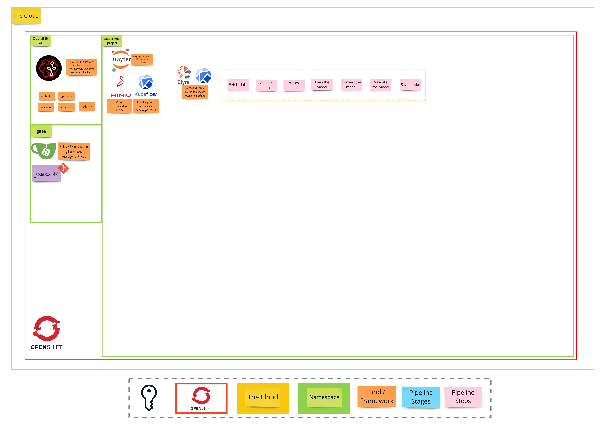

# Exercise 2 - In the Rhythm of Data
> Create training pipelines with Elyra Pipelines and Kubeflow Pipelines SDK (KFP)

## 👨‍🍳 Exercise Intro

In this exercise, we'll be starting with Elyra pipelines to automate the previous steps and then transitioning to Kubeflow Pipelines (KFP) for productionizing the automation.

## 🖼️ Big Picture

## 🔮 Learning Outcomes

- [ ] Create an Elyra Pipeline
- [ ] Get familiar with KFP and Data Science Pipelines
- [ ] Execute pipelines from Workbench

## 🔨 Tools used in this exercise
* [Elyra](https://elyra.readthedocs.io/en/latest/getting_started/overview.html) - Provides a Pipeline Visual Editor for building AI pipelines from notebooks, Python scripts and R scripts
* [Kubeflow Pipelines](https://www.kubeflow.org/docs/components/pipelines/overview/) -  A platform for building and deploying portable and scalable machine learning (ML) workflows using containers
