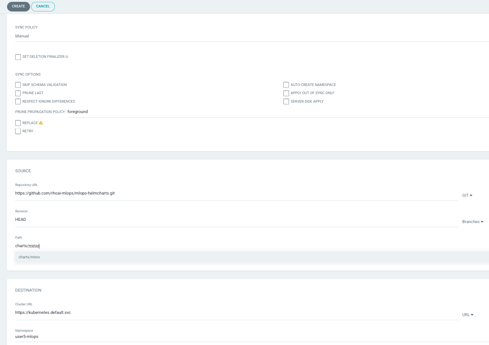

## 🐙 ArgoCD - GitOps Controller 
GitOps can be seen as a developer-centric approach to Ops. It teaches developers good practices around taking ownership of code once it leaves their machines and the approach to deploying and monitoring this code once it’s running.

From Argo CD's website, it is described as a tool that:

<div class="highlight" style="background: #f7f7f7">
<pre>
    automates the deployment of the desired application states in the specified target
    environments. Application deployments can track updates to branches, tags, or be pinned
    to a specific version of manifests at a Git commit.
</pre></div>

When something is seen as not matching the required state in Git, an application becomes out of sync. Depending on how you have implemented your GitOps, Argo CD can then resync the changes to apply whatever is in Git immediately or fire a warning to initiate some other workflow. In the world of Continuous Delivery as implemented by ArgoCD, Git is the single source of truth, so we should always apply the changes as seen there.

### Argo CD
> Argo CD is one of the most popular GitOps tools. It keeps the state of our OpenShift applications synchronized with our git repos. It is a controller that reconciles what is stored in our git repo (desired state) against what is live in our cluster (actual state). We can configure Argo CD to take actions based on these differences, such as auto sync the changes from git to the cluster or fire a notification to say things have gone out of whack.

Since we are going to deal with some yaml files, let's switch to a different type of workbench: `code-server` (let's be honest, Jupyter Notebook is not the best when it comes to yaml and commandline utilities🥲)

1. Go to OpenShift AI > `USER_NAME` >  Workbenches and click `Create workbench`

  Select a name you want, could be something like `mlops-gitops` 

    For Notebook Image: 

    - Image selection: `ml500-code-server`

    - Deployment size: `Small`

    Leave the rest default and hit `Create`.
  
  When it is in running state, Open it and use your credentials to access it.

2. Open a new terminal by hitting the hamburger menu on top left then select `Terminal` > `New Terminal` from the menu.

   

  An Argo CD instance is already installed to your `<USER_NAME>-mlops` environment. Let's verify that it is running and login to Argo CD UI.

3. Log in to OpenShift by using your credentials:

```bash
  oc login --server=https://api.${CLUSTER_DOMAIN##apps.}:6443 -u <USER_NAME> -p <PASSWORD>
```

Then check if Argo CD pods are alive:

  ```bash
  oc get pods -n <USER_NAME>-mlops
  ```

  


4. When all the pods are up and running, we can login to the UI of ArgoCD. Get the route and open it in a new browser tab.

  ```bash
  echo https://$(oc get route argocd-server --template='{{ .spec.host }}' -n <USER_NAME>-mlops)
  ```

5. Login to Argo CD by clicking `Log in via OpenShift` and use the OpenShift credentials provided.

  

6. Select `Allow selected permissions` for the initial login.

8. You just logged into Argo CD 👏👏👏! Lets deploy a sample application through the UI. In fact, let’s get Argo CD to deploy Minio app you manually deployed previously. On Argo CD - click `CREATE APPLICATION`. You should see see an empty form. Let’s fill it out by setting the following:

   * On the "GENERAL" box
      * Application Name: `mlops-minio`
      * Project: `default`
      * Sync Policy: `Automatic`
   * On the "SOURCE" box
      * Repository URL: `https://github.com/rhoai-mlops/mlops-helmcharts.git`
      * Select `Git` from the right drop down menu
      * Path: `charts/minio`
   * On the "DESTINATION" box
      * Cluster URL: `https://kubernetes.default.svc`
      * Namespace: `<USER_NAME>-mlops`

    Your form should look like this:

    

9. After you hit create, you’ll see `minio` application is created and should start deploying in your `<USER_NAME>-mlops` namespace.

  

10. If you drill down into the application you will get Argo CD’s amazing view of all of the k8s resources that were generated by the chart.

  

11. You can verify Minio is running and behaving as expected by navigating to the url of the app:

  ```bash
  echo https://$(oc get route/minio-ui -n <USER_NAME>-mlops --template='{{.spec.host}}')
  ```

🪄🪄 Magic! You not have a GitOps controller - Argo CD and got it to manually deploy an application for you. Next up, we’ll make Argo CD do some more GitOps 🪄🪄


