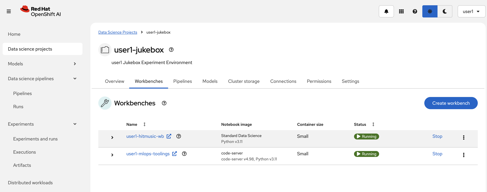
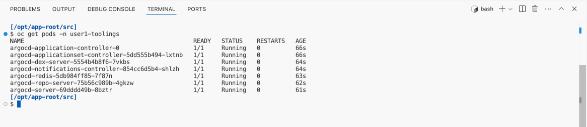
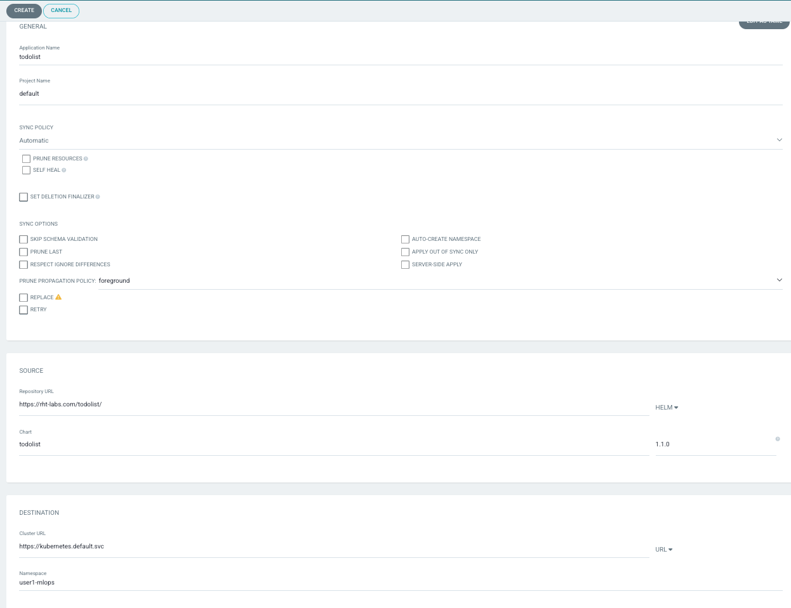
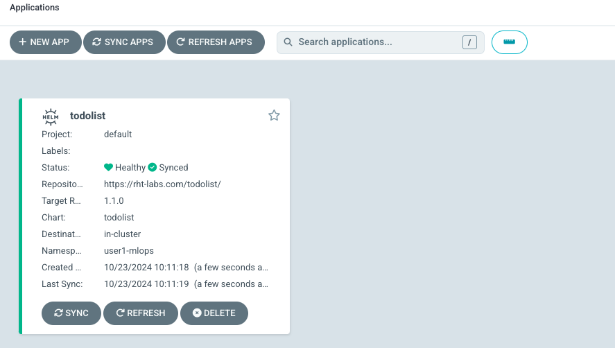

## 🐙 ArgoCD - GitOps Controller 

Let’s start with GitOps! GitOps is important in MLOps because it provides a consistent, automated way to manage machine learning workflows and model deployments, ensuring that everything is versioned, traceable, and reproducible. By using Git as the single source of truth, teams can easily track changes, manage configurations, and ensure that models and applications are always deployed in the correct state.

To put GitOps into action, we’ll use Argo CD as our GitOps engine.

### Argo CD Applications

Argo CD is one of the most popular GitOps tools. It keeps the state of our OpenShift applications synchronized with our git repos. It is a controller that reconciles what is stored in our git repo (desired state) against what is live in our cluster (actual state). 

In the context of MLOps, we’ll leverage Argo CD to deploy our tools and models in a repeatable and reproducible manner. By storing configuration definitions in Git, Argo CD will automatically apply those definitions, making the deployment process more efficient and consistent. This means we’ll be working with YAML files—so it’s time to switch to a different workbench: `code-server`. Let’s be honest, Jupyter Notebooks aren’t the best when it comes to working with YAML files and command-line utilities🥲. 

Let’s create a new workbench next to the existing Jupyter Notebook `<USER_NAME>-hitmusic-wb` workbench (Standard Data Science) in our `<USER_NAME>-jukebox` project and get started!

1. Go to `OpenShift AI` > `Data Science Projects` > `<USER_NAME>-jukebox` >  `Workbenches` and click `Create workbench`

  Select a name you want, could be something like `<USER_NAME>-mlops-toolings` 

    For Notebook Image: 

    - Image selection: `code-server`

    Leave the rest as the default and hit `Create workbench`.
  
  When it is in running state, Open it and use your credentials to access it.

  

  If you're prompted to confirm whether you trust the authors, go ahead and select 'Yes' :) After all, we know you trust us… right? 💚

2. Open a new terminal by hitting the hamburger menu on top left then select `Terminal` > `New Terminal` from the menu.

   

3. An Argo CD instance is already installed to your `<USER_NAME>-toolings` environment. Let's verify that it is running and login to Argo CD UI.

  Log in to OpenShift using your credentials (remember to replace <PASSWORD> with your actual password).

  ```bash
    oc login --server=https://api.<TRIMMED_CLUSTER_DOMAIN>:6443 -u <USER_NAME> -p <PASSWORD>
  ```

  Then check if Argo CD pods are alive:

  ```bash
  oc get pods -n <USER_NAME>-toolings
  ```

  

4. When all the pods are up and running, we can login to the UI of ArgoCD by clicking [here](https://argocd-server-<USER_NAME>-toolings.<CLUSTER_DOMAIN>). 
   
   Alternatively, you can get the URL by running the below command and open it in a new browser tab.

  ```bash
  echo https://$(oc get route argocd-server --template='{{ .spec.host }}' -n <USER_NAME>-toolings)
  ```

  <p class="tip">
    ⛷️ <b>TIP</b> ⛷️ - Remember the <b>Quick Links</b> in the top right provides the necessary
    links such as OpenShift console, OpenShift AI Dashboard, Argo CD and others.
  </p>

5. Login to Argo CD by clicking `Log in via OpenShift` and use the OpenShift credentials provided.

  

6. Select `Allow selected permissions` for the initial login.

7. You just logged into Argo CD 👏👏👏! Lets deploy a sample application through the UI. It'll be just to give you a taste of Argo CD's magic before we use it for our MLOps reasons. On Argo CD - click `CREATE APPLICATION`. You should see an empty form. Let's fill it out by setting the following:
   * On the "GENERAL" box
      * Application Name: `todolist`
      * Project Name: `default`
      * Sync Policy: `Automatic`
   * On the "SOURCE" box
      * Repository URL: `https://rht-labs.com/todolist/`
      * Select `Helm` from the right GIT/HELM drop down menu
      * Chart: `todolist`
      * Version: `1.1.0`
   * On the "DESTINATION" box
      * Cluster URL: `https://kubernetes.default.svc`
      * Namespace: `<USER_NAME>-toolings`
   * On the "HELM" box
      * Values Files: `values.yaml`

    Your form should look like this:
    

8. After you hit create, you’ll see `todolist` application is created and should start deploying in your `<USER_NAME>-toolings` namespace.

  

9. If you drill down into the application you will get Argo CD’s amazing view of all of the k8s resources that were generated. These resources are defined in the Helm chart you selected.

  

10. You can verify the little todolist application is running and behaving as expected by navigating to the url of the app. Go back to your `<USER_NAME>-mlops-toolings` workbench (code-server) and run the following command in the terminal:

    ```bash
    echo https://$(oc get route/todolist -n <USER_NAME>-toolings --template='{{.spec.host}}')
    ```

  _You can CMD/CTRL + click on the URL to open it in a new browser tab._
  
🪄🪄 Magic! You now have a GitOps controller - Argo CD and got it to manually deploy an application for you. Next up, we’ll make Argo CD do some more GitOps 🪄🪄
