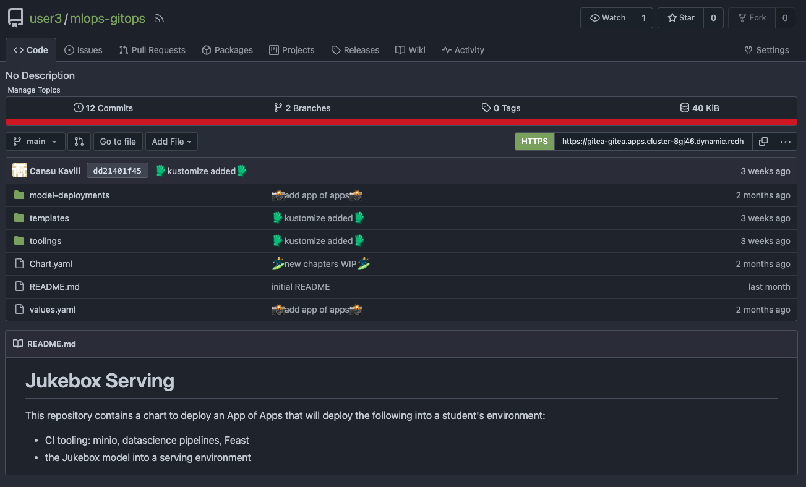

## Application of Applications

# Get Gitea Ready for GitOps

> In this exercise we'll connect Argo CD (our gitOps controller) to our git repository to enable the GitOps workflow. We will be storing definitions of toolings and model deployments in `mlops-gitops` repository and make Argo CD aware of that repo.

1. Log into Gitea with your credentials. Gitea URL:

    ```bash
    https://<GIT_SERVER>
    ```

    You will see a `mlops-gitops` repository already created for you. It is the git repository that we are going to use for <span style="color:purple;" >GIT</span>Ops purposes. It will serve as a mono-repo holding both our tooling configuration and the model deployment definitions. In the real world, you may want to separate these into different repos! Anyways, let's get started!

    

2. Let's go back to terminal and clone the repository.

    ```bash
    cd /opt/app-root/src
    git clone https://<GIT_SERVER>/<USER_NAME>/mlops-gitops.git
    ```

   With our git project cloned - let's start our GitOps Journey 🧙‍♀️🦄!

    <p class="tip">
    ⛷️ <b>TIP</b> ⛷️ - If your credentials are cached incorrectly, you can try clearing the cache using: <strong>git credential-cache exit</strong>
    </p>

3. This `mlops-gitops` repository holds Argo CD `ApplicationSet` definitions to create any application we define here. Let's get right into it - in the your IDE, open the `appset-toolings.yaml` file. Update `CLUSTER_DOMAIN` and `USER_NAME` placeholders with your values. Alternatively you can run the below command to do the changes automatically.

    ```bash
      sed -i -e 's/CLUSTER_DOMAIN/<CLUSTER_DOMAIN>/g' /opt/app-root/src/mlops-gitops/appset-toolings.yaml
      sed -i -e 's/USER_NAME/<USER_NAME>/g' /opt/app-root/src/mlops-gitops/appset-toolings.yaml
    ```

4. This `appset-toolings.yaml` file refers to the `toolings` folder which is where we store all the definitions of things we'll need for out countinuous training pipelines. The definitions for things like Minio, Tekton pipeline, Feast etc will all live in here eventually, but let's start small with only two objects for now. Under the `toolings` folder, you'll notice two subfolder. One is `bootstap` for boostrapping the cluster with some namespaces and permissions. And another one is `minio`, so that we actually have the Minio definition in Git. Because as we said, this is GitOps, definitions have to be stored in ✨Git✨. All we need to do is to create the ApplicationSet object, and then Argo CD will take care of the rest.

    ```bash
      oc apply -f /opt/app-root/src/mlops-gitops/appset-toolings.yaml -n <USER_NAME>-mlops
    ```

5. This is GITOPS - we now need to commit things! Let's get the configuration into git 👇

    ```bash
    cd /opt/app-root/src/mlops-gitops
    git add .
    git commit -m  "🦆 ADD - ApplicationSet definition 🦆"
    git push
    ```

  
  <p class="warn">
    ⛷️ <b>NOTE</b> ⛷️ - It may wait for you to enter your credentials on the top of the screen.
  </p>


6. In order for Argo CD to sync the changes from our git repository, we need to provide access to it. We'll deploy a secret to cluster, for now *not done as code* but in an upcoming section we'll tackle the secret as code and store it encrypted in Git. In your terminal create the Secret in your environment:

    ```bash
    cat <<EOF | oc apply -n <USER_NAME>-mlops -f -
      apiVersion: v1
      data:
        password: "$(echo -n <GIT_PASSWORD> | base64 -w0)"
        username: "$(echo -n <USER_NAME>| base64 -w0)"
      kind: Secret
      type: kubernetes.io/basic-auth
      metadata:
        annotations:
          tekton.dev/git-0: https://<GIT_SERVER>
          sealedsecrets.bitnami.com/managed: "true"
        name: git-auth
    EOF
    ```

7. Now check the Argo CD to see if ApplicationSet was able to see the subfolders under `toolings` and deploy the applications for us!

    

8. As Argo CD sync's the resources we can see them in the cluster as well:

    ```bash
    oc get projects | grep <USER_NAME>
    ```

    ```bash
    oc get pods -n <USER_NAME>-mlops
    ```

🪄🪄 Magic! You've now deployed an ApplicationSet to scaffold our tooling and projects in a repeatable and auditable way (via git!). Now, let's see how we can extend the toolings with just git push! 🪄🪄
