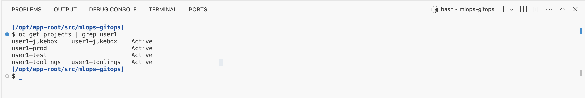
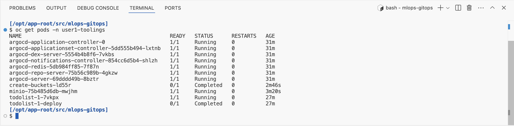

## ApplicationSets

# Get Gitea Ready for GitOps

> In this exercise we'll connect Argo CD (our GitOps controller) to our Git repository to enable the GitOps workflow. We will be storing definitions of toolings and model deployments in `mlops-gitops` repository and make Argo CD aware of that repo.

Gitea is a lightweight, self-hosted Git server that allows teams to manage repositories, track issues, and collaborate on code efficiently. It is open-source, easy to deploy, and supports various version control operations. Gitea serves as our central repository in this workshop where your `mlops-gitops` configurations will reside for seamless integration with Argo CD.

1. Log into Gitea with your credentials. Gitea URL:

    ```bash
    https://<GIT_SERVER>
    ```

    You will see a `mlops-gitops` repository already created for you. It is the git repository that we are going to use for <span style="color:purple;"><b>Git</b></span>Ops purposes. It will serve as a mono-repo holding both our tooling configuration and the model deployment definitions. In the real world, you may want to separate these into different repos! Anyways, let's get started!

    

2. Let's go back to the `<USER_NAME>-mlops-toolings` workbench (code-server) terminal and clone the repository.

    ```bash
    cd /opt/app-root/src
    git clone https://<USER_NAME>:<PASSWORD>@<GIT_SERVER>/<USER_NAME>/mlops-gitops.git
    ```

   With our git project cloned - let's start our GitOps Journey 🧙‍♀️🦄!

3. This `mlops-gitops` repository holds Argo CD `ApplicationSet` definitions to create any application we define here. An `ApplicationSet` is a resource that enables dynamic creation and management of multiple Argo CD applications. We have three `ApplicationSet` definitions: one for tooling, one for the test environment, and one for the production environment.

  Let’s get started with tooling - open the `mlops-gitops/appset-toolings.yaml` file in your IDE. Update the `CLUSTER_DOMAIN` and `USER_NAME` placeholders with your values. Then, do the same for the `toolings/bootstrap/config.yaml` file. Alternatively, you can run the commands below to automatically apply the changes.

    ```bash
      sed -i -e 's/CLUSTER_DOMAIN/<CLUSTER_DOMAIN>/g' /opt/app-root/src/mlops-gitops/appset-toolings.yaml
      sed -i -e 's/USER_NAME/<USER_NAME>/g' /opt/app-root/src/mlops-gitops/appset-toolings.yaml
      sed -i -e 's/USER_NAME/<USER_NAME>/g' /opt/app-root/src/mlops-gitops/toolings/bootstrap/config.yaml
    ```

5. This is GITOPS - First, we need to commit things! Let's get the configuration into git 👇

    ```bash
    cd /opt/app-root/src/mlops-gitops
    git config --global user.email "<USER_NAME>@mlops-wizard.com"
    git config --global user.name "<USER_NAME>"
    git add .
    git commit -m  "🦆 ADD - ApplicationSet definition 🦆"
    git push
    ```

6. This `appset-toolings.yaml` file refers to the `toolings` folder which contains all the definitions needed for our continuous training pipelines, such as MinIO, Tekton pipeline, Feast and more. For now, we’ll start small with only two applications. Within the `toolings` folder, you'll find two subfolders: one named `bootstrap`, which handles bootstrapping the cluster with necessary namespaces and permissions, and another named `minio`, which defines our storage environment. This setup means that we’re storing both the storage and environment definitions in Git. As we’ve discussed, this is GitOps, so our desired state must be stored in ✨Git✨. 

  All we need to do is create the ApplicationSet object, and then Argo CD will take care of the rest.

    ```bash
      oc apply -f /opt/app-root/src/mlops-gitops/appset-toolings.yaml -n <USER_NAME>-toolings
    ```

6. Now check the Argo CD to see if ApplicationSet was able to see the subfolders under `toolings` and deploy the applications for us!

    

8. As Argo CD sync's the resources we can see them in the cluster as well. In the `<USER_NAME>-mlops-toolings` workbench (code-server) run the following:

    ```bash
    oc get projects | grep <USER_NAME>
    ```

  You should see something like this if everything went well:

  

  You can also check the pods running in your `<USER_NAME>-toolings` namespace:

  ```bash
  oc get pods -n <USER_NAME>-toolings
  ```

  You also should see something like this if everything went well:

  

🪄🪄 Magic! You've now deployed an `ApplicationSet` to scaffold our tooling and projects in a repeatable and auditable way (via git!). Now, let's see how we can extend the toolings with just git push! 🪄🪄
