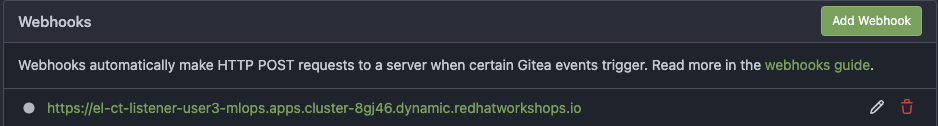
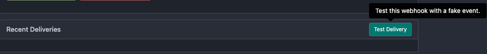

# Continuous Training Pipeline

In this exercise, we’ll set up OpenShift Pipelines (Tekton) to automatically trigger a Kubeflow Pipeline whenever there’s a push to the `jukebox` repository. The Kubeflow Pipeline will train a model, and once the model is ready, we’ll deploy it into a test environment for validation. To ensure traceability, the pipeline will update the model version information in the `mlops-gitops` repository, enabling Argo CD to handle the deployment update.


## Deploy Continuous Training Pipeline

1. First, let's clone the Git repository that stores the Tekton pipeline definition. 

```bash
    cd /opt/app-root/src
    git clone https://<GIT_SERVER>/<USER_NAME>/mlops-helmcharts.git
```

After cloning, from the left Explorer menu, go to `mlops-helmcharts/charts/pipelines` folder, see that we are calling KfP pipeline (that we ran manually in the previous chapter) from `templates/tasks/execute-ds-pipeline.yaml`. 

TODO: add a diagram here.

3. We need to apply this Tekton pipeline definition to our <USER_NAME>-mlops environment. This will provide us with a webhook URL, which we’ll add as a trigger in our `Jukebox` repository. This setup will ensure that our pipeline runs whenever there’s a change in the model source code (and maybe for other updates too, but let’s keep that a surprise for now 🤭).

Create `ct-pipeline` folder under `mlops-gitops/toolings/` and `config.yaml` file under this newly created folder. Or simply run the below commands:

```bash
    mkdir /opt/app-root/src/mlops-gitops/toolings/ct-pipeline
    touch /opt/app-root/src/mlops-gitops/toolings/ct-pipeline/config.yaml
```

2. Open up the `ct-pipeline/config.yaml` file and paste the below yaml to `config.yaml`. It contains the information, you know the drill by now:

    ```yaml
    chart_name: pipelines
    USER_NAME: <USER_NAME>
    cluster_domain: <CLUSTER_DOMAIN>
    ```

4. Again, this is GITOPS - so in order to affect change, we now need to commit things! Let's get the configuration into git, before telling Argo CD to sync the changes for us.

    ```bash
    cd /opt/app-root/src/mlops-gitops
    git add .
    git commit -m  "🥁 ADD - Continous training pipeline 🥁"
    git push
    ```

If you check from Argo CD, you'll see that the pipeline was popped up there already!


_Note: If you are seeing PVCs are still in Progressing status on Argo CD, it is because the OpenShift cluster is waiting for the first consumer, a.k.a. the first pipeline run, to create the Persistent Volumes. The sync status will be green after the first run._

5. Now, let's take the webhook and add it to the Jukebox repository. Run the below command and copy the webhook URL:

```bash
    echo https://$(oc -n <USER_NAME>-mlops get route el-ct-listener --template='{{ .spec.host }}')
```

6. Once you have the URL, in Gitea go to `jukebox` repository > `Settings` > `Webhook` , choose `Gitea` to add the webhook:


You can test the webhook by clicking the URL, and then click `Test Delivery`:




7. This test delivery acts like a commit to Jukebox repository and actually it triggers the pipeline! You can observe the pipeline running from OpenShift's `PipelineRuns` view as well as on OpenShift AI's, yes, `Data Science Pipeline > Runs` view 🙈 

Go to OpenShift UI > Pipelines > PipelineRuns and click the colorful bar to see the logs.


or you can use this link:

```bash
  https://console-openshift-console.<CLUSTER_DOMAIN>/pipelines/ns/<USER_NAME>-mlops/pipeline-runs
```

Then go to the OpenShift AI UI >  `Experiments` > `Experiments and Runs` and click the current run to see the details.


The pipeline will build the model, containerize it and save the information on Kubeflow Registry, like we manually did in the Data Science inner loop!

This pipeline will take a bit of time to complete the first time. However, for subsequent runs, we’ll leverage Kubeflow Pipeline’s caching feature, which reuses the results of previous steps when inputs haven’t changed. This reduces processing time and speeds up the pipeline considerably 🧚‍♂️