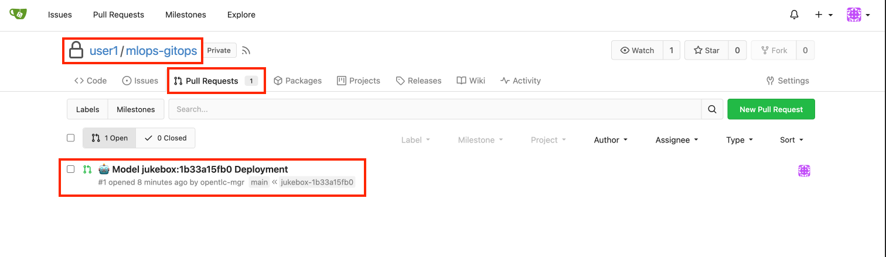
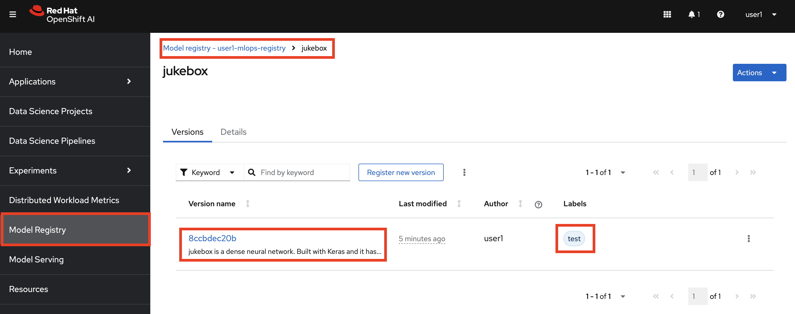
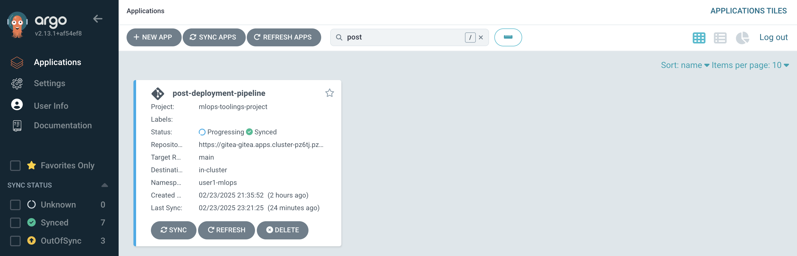
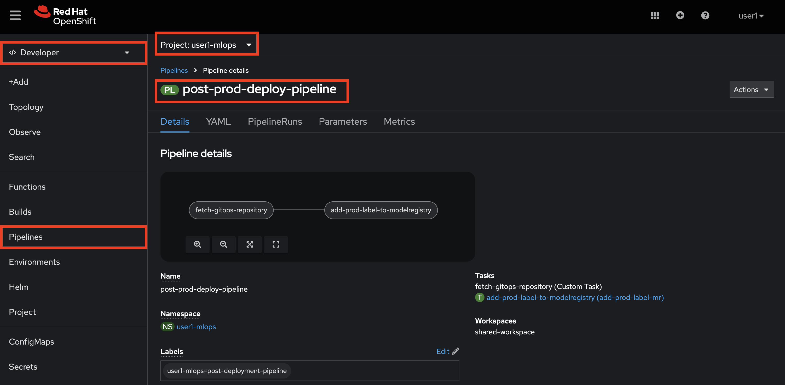
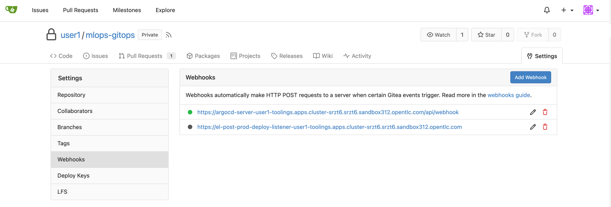
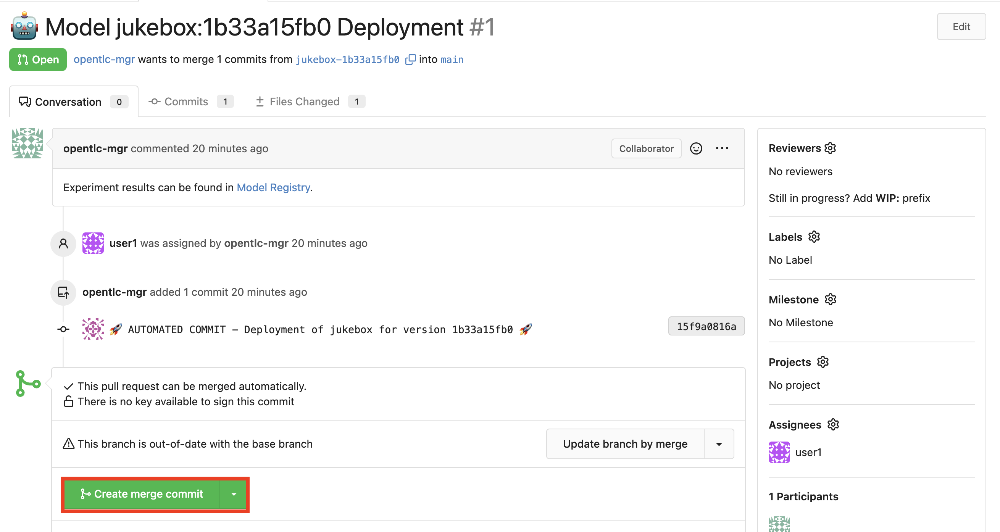
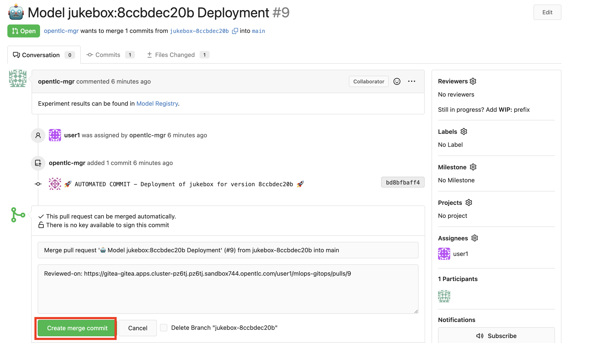
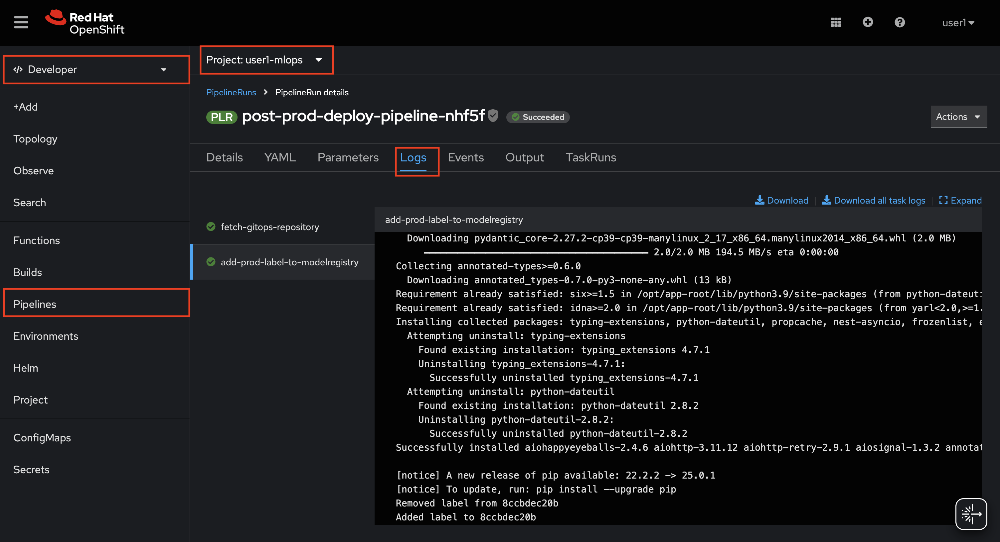
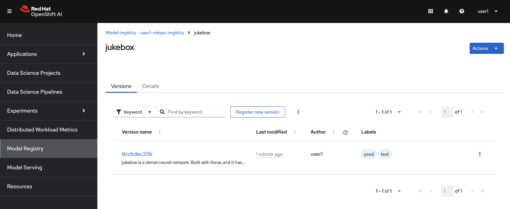

# Post-Deployment Pipeline

Once the test environment is deployed and validated, that we ensure the new version functions as expected without introducing regressions, we can proceed with deploying to production by accepting the automatically generated pull request (PR).

A PR is created in the `mlops-gitops` repository targeting `prod/config.yaml`. To review it, navigate to Gitea UI > `mlops-gitops` repository > Pull Requests. You should see something like this awaiting approval:



Once you approve the PR, the new version will begin rolling out to the `<USER_NAME>-prod` environment. After this, we need to update the Model Registry metadata. Currently, the registry reflects the test environment:



The Model Registry serves as our source of truth, tracking which model versions are deployed in each environment. Rather than updating this manually, we will automate it using a post-deployment pipeline.

---

## Installing the Post-Deployment Pipeline

1. Create a new folder under `toolings` named `post-deployment-pipeline` and add a `config.yaml` file. You can do this manually or run:

    ```bash
    mkdir /opt/app-root/src/mlops-gitops/toolings/post-deployment-pipeline
    touch /opt/app-root/src/mlops-gitops/toolings/post-deployment-pipeline/config.yaml
    ```

2. Open `post-deployment-pipeline/config.yaml` and add the following content:

    ```yaml
    chart_path: charts/post-deployment-pipeline
    USER_NAME: <USER_NAME>
    cluster_domain: <CLUSTER_DOMAIN>
    ```

3. Commit and push these changes so Argo CD can sync them automatically:

    ```bash
    cd /opt/app-root/src/mlops-gitops
    git add .
    git commit -m "🪑 ADD - Post deployment pipeline 🪑"
    git push
    ```

    After syncing, you'll see the pipeline appearing in Argo CD:

    

    **Note:** If Persistent Volume Claims (PVCs) remain in *Progressing* status in Argo CD, it’s because OpenShift is waiting for the first pipeline run to provision the Persistent Volumes. The status will turn green after the initial run.

    You can also verify the pipeline's creation via the OpenShift Dashboard:

    

4. Next, get the webhook URL by running:

    ```bash
    echo https://$(oc -n <USER_NAME>-mlops get route el-post-deploy-listener --template='{{ .spec.host }}')
    ```

5. Copy the generated URL and add it as a webhook in Gitea:

    - Navigate to `mlops-gitops` repository > `Settings` > `Webhooks`
    - Select `Gitea` and add the webhook:

    

6. Now, accept an open PR and observe the pipeline starting automatically. Merge the PR by clicking **Create Merge Commit**:

    

    

7. Merging the PR triggers the post-deployment pipeline. You can monitor its execution in OpenShift:

    

8. Once the pipeline completes, the Model Registry metadata updates automatically. Since the same model version is running in both `test` and `prod`, you should see both labels side by side:

    

As we continue refining this workflow, additional steps will be incorporated into the pipeline—stay tuned! 😊