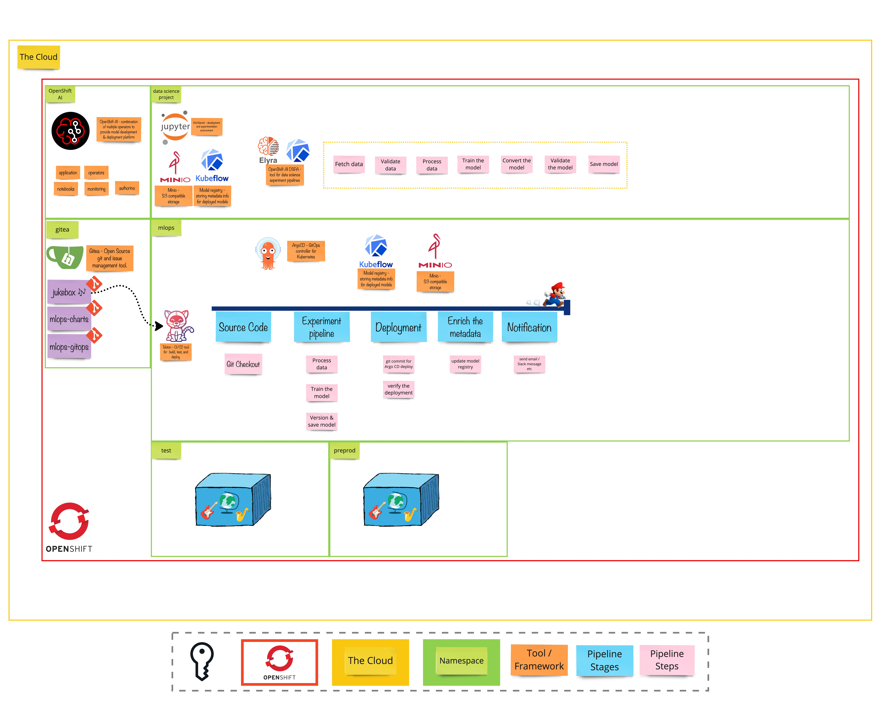

# Exercise 3 - From Studio to Stage
> Introduction to MLOps: a set of practices that automate and simplify machine learning workflows and deployments. 

## 👨‍🍳 Exercise Intro
In this exercise we will create our MLOps environment where the continuous training pipeline and the supporting toolings will be running.

## 🖼️ Big Picture

## 🔮 Learning Outcomes

- [ ] Get familiar with MLOps concept
- [ ] Deploy the necessary toolings to build & deploy models automatically
- [ ] Understand tracking important metadata

## 🔨 Tools used in this exercise
* [OpenShift GitOps](https://argoproj.github.io/argo-cd/) - A controller which continuously monitors application and compares the current state against the desired state
* [OpenShift Pipelines](https://tekton.dev/) -  Cloud Native CI/CD tool, allowing us to build, test, and deploy anywhere
* [Kubeflow Model Registry](https://www.kubeflow.org/docs/components/model-registry/) - Provides a central index for Machine Learning model metadata