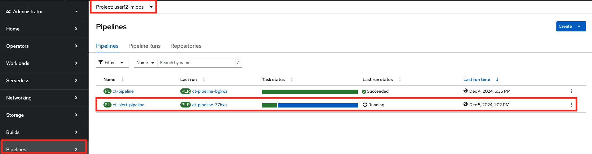
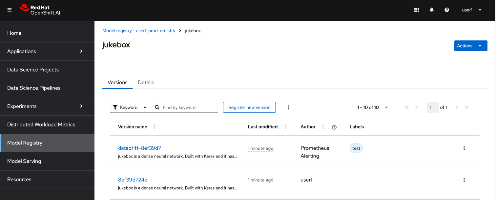

## Alerting & Triggering Training Pipeline

### Configure Alerts

1. In OpenShift's monitoring stack, we have Alert Manager that we can use to trigger alerts if some metrics are below or above in certain tresholds. For example, we just configured TrustyAI for data drift detection so naturally we would like to be notified when the data starts drifting. In order to do that we need to create a `PrometheusRule` such as below.

    <div class="highlight" style="background: #f7f7f7">
    <pre><code class="language-yaml">
        ---
        apiVersion: monitoring.coreos.com/v1
        kind: PrometheusRule
        metadata:
        name: jukebox-alerts
        spec:
        groups:
        - name: jukebox.rules
            rules:
            - alert: jukebox-datadrift-alert
            annotations:
                message: 'jukebox meanshift p-value has dropped below 0.05 for danceability, 
                          indicating a drift in data over the last 5000 samples compared to the training data.'
            expr: trustyai_meanshift{namespace="{{ .Release.Namespace }}", subcategory="danceability"}<0.05
            for: 10m
            labels:
                severity: "critical"
    </code></pre></div>

    But of course creating this manually wouldn't be much GitOps, right? 😏 Therefore, we should update our toolings to deploy a helm chart that includes this resource definition.

2. Create a `alerting` folder under `model-deployments/test` and `model-deployments/prod` as we want to monitor both. 

    ```bash
    mkdir /opt/app-root/src/mlops-gitops/model-deployments/test/alerting
    touch /opt/app-root/src/mlops-gitops/model-deployments/test/alerting/config.yaml
    mkdir /opt/app-root/src/mlops-gitops/model-deployments/prod/alerting
    touch /opt/app-root/src/mlops-gitops/model-deployments/prod/alerting/config.yaml
    ```

3. Open up the `alerting/config.yaml` file and paste the below line to both to let Argo CD know which chart we want to deploy.

    ```yaml
    chart_path: charts/alerting
    name: jukebox
    user: <USER_NAME>
    cluster_domain: <CLUSTER_DOMAIN>
    ```

4. Commit the changes to the repo as you’ve done before.

    ```bash
    cd /opt/app-root/src/mlops-gitops
    git add .
    git commit -m "🚨 Alert definition added 🚨"
    git push
    ```

5. Let's go to OpenShift UI and view the alert we just created. 

TODO: add screenshot


### Trigger Retraining Pipeline based on Alerts

Monitoring and receiving alerts about critical events like data drift or bias are important. However, alerting alone is not enough. To ensure models remain reliable and perform as expected, we need to act swiftly and effectively on these alerts.

When a drift or other anomaly is detected, we can trigger an automated retraining pipeline to address the issue. Let's configure Alert Manager to trigger the pipeline.

1. Create `Alertmanager Config` that knows the webhook URL of Tekton pipeline:

    <div class="highlight" style="background: #f7f7f7">
    <pre><code class="language-yaml">
        ---
        apiVersion: monitoring.coreos.com/v1beta1
        kind: AlertmanagerConfig
        metadata:
        name: jukebox-alerting
        spec:
          route:
            receiver: default
        receivers:
        - name: default
            webhookConfigs:
            - url: >-
                https://el-ct-listener-<USER_NAME>-mlops.<CLUSTER_DOMAIN>/
    </code></pre></div>

    Yet again, wouldn't be much GitOps! Update `test/alerting/config.yaml` and `prod/alerting/config.yaml` as below to enable this configuration:

    ```yaml
    chart_path: charts/alerting
    name: jukebox
    user: <USER_NAME>
    cluster_domain: <CLUSTER_DOMAIN>
    alert_manager: true # 👈 add this
    ```

2. The trigger of an Alertmanager is very different from a trigger of Git repository. They send different types of payloads and different information to the webhook. Therefore we should also make some changes on our training pipeline. Open up `mlops-gitops/toolings/ct-pipeline/config.yaml` file and update it:

    ```yaml
    chart_path: charts/pipelines
    USER_NAME: <USER_NAME>
    cluster_domain: <CLUSTER_DOMAIN>
    git_server: <GIT_SERVER> # 👈 add this
    alert_trigger: true # 👈 add this
    ```

2. Commit the changes to the repo:

    ```bash
    cd /opt/app-root/src/mlops-gitops
    git add .
    git commit -m "🔔 Alertmanager Config added 🔔"
    git push
    ```

3. Verify an alerting pipeline is triggered by going to OpenShift UI > `<USER_NAME>-mlops`> Pipelines

    

    and a new version is registered in the Model Registry due to data drift.

    