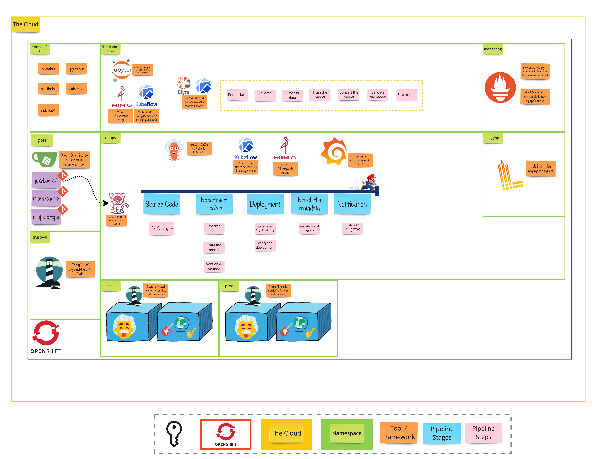

# Exercise 4 - The Sound Check
>  While a model predicts something accurately today, it doesn't mean that it will always predict it accurately. Machine learning models can be influenced by various factors, including changes in data patterns, shifts in user behavior, and evolving external conditions. By implementing continuous monitoring, we can proactively identify these changes, assess their impact on model accuracy, and make necessary adjustments to maintain optimal performance.

## 👨‍🍳 Exercise Intro
In this exercise, we will utilize OpenShift's monitoring stack to collect metrics from our deployed model. This will include generic metrics like resource usage and request success rates, as well as machine learning-specific metrics such as data and model drift. We will visualize these metrics using Grafana and set alerts based on sensible thresholds to trigger our training pipeline, ensuring that our production model consistently performs as expected. Additionally, we will gather logs from the model and store them in Loki, leveraging the OpenShift Logging component for visualization.

## 🖼️ Big Picture

## 🔮 Learning Outcomes

- [ ] Can deploy the necessary toolings to monitor the model and generate alerts
- [ ] Can query Prometheus to see metrics from the model and TrustyAI
- [ ] Can install Grafana and create dashboards to visualize the metrics
- [ ] Can create search index in OpenShift Logging Stack to store logs

## 🔨 Tools used in this exercise
* [Prometheus](https://prometheus.io/) - Stores our metrics and used for alerting
* [Grafana](https://grafana.com/) - Used to visualize our metrics
* [Loki](https://grafana.com/oss/loki/) - Scalable, highly available, multi-tenant log aggregation system
* [TrustyAI](https://trustyai-explainability.github.io/trustyai-site/main/main.html) - AI explanability tool