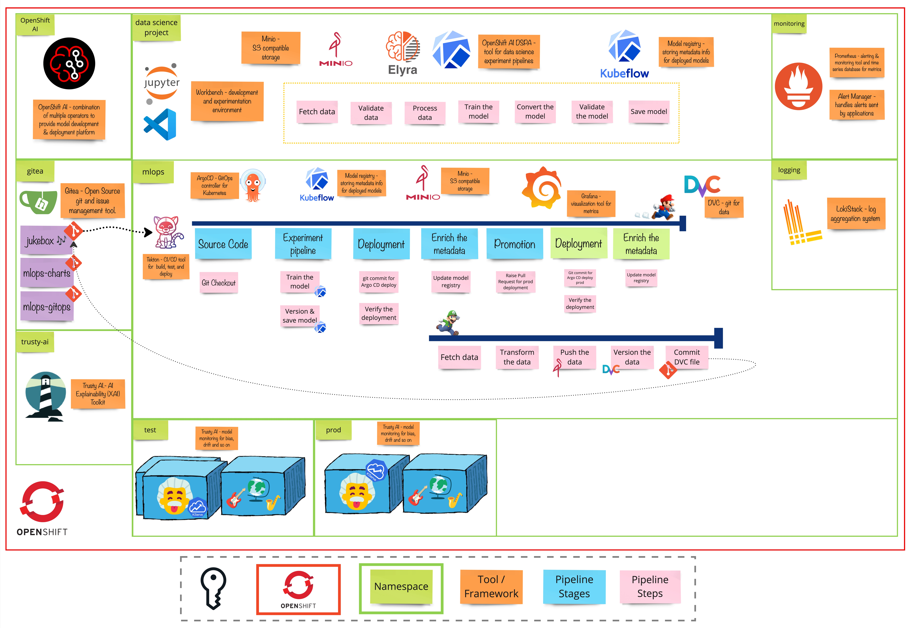

# Exercise 5 - The Data Tracks
>  Data versioning is the practice of keeping track of different versions of a dataset as it changes over time.

## 👨‍🍳 Exercise Intro
In this exercise, we’ll enhance traceability by introducing versioning for our training data. We’ll build a scheduled ETL (Extract, Transform, Load) pipeline that versions the updated training data and pushes the data version information to the Jukebox repository. This action will automatically trigger the training pipeline to use the newly versioned data for model training.

## 🖼️ Big Picture

## 🔮 Learning Outcomes
- [ ] Use DVC to version the data 
- [ ] Schedule a data pipeline
- [ ] Update the training pipeline to use versioned data

## 🔨 Tools used in this exercise
* [DVC](https://dvc.org/) - Manage and version data
