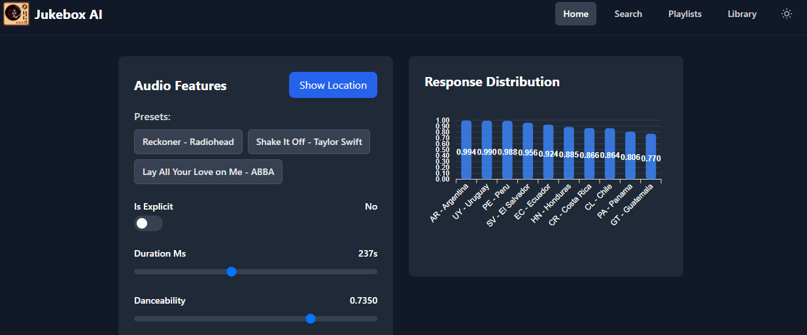

# Pre & Post Processing

So far, we've been sending requests to `Jukebox` in a format that the model can understand and receiving a list of countries where a song might be famous. However, the country list is not in a human-readable form; instead, it's normalized data meant for machine consumption. For instance, the system might output `12` to represent the UK, which is clear to the model but not to us.

In real-world applications, systems or users interacting with models may not provide data in the exact format required by the model. Similarly, they may not understand the raw outputs that the model produces. This is where pre-processing and post-processing come into play.

- Pre-processing transforms raw inputs into a format suitable for the model to understand.
- Post-processing converts the model's outputs into actionable, human-readable insights.
  
Together, these steps bridge the gap between real-world data and the valuable insights delivered by the model.

In this exercise, we will explore how to implement pre- and post-processing using `Transformers` in KServe. KServe’s Transformers enhance the serving process by allowing you to incorporate Python code for both pre-processing input requests and post-processing model outputs within the same deployment. This approach reduces complexity, improves maintainability, and ensures consistent data transformation across deployments.

### Enable Transformers

1. The transformer itself works as sidecar container within the model deployment. Let's first see what it looks like. The Python code that is responsible for pre- and post-processing can be found in [here](https://<GIT_SERVER>/<USER_NAME>/mlops-helmcharts/src/branch/main/charts/model-deployment/music-transformer/music_transformer/music_transformer.py) in file `mlops-helmcharts/charts/model-deployment/music-transformer/music_transformer/music_transformer.py` alongside with a [Containerfile](https://<GIT_SERVER>/<USER_NAME>/mlops-helmcharts/src/branch/main/charts/model-deployment/music-transformer/Containerfile) to build the transformer image.

2. We need to update the model deployment to use this transformers whenever it receives a request. That means a change in the helm-chart template for `InferenceService`. You can see the changes [here](https://<GIT_SERVER>/<USER_NAME>/mlops-helmcharts/src/branch/main/charts/model-deployment/music-transformer/templates/inferenceservice.yaml#L49-L63).

    Actually, before we make any update, let's do a `git pull` on our GitOps repository to pull all the changes have been done automagically by the pipeline.

    ```bash
    cd /opt/app-root/src/mlops-gitops
    git config pull.rebase false
    git pull
    ```

    Now let's update GitOps configuration for using this helm chart. Go to your code-server workbench and open up `mlops-gitops/model-deployments/test/jukebox/config.yaml` and add update `chart_path`:

    ```yaml
    ---
    chart_path: charts/model-deployment/music-transformer # 👈 update this
    name: jukebox
    version: 4562a17c17 # this value can be different for you
    image_repository: image-registry.openshift-image-registry.svc:5000
    image_namespace: <USER_NAME>-test
    ```

    And do the same thing for **prod** environment. Open up `mlops-gitops/model-deployments/prod/jukebox/config.yaml` and add update `chart_path` as above.

3. Transformers will change the way that we send request and process the model's prediction. That is why we need to make changes on the frontend side and start sending values that are more meaningful to us. To update frontend, same thing again, we need to update our GitOps configuration and point to a new version of `jukebox-ui` image that has the necessary changes. 

    Open up `mlops-gitops/model-deployments/test/jukebox-ui/config.yaml` and add update `image`:

    ```yaml
    ---
    repo_url: https://gitea-gitea.apps.cluster-65vzq.65vzq.sandbox2605.opentlc.com/user1/jukebox-ui
    chart_path: chart
    model_endpoint: https://jukebox-user1-test.apps.cluster-65vzq.65vzq.sandbox2605.opentlc.com
    model_name: jukebox
    image: quay.io/rhoai-mlops/jukebox-ui:transformer-1.3 # 👈 update this
    ```

    And the same thing for **prod**. Open up `mlops-gitops/model-deployments/prod/jukebox-ui/config.yaml` and add update `image` as above.

4. Push the changes:

    ```bash
    cd /opt/app-root/src/mlops-gitops
    git pull
    git add .
    git commit -m  "🚝 UPDATE - helm chart with transformers 🚝"
    git push
    ```

5. You can check if the new version of model deployment and frontend are being rolled out with this command:

    ```bash
    oc get po -n <USER_NAME>-test -w
    ```

    You'll see the new pod is coming up while the old one is terminating. 

    _You must do Control+C to break the ‘watch’ mode._

6. Let's go to [Jukebox UI](https://jukebox-ui-<USER_NAME>-test.<CLUSTER_DOMAIN>/) and observe the changes.

    ```bash
    https://jukebox-ui-<USER_NAME>-test.<CLUSTER_DOMAIN>/
    ```

   Now, the values makes much more sense (we hope 🤭)

    


