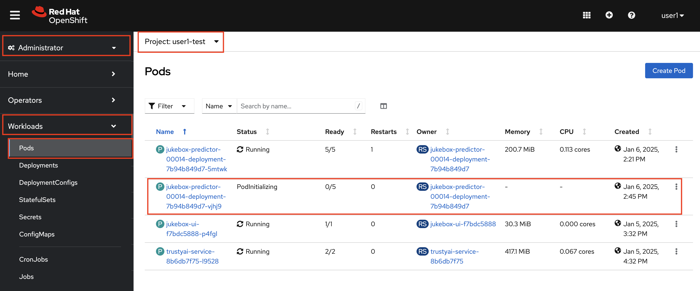
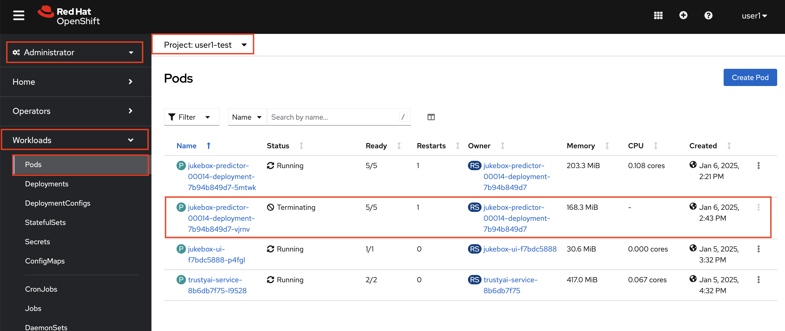

# Autoscaling

Autoscaling ensures optimal performance during high-demand periods by provisioning additional resources while minimizing costs by scaling down during low activity. This is important for us because Machine Learning workloads, such as model training and inference, often experience fluctuating resource requirements. 

Luckily for us, autoscaling based on the incoming request load is quite easy with KServe and OpenShift.

1. Let's enable autoscaling in `InferenceService` for test environment by updating `mlops-gitops/model-deployments/test/jukebox/config.yaml` on code-server workbench. Add `autoscaling: true` to the config file.

    ```bash
    ---
    chart_path: charts/model-deployment/music-transformer
    name: jukebox
    version: 4562a17c17
    image_repository: image-registry.openshift-image-registry.svc:5000
    image_namespace: <USER_NAME>-test
    autoscaling: true # 👈 add this
    ```

    This will update the `InferenceService` by adding the below annotation, and trigger a new model deployment with autoscaling capability! 

    <div class="highlight" style="background: #f7f7f7">
    <pre><code class="language-yaml">
    ---
    apiVersion: serving.kserve.io/v1beta1
    kind: InferenceService
    metadata:
    annotations:
      openshift.io/display-name: jukebox
      serving.knative.openshift.io/enablePassthrough: 'true'
      sidecar.istio.io/inject: 'true'
      sidecar.istio.io/rewriteAppHTTPProbers: 'true'
      autoscaling.knative.dev/target: "1" ### 👈 this does the magic 🔮
    </code></pre></div>

2. Push the changes:

    ```bash
    cd /opt/app-root/src/mlops-gitops
    git pull
    git add .
    git commit -m  "💸 UPDATE - autoscaling enabled 💸"
    git push
    ```
    
3. Let's test the autoscaling with generating some load. Go to your Jupyter Notebook workbench and open `jukebox/6-advanced_deployment/1-test_autoscale.ipynb`

4. Go to OpenShift AI > <USER_NAME>-test project > Workloads > Pods and observe that a new pod is coming up.

    

5. Since this is *auto*scaling, the extra resources will be automatically removed once they are no longer needed—that is, when there are no concurrent requests. After a short while, you'll notice that the same pod will begin terminating.

    