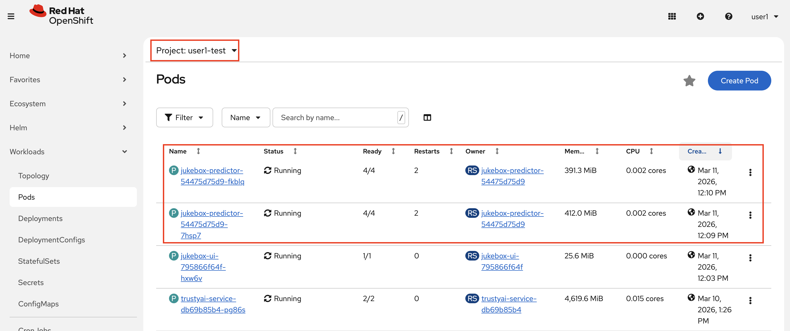

# Autoscaling

Autoscaling ensures optimal performance during high-demand periods by provisioning additional resources while minimizing costs by scaling down during low activity. This is important for us because Machine Learning workloads, such as model training and inference, often experience fluctuating resource requirements. 

Luckily for us, autoscaling based on the resource consumption or incoming request load is quite easy with KServe and OpenShift.

## Simple Autoscaling with HPA (Horizontal Pod Autoscaling)

1. OpenShift by default supports autoscaling based on CPU and Memory consumption. Let's first experience that by enabling autoscaling in `InferenceService` for test environment. Update `mlops-gitops/model-deployments/test/jukebox/config.yaml` on `<USER_NAME>-mlops-toolings` workbench (code-server). Add `autoscaling: true` to the config file.

    ```bash
    ---
    chart_path: charts/model-deployment/music-transformer
    name: jukebox
    version: 4562a17c17 # 🚩⚠️ this value can be different for you
    image_repository: image-registry.openshift-image-registry.svc:5000
    image_namespace: <USER_NAME>-test
    autoscaling: true # 👈 add this
    ```

    This will update the `InferenceService` by adding the below annotation, and trigger a new model deployment with autoscaling capability! 

    <div class="highlight" style="background: #f7f7f7">
    <pre><code class="language-yaml">
    ---
    apiVersion: serving.kserve.io/v1beta1
    kind: InferenceService
    metadata:
    annotations:
      openshift.io/display-name: jukebox
      security.opendatahub.io/enable-auth: 'false'
      serving.kserve.io/deploymentMode: RawDeployment
      serving.kserve.io/autoscalerClass: hpa ### 👈 this does the magic 🔮
    ...
    spec: ### 👈 and this 🔮
      predictor:
        scaleTarget: 5
        scaleMetric: memory
    </code></pre></div>

    _Just to experience the autoscaling, we are setting a very low threshold for memory to kick off the autoscaling._

2. Push the changes:

    ```bash
    cd /opt/app-root/src/mlops-gitops
    git pull
    git add .
    git commit -m  "💸 UPDATE - autoscaling enabled 💸"
    git push
    ```
    
3. Wait for the model to be redeployed, you can keep track of the pods like before: `oc get po -n <USER_NAME>-test -w` (Ctrl+C to cancel out of it).

4. Let's test the autoscaling by generating some load. Go to your Jupyter Notebook `<USER_NAME>-hitmusic-wb` workbench (Standard Data Science) and go through Notebook `jukebox/6-advanced_deployment/1-test_autoscale.ipynb`.  

> ⚠️ When entering the inference endpoint, make sure to enter the one for your model served in `<USER_NAME>-test`.

5. Go to `OpenShift Dashboard` in Administrator view > `<USER_NAME>-test` project > `Workloads` > `Pods` and observe that a new pod is coming up.

    

6. Since this is *auto*scaling, the extra resources will be automatically removed once they are no longer needed, after a short while, you'll notice that the same pod will begin terminating. But let's not wait for it and go for a more advance scaling!

## Autoscaling with KEDA (Kubernetes Event-driven Autoscaling)

CPU and memory are good metrics to scale but they are rarely a good indicator of the load, especially in Machine Learning workload. You'd like to scale based on the incoming load such as the number of request you are getting in a given period. 

Therefore we are introducing another tool called KEDA. KEDA will help us to autoscale based on the metrics that are exposed by the model runtime, or Jukebox UI, or any other custom metrics we may set. 

In this case, we are going to look at the number of requests the model is getting and will be using `ovms_current_requests` metrics.


1. Update `mlops-gitops/model-deployments/test/jukebox/config.yaml` on `<USER_NAME>-mlops-toolings` workbench (code-server). Add `keda: true` to the config file.

    ```bash
    ---
    chart_path: charts/model-deployment/music-transformer
    name: jukebox
    version: 4562a17c17 # 🚩⚠️ this value can be different for you
    image_repository: image-registry.openshift-image-registry.svc:5000
    image_namespace: <USER_NAME>-test
    autoscaling: true 
    keda: true # 👈 add this
    ```

    This will update the `InferenceService` by updating the autoscale annotation, and trigger a new model deployment with KEDA autoscaling capability! 

    <div class="highlight" style="background: #f7f7f7">
    <pre><code class="language-yaml">
    ---
    apiVersion: serving.kserve.io/v1beta1
    kind: InferenceService
    metadata:
    annotations:
      openshift.io/display-name: jukebox
      security.opendatahub.io/enable-auth: 'false'
      serving.kserve.io/deploymentMode: RawDeployment
      serving.kserve.io/autoscalerClass: keda ### 👈 this does the magic 🔮
    ...
    spec: ### 👈 and this 🔮
      predictor:
        autoScaling:
          metrics:
            - external:
                authenticationRef:
                authModes: bearer
                authenticationRef:
                    name: inference-prometheus-auth
                metric:
                backend: prometheus
                query: 'ovms_current_requests{namespace="<USER_NAME>-test", name="jukebox", version="1"}'
                serverAddress: 'https://thanos-querier.openshift-monitoring.svc.cluster.local:9091'
                target:
                type: Value
                value: '1'
            type: External
    </code></pre></div>

_Again, just for the simplicty, we trigger the autoscaling when there are more than one request concurrently._

2. Push the changes:

    ```bash
    cd /opt/app-root/src/mlops-gitops
    git pull
    git add .
    git commit -m  "🎚️ UPDATE - KEDA enabled 🎚️"
    git push
    ```
3. Let's delete the HPA that previous exercise created to not collide the autoscaling.

  ```bash
    oc delete hpa jukebox-predictor -n <USER_NAME>-test
  ```

4. Once again, wait for the model to be redeployed, you can keep track of the pods like before: `oc get po -n <USER_NAME>-test -w` (Ctrl+C to cancel out of it).

5. Let's again use the same load testing tool. G back to your Jupyter Notebook `<USER_NAME>-hitmusic-wb` workbench and go through Notebook `jukebox/6-advanced_deployment/1-test_autoscale.ipynb` once again.  

6. Go to `OpenShift Dashboard` in Administrator view > `<USER_NAME>-test` project > `Workloads` > `Pods` and observe that a new pod is coming up.
