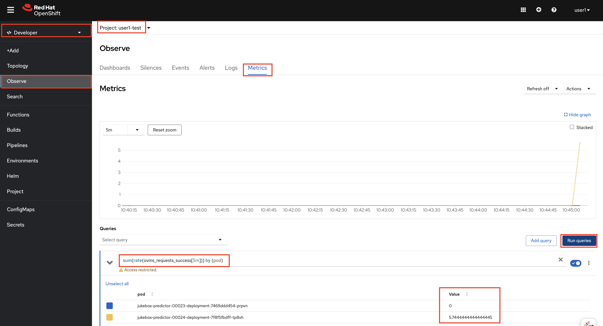
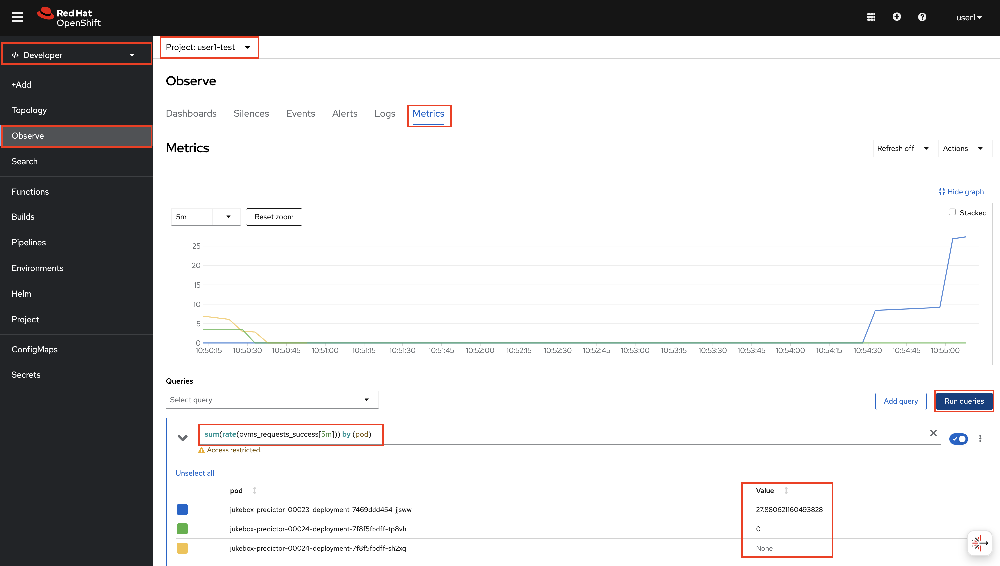

# Advanced Deployments

## Blue/Green Deployments

Blue/Green deployments are straightforward: you switch all traffic from one environment to another in a single step. This approach is ideal if you prioritize simplicity and prefer to avoid managing traffic splits, as required in Canary or A/B deployments. It is better suited for deployments where you need a clean cutover without prolonged monitoring periods.

Canary or A/B deployments are typically used for experiments to measure the effectiveness of different models based on user interactions. If your goal is not to experiment but to replace the old model with a new one in a controlled way, Blue-Green is a better fit.

However, from an implementation point of view, for KServe, it's pretty similar with Canary deployments. It's just shifting the 100% of the traffic to the new revision of the model. Because KServe keeps each revision definition to provide you an easy rollback options. 

1. If you update `trafficPercent` value as `100`, all the traffic will go to the latest version. Update `mlops-gitops/model-deployments/test/jukebox/config.yaml` on code-server workbench.

    ```bash
    ---
    chart_path: charts/model-deployment/music-transformer
    name: jukebox
    version: 4562a17c17
    image_repository: image-registry.openshift-image-registry.svc:5000
    image_namespace: <USER_NAME>-test
    autoscaling: true
    canary:
      trafficPercent: 100 # 👈 update this
    ```

2. Let's push the change.

    ```bash
    cd /opt/app-root/src/mlops-gitops
    git pull
    git add .
    git commit -m  "🐳 UPDATE - blue green deployment 🍏"
    git push
    ```

3. Verify that only one version is running now:

  ```bash
  oc get isvc jukebox -n <USER_NAME>-test
  ```

    <div class="highlight" style="background: #f7f7f7; overflow-x: auto; padding: 10px;">
    <pre><code class="language-bash">                                                                                                  
    NAME      URL                                                                          READY   PREV   LATEST   PREVROLLEDOUTREVISION     LATESTREADYREVISION       AGE
    jukebox   https://jukebox-<USER_NAME>-test.<CLUSTER_DOMAIN>   True    0     100       jukebox-predictor-00023   jukebox-predictor-00024   38h
    </code></pre>
    </div>

1. Let's check the same approach to verify that we only send traffic to the latest (green) version. Again, go back to Jupyter Notebook and run `jukebox/6-advanced_deployments/2-canary_testing.ipynb`. Then, in `OpenShift Dashboard`, go to `Observe` > `Metrics` in `<USER_NAME>-test` namespace. Use the query below.

  You should see the traffic is only being received by the latest revision.

  ```bash
  sum(rate(ovms_requests_success[5m])) by (pod) 
  ```

  

5. If you want to rollback to the previous version, update `trafficPercent` value as `0`.

    ```bash
    ---
    chart_path: charts/model-deployment/music-transformer
    name: jukebox
    version: 4562a17c17
    image_repository: image-registry.openshift-image-registry.svc:5000
    image_namespace: <USER_NAME>-test
    autoscaling: true
    canary:
      trafficPercent: 0 # 👈 update this
    ```


4. And push the change.

    ```bash
    cd /opt/app-root/src/mlops-gitops
    git pull
    git add .
    git commit -m  "🍏 UPDATE - blue green deployment 🐳"
    git push
    ```

5. Oberve that only the previous version now receives the traffic bu running the `locust` command and checking the metrics:

    ```bash
    oc get isvc jukebox -n <USER_NAME>-test
    ```

    <div class="highlight" style="background: #f7f7f7; overflow-x: auto; padding: 10px;">
    <pre><code class="language-bash">                                                                                                  
    NAME      URL                                                                          READY   PREV   LATEST   PREVROLLEDOUTREVISION     LATESTREADYREVISION       AGE
    jukebox   https://jukebox-<USER_NAME>-test.<CLUSTER_DOMAIN>   True    100     0       jukebox-predictor-00023   jukebox-predictor-00024   38h
    </code></pre>
    </div>

    ```bash
    sum(rate(ovms_requests_success[5m])) by (pod) 
    ```

  


6. With blue-green deployment, either way, there are two replicas of the model are running. The trade off here is that, blue-green requires maintaining duplicate environments, which can be resource-intensive. You can check it by running the below command on the terminal of your code-server.

  ```bash
  oc get po -l component=predictor -n <USER_NAME>-test
  ```
    <div class="highlight" style="background: #f7f7f7; overflow-x: auto; padding: 10px;">
    <pre><code class="language-bash"> 
    NAME                                                  READY   STATUS    RESTARTS        AGE
    jukebox-predictor-00023-deployment-7469ddd454-jjsww   6/6     Running   1 (8m46s ago)   8m52s
    jukebox-predictor-00024-deployment-7f8f5fbdff-tp8vh   6/6     Running   1 (25m ago)     25m
    </code></pre>
    </div>