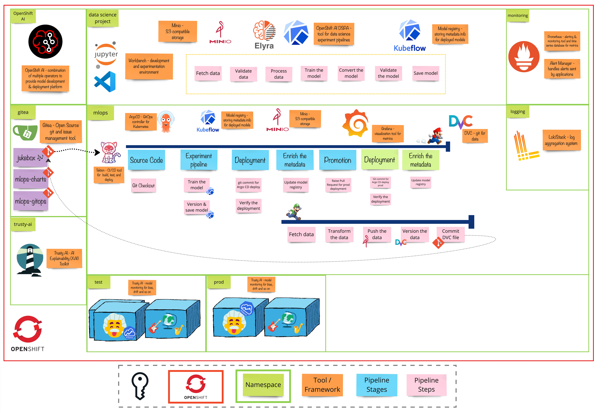

# Exercise 6 - The Headliner
>  Techniques to enhance the reliability and scalability of machine learning systems. 

## 👨‍🍳 Exercise Intro
In this exercise, we'll cover pre- and post-processing for data and predictions, explore autoscaling to handle loads.

## 🖼️ Big Picture

## 🔮 Learning Outcomes
- [ ] Able to use transformers for pre- and post-processing of data
- [ ] Autoscale based on resources and incoming requests

## 🔨 Tools used in this exercise
* [KServe](https://kserve.github.io/website/docs/intro) - A model inference platform on top of OpenShift
* * [KEDA](https://keda.sh/ - Kubernetes Event-driven Autoscaling
