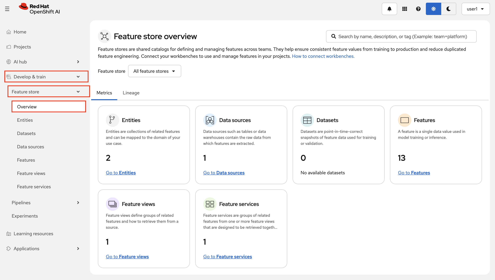
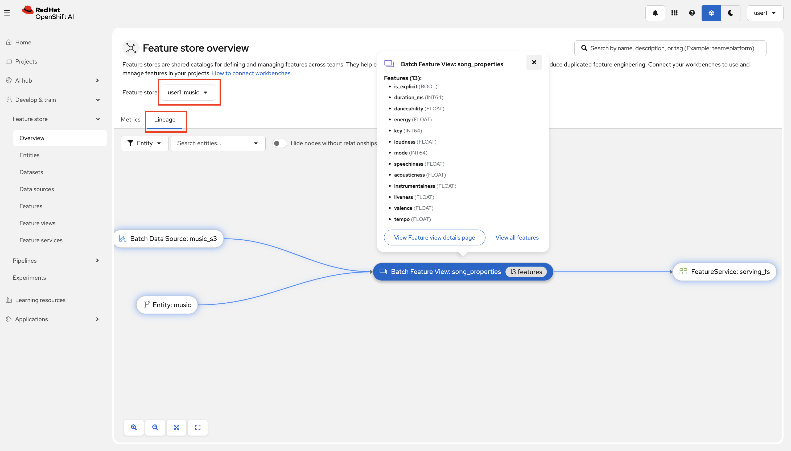
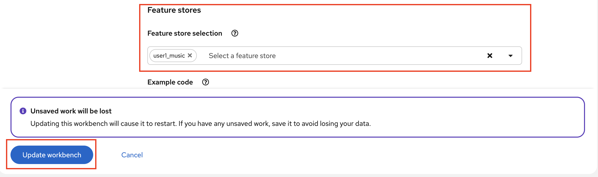

# Feast

## What is a Feature, and Why Does it Matter?

Features are measurable properties or characteristics of data that are used to train a model. In our case song attributes such as `danceability`, `energy`, and `valence` are important features that play a critical role to predict the likelihood of a song becoming a hit in which country.


## What is a Feature Store?

A `Feature Store` is a centralized repository where features like those listed above are:

- **Managed:** Each feature (e.g., danceability, tempo) is engineered, versioned, and documented so that its definition is consistent and easy to understand.
- **Stored:** Features are stored in a way that allows fast access during both model training and real-time predictions.
- **Shared:** Features created for one project, such as predicting hit songs, can be reused in another project, like analyzing trends across countries.
  
  In the context of our dataset, a feature store ensures that features like `energy` and `speechiness` are consistent, up-to-date, and they look the same in both training and serving.


## How does Feast work?

Feast (**Fea**ture **St**ore, cool name right?✨) is a framework that registers and keeps track of features and that's what we are going to use in this section.

Feast has three components:
1. **Offline Store:** A long-term storage system for historical feature data, used for training models.
2. **Registry:** A centralized metadata store that defines and tracks all features, their sources, and associated entities in the feature store.
3. **Online Store:** A low-latency storage system optimized for serving features in real-time during model inference.

In our case the `Registry` and `Online Store` will be stored in the same database for simplicity.

## Setting Up and Using Feast  

Let's first deploy Feast in our `<USER_NAME>-toolings` namespace through GitOps!

1. We will start by creating a Feast database. Let's transition to `<USER_NAME>-mlops-toolings` workbench (code-server) and create `feast-database` folder under `mlops-gitops/toolings`.

    ```bash
    mkdir /opt/app-root/src/mlops-gitops/toolings/feast-database
    touch /opt/app-root/src/mlops-gitops/toolings/feast-database/config.yaml
    ```

2. Add below config to `feast-database/config.yaml` to point Argo CD where to find the helm chart.

    ```yaml
    chart_path: charts/feast-database
    ```
3. And let's deploy a Feast service into `<USER_NAME>-toolings` namespace.

    ```bash
    mkdir /opt/app-root/src/mlops-gitops/toolings/feast
    touch /opt/app-root/src/mlops-gitops/toolings/feast/config.yaml
    ```

4. Add below config to `feast/config.yaml`:

    ```yaml
    chart_path: charts/feast
    USER_NAME: <USER_NAME>
    git_server: <GIT_SERVER>
    ```

5. Commit and push the changes because if it's not in Git..😉
   
    ```bash
    cd /opt/app-root/src/mlops-gitops
    git pull
    git add .
    git commit -m  "🍕 ADD - Feast Database and Service 🍕"
    git push
    ```

6. After Feast is deployed, we need to initialize it. We can do it manually quickly! Normally, Feast comes with a cronjob that runs these steps regularly but let's not wait for it:)
    
     Go to your code-server terminal, and connect to the Feast pod with following commands:
   
    ```bash
    oc login --server=https://api.<TRIMMED_CLUSTER_DOMAIN>:6443 -u <USER_NAME> -p <PASSWORD>
    oc project <USER_NAME>-toolings
    oc rsh `oc get po -l feast.dev/name=<USER_NAME>-music -o name -n <USER_NAME>-toolings`
    ```

    And run the below command:

    ```bash
    feast apply
    exit
    ```

    You should see an output like this:

    <div class="highlight" style="background: #f7f7f7">
    <pre><code class="language-yaml">
    music = Entity(name="music", join_keys=["spotify_id"])
    No project found in the repository. Using project name music defined in feature_store.yaml
    Applying changes for project <USER_NAME>_music
    Deploying infrastructure for song_properties
    </code></pre></div>


7. Feast comes with an integrated UI! Go to OpenShift AI Dashboard > `Develop and train` > `Feature store` > `Overview` and select `<USER_NAME>_music` from the dropdown.

 

 From `Lineage` view, you can get many information regarding data sources and features.

  

8. And as it says on the page; you can connect your workbenches to use and manage features in your projects! So let's do that and explote Feast in the inner loop first. 

  Go to OpenShift AI dashboard > `Projects` > `<USER_NAME>-jukebox` > `Workbenches` and edit your Jupyter workbench (Data Science on) by clicking the three dots on the right.

  

9. Scroll down to the end and select `<USER_NAME>-music` as the Feature Store to connect your workbench to the Feature Store.

  

  Wait for the workbench to be restarted and reconnect it. 

  Then, let’s begin by exploring how to use Feast in the inner loop:  

## Explore Feast in the Inner Loop

1. Navigate back to your Jupyter Notebook `<USER_NAME>-hitmusic-wb` workbench (Data Science one) and open the folder `7-feature_store`.  
2. Inside this folder, locate the `feature_repo` directory. This is where the feature definitions are stored. Open the `features.py` file to review the features we’ve defined.  
3. Next, open the notebook `1-setup_feast.ipynb` located in the `7-feature_store` folder and execute the cells step-by-step. Then continue with `2-test_load_historical_features.ipynb` and `3-test_load_online_features.ipynb`. This will set up Feast and demonstrate how it works in the inner loop. 

4. Once you’ve seen how Feast is used for inner loop tasks like feature exploration and training, we’ll move on to its role in the **outer loop**.  

