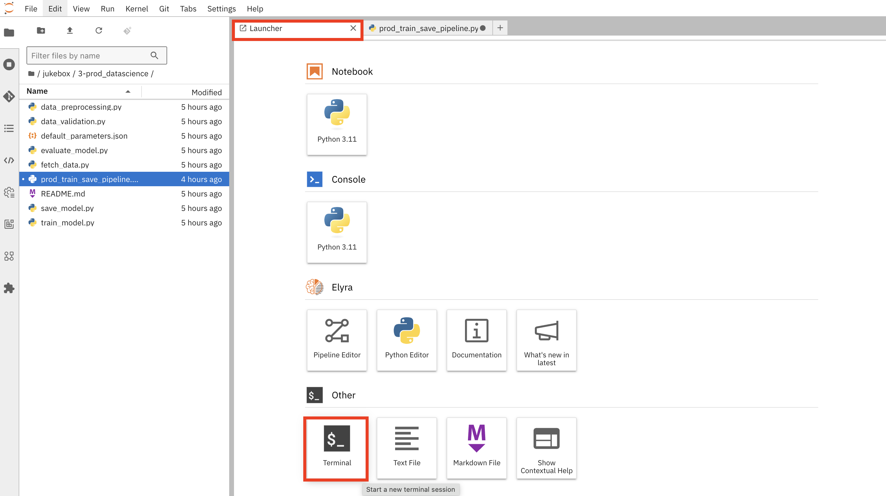

# GitOps Feast

Now let's set up Feast so we can use it in our outer loop.  
We will start by adding our feast-database to Argo.  

```bash
mkdir /opt/app-root/src/mlops-gitops/toolings/feast-database
touch /opt/app-root/src/mlops-gitops/toolings/feast-database/config.yaml
```

```yaml
chart_path: charts/feast-database
USER_NAME: <USER_NAME>
git_server: <GIT_SERVER>
```

```bash
cd /opt/app-root/src/mlops-gitops
git add .
git commit -m  "🍕 ADD - Feast Database 🍕"
git push
```

This feast database is a simple postgressql database, and it will act as both our feature store registry (where we keep track of what features we have and where they are stored) and our online store (for real-time feature retrieval).  

# Feast in our training pipeline

Let's now utilize Feast inside our training pipeline!  
This let's us request specific features from Feast that we want to train on.  
To enable this:

1. Open up your Jupyter notebook.
2. Go to the file `3-prod_datascience/prod_train_save_pipeline.py`.
3. Comment out the lines under `### 🍇 Fetches data from DVC`, in other words, all of these lines:
    ```python
        fetch_task = fetch_data_from_dvc(
            cluster_domain = cluster_domain,
            git_version = version
        )
        kubernetes.use_field_path_as_env(
            fetch_task,
            env_name='namespace',
            field_path='metadata.namespace'
        )

        kubernetes.use_secret_as_env(
            fetch_task,
            secret_name='aws-connection-data',
            secret_key_to_env={
                'AWS_S3_ENDPOINT': 'AWS_S3_ENDPOINT',
                'AWS_ACCESS_KEY_ID': 'AWS_ACCESS_KEY_ID',
                'AWS_SECRET_ACCESS_KEY': 'AWS_SECRET_ACCESS_KEY',
                'AWS_S3_BUCKET': 'AWS_S3_BUCKET',
            },
        )
        kubernetes.use_secret_as_env(
            fetch_task,
            secret_name='git-auth',
            secret_key_to_env={
                'username': 'username',
                'password': 'password',
            },
        )
    ```
4. Now add these lines under `### 🛍️ Fetch Data from Feast`:
    ```python
    fetch_task = fetch_data_from_feast()
    kubernetes.use_secret_as_env(
        fetch_task,
        secret_name='aws-connection-data',
        secret_key_to_env={
            'AWS_S3_ENDPOINT': 'AWS_S3_ENDPOINT',
            'AWS_ACCESS_KEY_ID': 'AWS_ACCESS_KEY_ID',
            'AWS_SECRET_ACCESS_KEY': 'AWS_SECRET_ACCESS_KEY',
            'AWS_S3_BUCKET': 'AWS_S3_BUCKET',
        },
    )    
    ```
5. Let's persist the changes in Git. Go to your terminal, or open a new one by going to the `Launcher` and selecting `Terminal`:

   

   ..and run the below commands.

    ```bash
    cd /opt/app-root/src/jukebox/
    git add 3-prod_datascience/prod_train_save_pipeline.py
    git commit -m "🛍️ fetch data via Feast 🛍️"
    git push
    ```


# Automatically apply new changes


# Automatically materialize new data


Feast is now fully set up and working in your MLOps environment!  
Let's deploy a model that can use the online feature store.