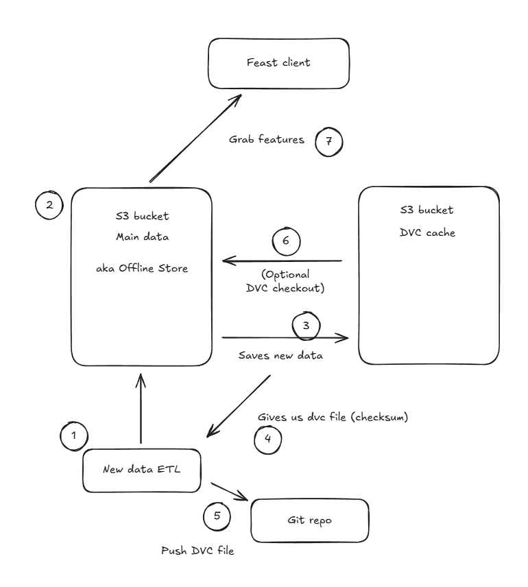

# GitOpsifying Feast

Now, let’s set up Feast for use in the **outer loop** of our workflow. We’ll configure a simple PostgreSQL database to serve a dual purpose:  

- **Registry**: It will store metadata about our features, including their definitions and storage locations.  
- **Online Store**: It will enable real-time retrieval of features during inference.  

Let’s dive in!  

1. We will start by creating a Feast database in `<USER_NAME>-mlops` namespace. Let's transition to `code-server` workbench and create `feast-database` folder under `mlops-gitops/toolings`.

    ```bash
    mkdir /opt/app-root/src/mlops-gitops/toolings/feast-database
    touch /opt/app-root/src/mlops-gitops/toolings/feast-database/config.yaml
    ```

2. Add below config to `feast-database/config.yaml` to point Argo CD where to find the helm chart.

    ```yaml
    chart_path: charts/feast-database
    USER_NAME: <USER_NAME>
    git_server: <GIT_SERVER>
    ```
3. Commit and push the changes because if it's not in Git..😉
   
    ```bash
    cd /opt/app-root/src/mlops-gitops
    git pull
    git add .
    git commit -m  "🍕 ADD - Feast Database 🍕"
    git push
    ```

## Utilizing Feast in Our Training Pipeline

Now, let’s integrate Feast into our training pipeline! This will allow us to request specific features directly from Feast to train our models.

A full flow with Feast and DVC both included would look like this:



DVC tracks and versions our data, but Feast is what fetches the data so that we can create, manage, and use feature definitions.

By doing this, we’ll switch from fetching data via DVC to retrieving features from Feast for our training process. Let’s make it happen!  

To set this up:  

1. Open your Jupyter Notebook workbench.
2. Navigate to the file `3-prod_datascience/prod_train_save_pipeline.py`.  
3. Locate the section labeled `### 🍇 Fetches data from DVC` and comment out all the lines under this heading. 
   
   > 🪄 Pro tip: Select all the lines you want to comment out, then hit CTRL/Command + `/`

   It should look like this:

   <!-- ## ADD GIF HERE MAYBE? ## -->
    <div class="highlight" style="background: #f7f7f7; overflow-x: auto; padding: 10px;">
    <pre><code class="language-python">
        ### 🍇 Fetches data from DVC
        # fetch_task = fetch_data_from_dvc(
        #     cluster_domain = cluster_domain,
        #     git_version = version
        # )
        # kubernetes.use_field_path_as_env(
        #     fetch_task,
        #     env_name='namespace',
        #     field_path='metadata.namespace'
        # )
        #
        # kubernetes.use_secret_as_env(
        #     fetch_task,
        #     secret_name='aws-connection-data',
        #     secret_key_to_env={
        #         'AWS_S3_ENDPOINT': 'AWS_S3_ENDPOINT',
        #         'AWS_ACCESS_KEY_ID': 'AWS_ACCESS_KEY_ID',
        #         'AWS_SECRET_ACCESS_KEY': 'AWS_SECRET_ACCESS_KEY',
        #         'AWS_S3_BUCKET': 'AWS_S3_BUCKET',
        #     },
        # )
        # kubernetes.use_secret_as_env(
        #     fetch_task,
        #     secret_name='git-auth',
        #     secret_key_to_env={
        #         'username': 'username',
        #         'password': 'password',
        #     },
        # )
    </code></pre></div>
    
4. Now add these lines under `### 🛍️ Fetch Data from Feast`:
   
    ```python
        ### 🛍️ Fetch Data from Feast
        fetch_task = fetch_data_from_feast()
        kubernetes.use_secret_as_env(
            fetch_task,
            secret_name='aws-connection-data',
            secret_key_to_env={
                'AWS_S3_ENDPOINT': 'AWS_S3_ENDPOINT',
                'AWS_ACCESS_KEY_ID': 'AWS_ACCESS_KEY_ID',
                'AWS_SECRET_ACCESS_KEY': 'AWS_SECRET_ACCESS_KEY',
                'AWS_S3_BUCKET': 'AWS_S3_BUCKET',
            },
        )    

    ```

    Make sure you save the file!

5. Let's persist the changes in Git. Go to your terminal, or open a new one by going to the `Launcher` and selecting `Terminal`:

   

   ..and run the below commands.

    ```bash
    cd /opt/app-root/src/jukebox/
    git pull
    git add 3-prod_datascience/prod_train_save_pipeline.py
    git commit -m "🛍️ fetch data via Feast 🛍️"
    git push
    ```

6. Since this is a push in `Jukebox` repository, this should trigger a pipeline. This time, pipeline will be using Feast, and you can verify this by checking the logs of `fetch-data` task.

TODO: add screenshot