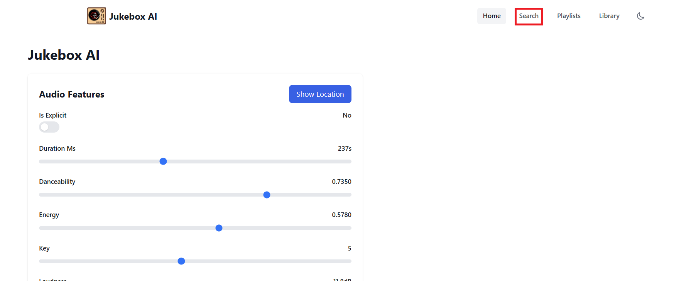
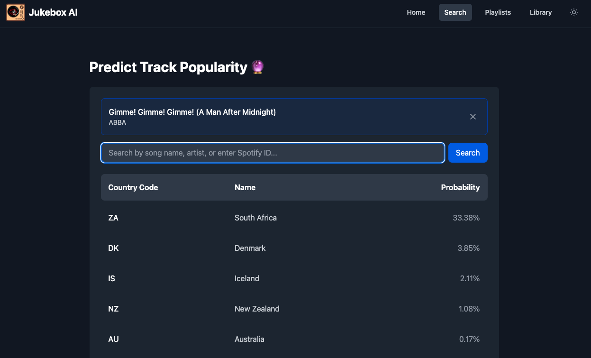

# Using Feast for Inference  

In addition to retrieving features for training, Feast can also be used to fetch features during inference. This ensures consistency by using the exact same features in both training and serving, reducing the risk of mismatches and improving model performance.  

The Feast Server will act as the interface for feature retrieval, while its integrated UI with OpenShift AI Dashboard provides better visibility into the features being used, overall making feature consumption simpler and more transparent.


## Deploying the New Model Server  

Now that we’re training with a feature store, it’s time to serve our model using the same feature store. Just like in the previous chapter, we’ll use **KServe transformers** to retrieve features from Feast during inference.  

To deploy the new model, we’ll configure our test model to point to the **Feast transformer** for feature retrieval at inference time. The underlying model remains the same as the one we just trained, so no changes are needed on that front.  

By using the Feast transformer in our serving pipeline, we will be making the features used during inference match exactly with those used during training. Let’s get started with the deployment!  

1. Start by pulling the latest changes, as the model version has likely been updated in the **mlops-gitops** repository.  
   
  ```bash
  cd /opt/app-root/src/mlops-gitops
  git pull
  ```

2. Then we want update our config file (`mlops-gitops/model-deployments/test/jukebox/config.yaml`) for our test model, which we can do by running these lines: 
   
  ```bash
  sed -i 's|chart_path: charts/model-deployment/music-transformer|chart_path: charts/model-deployment/music-transformer-with-feast|' /opt/app-root/src/mlops-gitops/model-deployments/test/jukebox/config.yaml
  sed -i '$a feast_server_url: https://feast-<USER_NAME>-music-online.<USER_NAME>-toolings.svc.cluster.local:443' /opt/app-root/src/mlops-gitops/model-deployments/test/jukebox/config.yaml
  sed -i '$a feature_service: serving_fs' /opt/app-root/src/mlops-gitops/model-deployments/test/jukebox/config.yaml
  sed -i '$a entity_id_name: spotify_id' /opt/app-root/src/mlops-gitops/model-deployments/test/jukebox/config.yaml
  ```

  You should end up with something like this:

  <div class="highlight" style="background: #f7f7f7; overflow-x: auto; padding: 10px;">
  <pre><code class="language-yaml">
  chart_path: charts/model-deployment/music-transformer-with-feast # 👈 Updated
  name: jukebox
  version: 68b0c7cf1b
  image_repository: image-registry.openshift-image-registry.svc:5000
  image_namespace: <USER_NAME>-test
  autoscaling: true
  keda: true
  feast_server_url: https://feast-<USER_NAME>-music-online.<USER_NAME>-toolings.svc.cluster.local:443 # 👈 New stuff
  feature_service: serving_fs # 👈 New stuff
  entity_id_name: spotify_id # 👈 New stuff
  </code></pre></div>


  We change the model server to use a new transformer where we fetch online features from Feast as a pre-processing step. With this, the input to the model will simply be an ID rather than a list of values. In this flow, it's important that all data goes through Feast so that the online store always have the latest songs we want to run through our model.  
  We are also pointing out the Feast feature server endpoint so we can send requests to it for the online features.  
  Finally we have also added:
  - The specific Feature Service we want to use. Remember, the Feature Service groups a bunch of features together and returns them all at once to us
  - And the Entity ID. This just says what ID we will use to fetch the feature values, in our case it's the spotify ID of whatever song we want to get properties for.

1. And then commit it to git:

  ```bash
  cd /opt/app-root/src/mlops-gitops
  git add .
  git commit -m  "🦒 ADD - Use Feast with the served model 🦒"
  git push
  ```


## Deploy and Test the New Jukebox UI

Up until now, we’ve been manually providing song characteristics from the UI and requesting predictions. However, with Feast integrated into our workflow, we can simplify this process. Instead of entering all the features, we’ll only need to select a song, and the necessary features will be automatically retrieved from the Feature Store. 

The model server now expects a song (rather than individual song features) as input. Therefore we need to update the UI to send the correct request data (a `song ID`) so that Feast can retrieve the appropriate features for the selected song.

1. To update the UI in the test namespace, open up `mlops-gitops/model-deployments/test/jukebox-ui/config.yaml` and add update `image`:

    ```yaml
    ---
    repo_url: https://gitea-gitea.<CLUSTER_DOMAIN>/<USER_NAME>/jukebox-ui
    chart_path: chart
    model_endpoint: https://jukebox-<USER_NAME>-test.<CLUSTER_DOMAIN>
    model_name: jukebox
    image: quay.io/rhoai-mlops/jukebox-ui:feast-1.4 # 👈 update this
    search_as_default: true # 🧸 add this
    ```

  Alternatively, (for the lazy ones ;)) you can run this command in the terminal:

  ```bash
  sed -i 's|image: quay.io/rhoai-mlops/jukebox-ui:transformer-1.6|image: quay.io/rhoai-mlops/jukebox-ui:feast-1.4|' /opt/app-root/src/mlops-gitops/model-deployments/test/jukebox-ui/config.yaml
  sed -i '$a search_as_default: true' /opt/app-root/src/mlops-gitops/model-deployments/test/jukebox-ui/config.yaml
  ```

2. Let's commit it to git:
  
  ```bash
  cd /opt/app-root/src/mlops-gitops
  git add .
  git commit -m  "🧪 UPDATE - new UI 🧪"
  git push
  ```

3. After Argo CD sync the changes, go to the UI, here is the URL if you have lost it since last time. If you have the site open, just refresh the page to ensure you have the latest code changes:  
  
  ```bash
  https://jukebox-ui-<USER_NAME>-test.<CLUSTER_DOMAIN>
  ```

4. Instead of just predicting based on random features, we can now go to the **Search** button in the top right:




5. Search for a popular song (`Gimme! Gimme! Gimme!` from ABBA for example) and select it.



Our pre-processing will look up the latest feature values for the song in our online database and use them to predict the location.  

This way we can have an up-to-date store of important features that we can fetch at any point.  
