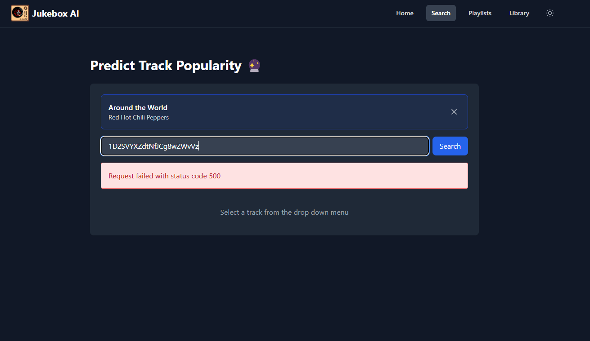
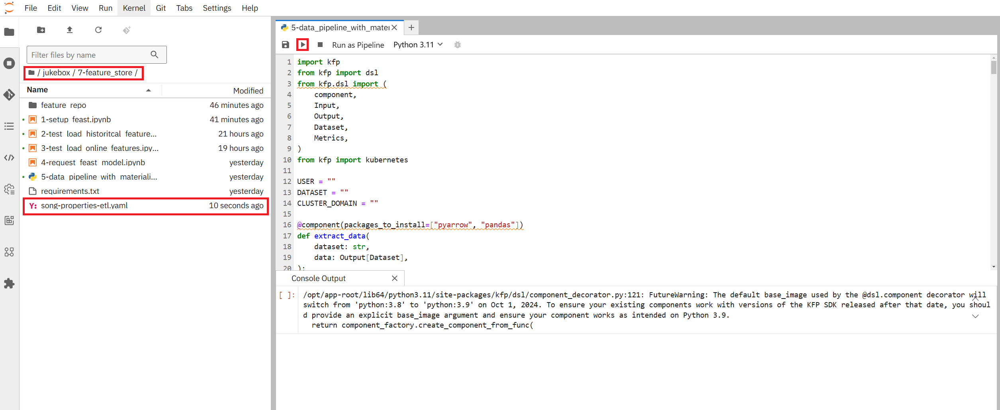
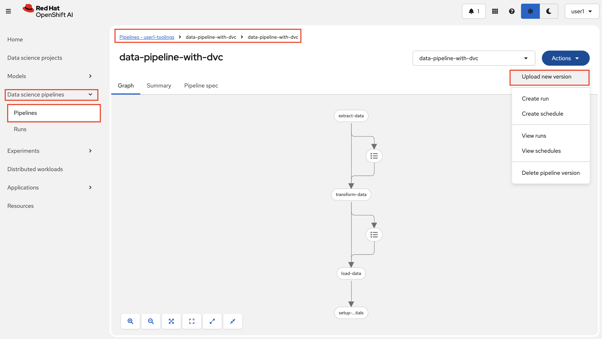
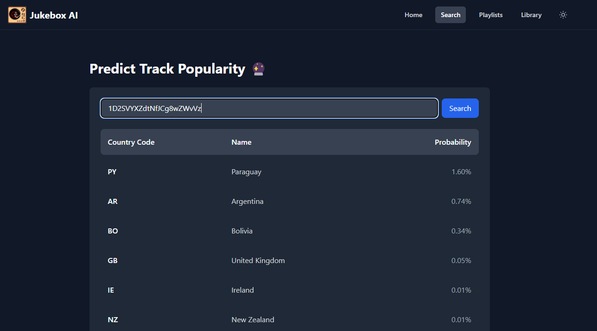

# Apply and Materialize in our pipelines

We don't want to manually apply new feature changes and materialize our data, so we will add steps in our pipelines to make sure this is done automatically.  

## Automatically materialize new data

Whenever we get new datapoints into our system, we want to make sure that our online feature store is updated with the latest values of these features.  
Because of that, we will materialize all incoming data, and we will do it in an incremental fasion so only the new data gets materialized (based on a timestamp).  
To do this, we can simply modify our ETL pipeline to include a materialization step after the data has been uploaded to S3.  

1. Go to the UI and search for Gimme! Gimme! Gimme! by Abba. Nothing should show up as we haven't yet added that song to our online feature store.
    
2. Go to your Jupyter Notebook, open up `jukebox/7-feature_store/5-data_pipeline_with_materialize.py` and press the Run button.
    
3. Download the new file it produced.
4. In your OpenShift AI console, go to Pipelines and navigate to your <USER_NAME>-mlops project. In here we will import the downloaded pipeline file by creating a new version for our current ETL pipeline.
    
5. Since we don't want to wait for the scheduled run, let's kick off a pipeline run immediately.
6. Go back to the UI and search for `` (the ID for Gimme! Gimme! Gimme!) and press Search. You won't get a dropdown since our frontend isn't synched with our online feature store, but we will now get a prediction on the song!
    

## Automatically apply new changes

To apply new changes to our feature store, we can add a step to our Continous Training pipeline to see if there has been any change to our features before we start training.  

1. Go to `mlops-gitops/toolings/ct-pipeline/config.yaml` and update it:

    ```yaml
    chart_path: charts/pipelines
    USER_NAME: <USER_NAME>
    cluster_domain: <CLUSTER_DOMAIN>
    git_server: <GIT_SERVER>
    alert_trigger: true
    apply_feature_changes: true # 👈 add this
    ```

2. Commit the changes to the repo:

    ```bash
    cd /opt/app-root/src/mlops-gitops
    git add .
    git commit -m "✅ Features automatically applied ✅"
    git push
    ```

3. To try it out, we can remove one feature and make sure that everything from training to inference with the UI still works.  
Go to your Jupyter Notebook and navigate to `jukebox/7-feature_store/feature_repo/feature_service.py`. Here we can remove line 14 (the feature `loudness`) as we saw in the data exploration how it was highly correlated with another feature (energy) so we don't need both:
    ```python
    from feast import FeatureService

    from features import song_properties

    song_properties_fs = FeatureService(
        name="serving_fs",
        features=[
            song_properties[[
                "is_explicit",
                "duration_ms",
                "danceability",
                "energy",
                "key",
                # "loudness", # 👈 change this to a comment
                "mode",
                "speechiness",
                "acousticness",
                "instrumentalness",
                "liveness",
                "valence",
                "tempo"
                ]]
        ]
    ) 
    
    ```
    Note: you could also create a new version, but this is easier in this case, git will version it anyhow.
4. Save the file and commit your change to git by running this in your terminal:
    ```bash
    cd /opt/app-root/src/jukebox/
    git add 7-feature_store/feature_repo/feature_service.py
    git commit -m "🎺 Remove feature loudness 🎺"
    git push
    ```
5. Now we just need to wait for the Continous Training pipeline to finish.  
To keep track of the kubeflow training pipeline in OpenShift AI, you can go to Experiments -> Experiment and Runs -> training.  
You can also keep track of the OpenShift pipeline in the OpenShift Console by going to Pipelines -> Pipeline Runs.  
When the OpenShift pipeline has finished, we have a new model deployed ready to be tested.  

6. Go to the UI (https://jukebox-ui-<USER_NAME>-test.<CLUSTER_DOMAIN>) and search for a song, it should still work (and give a different result than before) even though we haven't changed the UI at all, feast takes care of the feature change.
