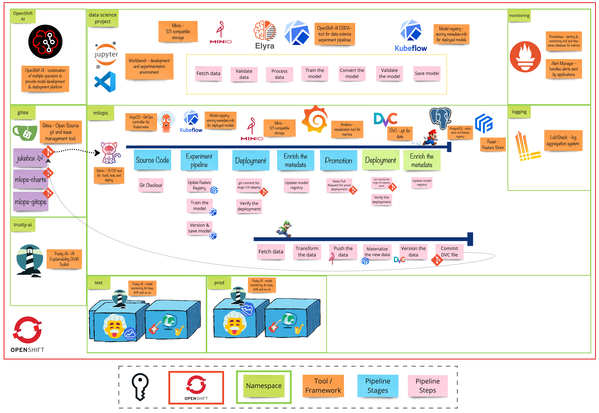

# Exercise 7 - The Feature Playlist
>  A Feature Store acts as a centralized repository for storing, processing, and serving machine learning features. It ensures that features are consistent, reusable, and efficiently retrieved for both training and real-time inference.

## 👨‍🍳 Exercise Intro
In this exercise, we'll introduce the Feature Store concept both in the inner loop and the outer loop, and integrate it with our current MLOps workflow.

## 🖼️ Big Picture

## 🔮 Learning Outcomes
- [ ] Use Feast in the inner loop
- [ ] Introduce transformers using Feast in the outer loop
- [ ] Automatically keep the features up to date

## 🔨 Tools used in this exercise
* [Feast](https://feast.dev/) - A feature store to store and serve features consistently for offline training and online inference.
