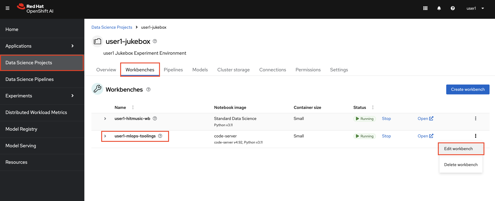
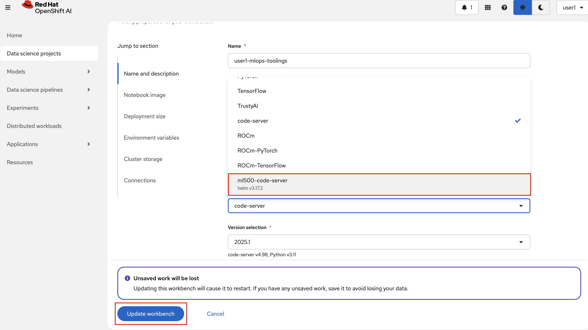
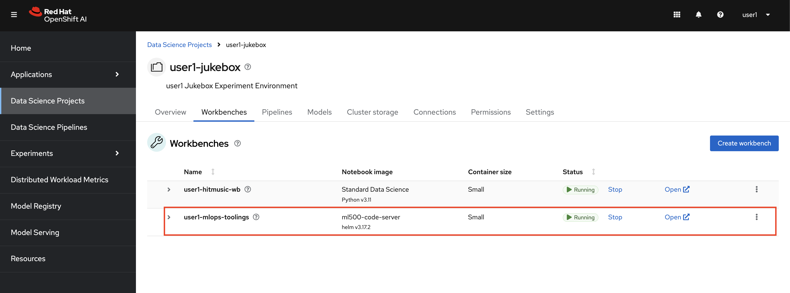
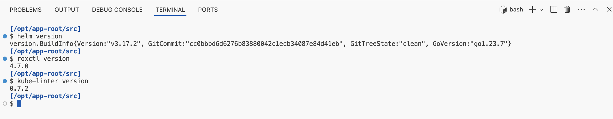

## New Workbench image

In the upcoming exercises, we will use several command-line utilities (CLIs)* to perform security-related tasks locally before integrating them into our pipeline. These CLIs are not included in the default workbench images that come with OpenShift AI. To address this, we built a custom workbench image!

We started with the code-server workbench image as the base, installed the necessary tools, and made it available on OpenShift AI for everyone to use.** Now, we can seamlessly switch our current workbench to this new image without losing any data.

*_No spoilers! 🤫_

**_You can find the Containerfile [here]()._


1. Select `Edit Workbench` for your `code-server` workbench.
    

2. Go to `Notebook image` > `Image selection `, and select `ml500-custom-image`. Then click `Update workbench`.

    

3. You should see the image you selected on your Workbenches list as below. 

    

4. When it is Running, open it and test a couple of CLIs to verify the image.

    ```bash
    helm version
    ```
    ```bash
    roxctl version
    ```
    ```bash
    kube-linter version
    ```
You should get outputs like this:

    


Now let's go and use some of these utilities! 🏃💨