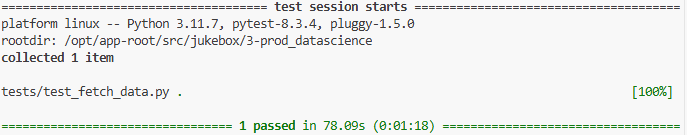

# Unit Testing 

Unit testing is a common practice in standard software development as it allows you to test components of your code individually to make sure each of them work as expected.  
Maybe unsurprisingly, this is something we want to do in AI development as well, to make sure that all components that go into creating and evaluating our models function properly.  

We have already set up a unit test for one of the pipeline components, let's try it out!

1. Go to your code server workbench and on the terminal run the below code:

    ```bash
    cd /opt/app-root/src/
    git clone https://<USER_NAME>:<PASSWORD>@gitea-gitea.<CLUSTER_DOMAIN>/<USER_NAME>/jukebox.git
    cd /opt/app-root/src/jukebox/3-prod_datascience
    pip install -r tests/requirements.txt
    PYTHONPATH=$(pwd) pytest tests/test_fetch_data.py 
    ```
    If you want to take a look at the code, you can find it in `jukebox/3-prod_datascience/tests/test_fetch_data.py`.  
    Here we are testing if the data we load have the expected number and order of columns.  
2. After a while (a couple of minutes), you should get an output similar to this:
    


## Automatic unit testing

Now that we are able to test our pipeline, let's make sure it gets tested each time we change our code (like good software developers 🧑‍💻).  
To do that, we can simply add it to our training pipeline, which will be ran at any code change.  

1. 