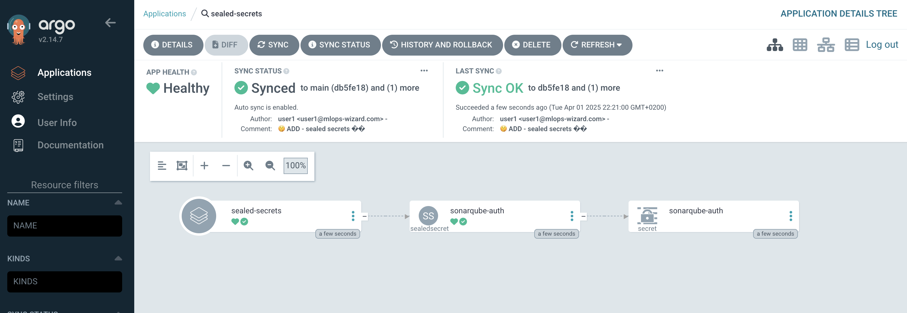

## Sealed Secrets

When we say GitOps, we say _"if it's not in Git, it's NOT REAL"_. But how are we going to store our sensitive data like credentials in Git repositories, where many people can access?! Sure, Kubernetes provides a way to manage secrets, but the problem is that it stores the sensitive information as a base64 string - anyone can decode a base64 string! Therefore, we cannot store `Secret` manifest files openly. We use an open-source tool called Sealed Secrets to address this problem.

Sealed Secrets allows us to _seal_ Kubernetes secrets by using a utility called `kubeseal`. The `SealedSecrets` are Kubernetes resources that contain encrypted `Secret` object that only the controller can decrypt. Therefore, a `SealedSecret` is safe to store even in a public repository.

### Sealed Secrets in action

1. The observant among you have noticed that in the previous exercise we created a secret for SonarQube and added it to Git just like that...😳 Lets start by fixing this and sealing our SonarQube credentials so they can be safely checked in to the repository. (yeah we know, git commit history, but we are trying to make a point here, so please 🤣)

    First, we'll create the secret in a tmp directory. So go to youe code-server and run below piece of code in terminal. 

    ```bash
    cat << EOF > /tmp/sonarqube.yaml
    apiVersion: v1
    data:
      username: "$(echo -n admin | base64 -w0)"
      password: "$(echo -n <PASSWORD> | base64 -w0)"
      currentAdminPassword: "$(echo -n admin | base64 -w0)"
    kind: Secret
    metadata:
      name: sonarqube-auth
    EOF
    ```

3. Use `kubeseal` command line to seal the secret definition. This will encrypt it using a certificate stored in the controller running inside the cluster. This has already been deployed for you as only one instance can exist per cluster.

    <p class="warn">
        ⛷️ <b>NOTE</b> ⛷️ - If you get an error "Error: cannot get sealed secret service: Unauthorized" from running the Kubeseal command, just re-login to OpenShift and run the command again. 
    </p>

    ```bash
    export CLUSTER_DOMAIN=<CLUSTER_DOMAIN>
    oc login --server=https://api.${CLUSTER_DOMAIN##apps.}:6443 -u <USER_NAME> -p thisisthepassword

    ```

    ```bash
    kubeseal < /tmp/sonarqube.yaml > /tmp/sealed-sonarqube.yaml \
    -n <USER_NAME>-toolings \
    --controller-namespace sealed-secrets \
    --controller-name sealed-secrets \
    -o yaml
    ```

4. Verify that the secret is sealed:

    ```bash
    cat /tmp/sealed-sonarqube.yaml
    ```

    We should now see the secret is sealed, so it is safe for us to store in our repository. It should look something a bit like this, but with longer password and username output.

    <div class="highlight" style="background: #f7f7f7">
    <pre><code class="language-yaml">
    apiVersion: bitnami.com/v1alpha1
    kind: SealedSecret
    metadata:
      creationTimestamp: null
      name: sonarqube-auth
      namespace: <USER_NAME>-toolings
    spec:
      encryptedData:
        username: AgAj3JQj+EP23pnzu...
        password: AgAtnYz8U0AqIIaqYrj...
        currentAdminPassword: AgAtnYz8U0AqIIaqYrj...
    ...
    </code></pre></div>

5. We want to grab the results of this sealing activity, in particular the `encryptedData` so we can add it to git. We have already written a <span style="color:blue;">[helper helm chart](https://github.com/redhat-cop/helm-charts/tree/master/charts/helper-sealed-secrets)</span> that can be used to add sealed secrets to our cluster in a repeatable way. We'll provide the `encryptedData` values to this chart in the next step.

    ```bash
    cat /tmp/sealed-sonarqube.yaml| grep -E 'username|password|currentAdminPassword'
    ```

    <div class="highlight" style="background: #f7f7f7">
    <pre><code class="language-yaml">
        username: AgAj3JQj+EP23pnzu...
        password: AgAtnYz8U0AqIIaqYrj...
        currentAdminPassword: AgAtnYz8U0AqIIaqYrj...
    </code></pre></div>


4. Open up `mlops-gitops/toolings` and create a folder called `sealed-secrets`, and a `config.yaml` file under it.

    ```bash
    mkdir /opt/app-root/src/mlops-gitops/toolings/sealed-secrets
    touch /opt/app-root/src/mlops-gitops/toolings/sealed-secrets/config.yaml
    ```

5. Open up the `sealed-secrets/config.yaml` file and paste the below yaml to `config.yaml`. We have already written a <span style="color:blue;">[helper helm chart](https://github.com/redhat-cop/helm-charts/tree/master/charts/helper-sealed-secrets)</span> that can be used to add sealed secrets to our cluster in a repeatable way. We'll provide the `encryptedData` values to this chart in the next step. 

    First, copy below:

    ```yaml
    repo_url: https://github.com/redhat-cop/helm-charts.git
    chart_path: charts/helper-sealed-secrets
    ```

    Then, extend the `config.yaml` file with the encrypted password you got previously:

    ```yaml
    repo_url: https://github.com/redhat-cop/helm-charts.git
    chart_path: charts/helper-sealed-secrets
    # ⬇️ extend by adding sealed secrets below
    secrets:
      # Additional secrets will be added to this list when necessary
      - name: sonarqube-auth
        type: Opaque
        data:
          username: AgAj3JQj+EP23pnzu...
          password: AgAtnYz8U0AqIIaqYrj...
          currentAdminPassword: AgCHCphbYpeLYMPK...
    ```

6. And let's update the `sonarqube/config.yaml` as below by removing the password information and point to sealed secret definition:

    ```yaml
    repo_url: https://github.com/redhat-cop/helm-charts.git
    chart_path: charts/sonarqube
    account:
      existingSecret: sonarqube-auth # 👈 this is the change
    plugins:
      install:
        - https://github.com/checkstyle/sonar-checkstyle/releases/download/10.9.3/checkstyle-sonar-plugin-10.9.3.jar
        - https://github.com/dependency-check/dependency-check-sonar-plugin/releases/download/3.1.0/sonar-dependency-check-plugin-3.1.0.jar
    ```

7. Git add, commit, push your changes (GITOPS WOOOO 🪄🪄). 

    ```bash
    cd /opt/app-root/src/mlops-gitops
    git pull
    git add .
    git commit -m  "🤫 ADD - sealed secrets 🤫"
    git push 
    ```


8. 🪄 🪄 Log in to Argo CD - you should now see the Sealed Secret application in Argo CD UI. It is unsealed as a regular k8s secret 🪄 🪄

    If you drill into the `SealedSecret` -  you can verify that the `sonarqube` secret has synced automatically:

    

