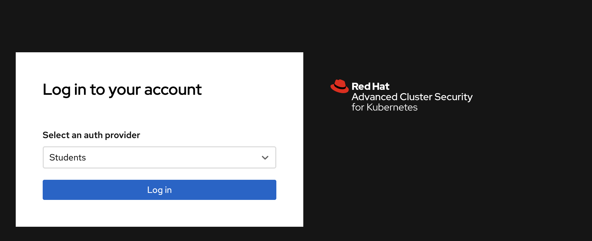
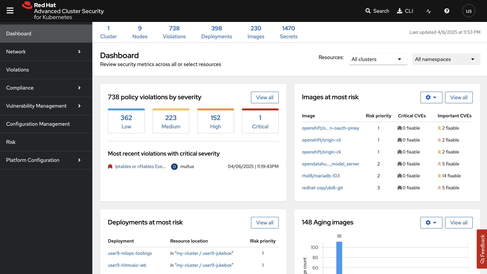

# Image Security (StackRox)

> We use some ready container images to build our modelcars 🚗. We use them as base and add our model artifacts on top of them. We need to protect our containers from errors and vulnerabilities in public registry images, or outdated packages and libraries. Image security step in our pipeline helps us to discover them before moving images to production.


## Set Up StackRox Access

StackRox (Advanced Cluster Security, or ACS) is deployed at the cluster level and can monitor multiple clusters. In this environment, the ACS / StackRox operator has already been deployed and configured for you.

1. Connect to the ACS WebUI:

    ```bash
    https://central-rhacs-operator.<CLUSTER_DOMAIN>
    ```

    Using youe credentials to log in.
    
    

2. An API Token was created for us as part of the install configuration. We can retrieve it using:

    Export the token as environment variable:

    ```bash
    export ROX_API_TOKEN=$(oc -n <USER_NAME>-toolings get secret rox-api-token-ml500 -o go-template='{{index .data "token" | base64decode}}')
    ```

    Export the StackRox endpoint:

    ```bash
    export ROX_ENDPOINT=central-rhacs-operator.<CLUSTER_DOMAIN>
    ```

3. Verify the token by running **roxctl**

    ```bash
    roxctl central whoami --insecure-skip-tls-verify -e $ROX_ENDPOINT:443
    ```

4. This API token will be used by our pipeline. Let's create Sealed Secret definition for it.

    ```bash
    cat << EOF > /tmp/rox-auth.yaml
    apiVersion: v1
    data:
      password: "$(echo -n ${ROX_API_TOKEN} | base64 -w0)"
      username: "$(echo -n ${ROX_ENDPOINT} | base64 -w0)"
    kind: Secret
    metadata:
      name: rox-auth
    EOF
    ```

    Use `kubeseal` commandline to seal the secret definition.

    ```bash
    kubeseal < /tmp/rox-auth.yaml > /tmp/sealed-rox-auth.yaml \
        -n <USER_NAME>-toolings \
        --controller-namespace sealed-secrets \
        --controller-name sealed-secrets \
        -o yaml
    ```

    As always, we want to grab the results of this sealing activity, in particular the `encryptedData`. Because this is GitOps, and we will save it in our Git repos :)

    ```bash
    cat /tmp/sealed-rox-auth.yaml | grep -E 'username|password'
    ```

    <div class="highlight" style="background: #f7f7f7">
    <pre><code class="language-yaml">
        username: AgAj3JQj+EP23pnzu...
        password: AgAtnYz8U0AqIIaqYrj...
    </code></pre></div>

    Open up `mlops-gitops/toolings/sealed-secrets/config.yaml` file and extend the Sealed Secrets entry. Copy the output of `username` and `password` from the previous command and update the values. Make sure you indent the data correctly.

    ```yaml
        - name: rox-auth
          type: kubernetes.io/basic-auth
          data:
            username: AgAj3JQj+EP23pnzu...
            password: AgAtnYz8U0AqIIaqYrj...
    ```

    Check our changes into git.

    ```bash
    cd /opt/app-root/src/mlops-gitops
    git pull
    git add .
    git commit -m  "🔒 ADD - stackrox sealed secret 🔒"
    git push
    ```

Now we can use ACS to help move security **LEFT** in our continous training pipeline. 

## Scan Images

1. Let's extend the pipeline with image scanning. In order to do that, open up `mlops-gitops/toolings/ct-pipeline/config.yaml` and add `image_scan: true` flag to introduce [scanning task](https://<GIT_SERVER>/<USER_NAME>/mlops-helmcharts/src/branch/main/charts/pipelines/templates/tasks/image-scan.yaml).
   
    ```yaml
    chart_path: charts/pipelines
    USER_NAME: <USER_NAME>
    cluster_domain: <CLUSTER_DOMAIN>
    git_server: <GIT_SERVER> 
    alert_trigger: true 
    apply_feature_changes: true
    unit_tests: true
    linting: true 
    image_scan: true # 👈 add this
    ```

2. Commit the changes to the repo:

    ```bash
    cd /opt/app-root/src/mlops-gitops
    git pull
    git add .
    git commit -m "🤳 image scan task is added 🤳"
    git push
    ```

    Go to OpenShift Console > Pipelines in `<USER_NAME>-toolings` namespace to verify that the `image_scan` task is included in the  Pipeline now:


3. Kick off a pipeline with an empty commit to see the changes on the pipeline:

    ```bash
    cd /opt/app-root/src/jukebox
    git commit --allow-empty -m "🏃 trigger pipeline for image scanning 🏃"
    git push
    ```
