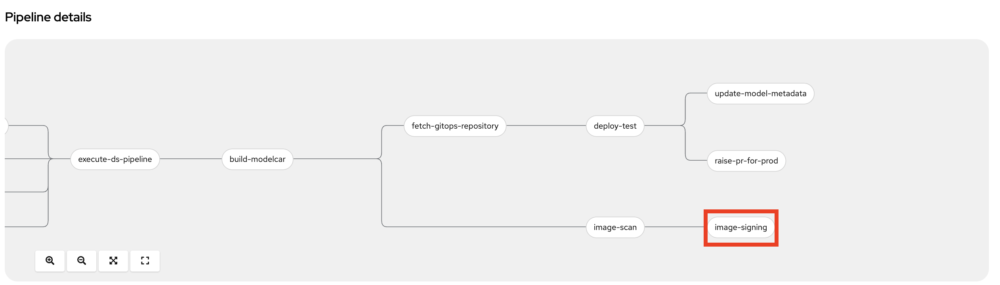
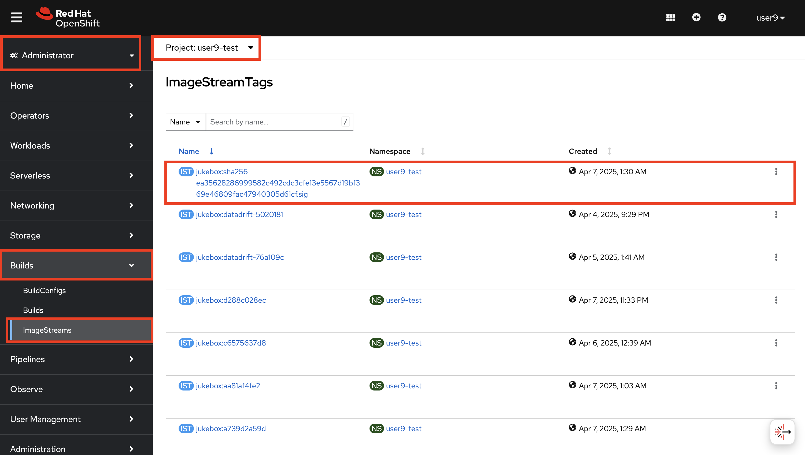

# Image Signing

> It is important to verify that the container image we deploy to our clusters has not been tampered and comes from a valid source. This is generally achieved by signing the image after building and verifying the signature before deployment. In this exercise, we will user `cosign` for creating, storing and verifying container image signatures.

## Before starting, generate your keys

1. Generate a key-pair to use for signing images. It expects you to enter a password for private key. Feel free to select anything you like :)

    ```bash
    cd /tmp
    cosign generate-key-pair k8s://<USER_NAME>-toolings/<USER_NAME>-cosign 
    ```

    You should get an output like this:
    <div class="highlight" style="background: #f7f7f7">
    <pre><code class="language-bash">
    $ cosign generate-key-pair k8s://<USER_NAME>-toolings/<USER_NAME>-cosign
    Enter password for private key:
    Enter again:
    Successfully created secret cosign in namespace <USER_NAME>-toolings
    Public key written to cosign.pub
    </code></pre></div>

    You just generated two keys (one private key, one public key). Private key is used to sign the images and it is automatically saved as a secret in your `toolings` namespace alongside the password you choose. Public key is used to verify the signed images. You can share your public key for people to verify your images but private one should not be shared or at least sealed before storing publicly.

    <p class="tip">
    🐌 THIS IS NOT GITOPS - The generated private key is stored in a Kubernetes secret in you <USER_NAME>-toolings project. We'll leave it as an exercise to the reader to extract and store this as a Sealed Secret instead! 🐎
    </p>

    <p class="tip">
    😱 If `cosign` command returns error, that means you logged out of the cluster so please run the below command and then run the cosign command again.
    </p>

    ```bash
    export CLUSTER_DOMAIN=<CLUSTER_DOMAIN>
    oc login --server=https://api.${CLUSTER_DOMAIN##apps.}:6443 -u <USER_NAME> -p <PASSWORD>
    ```


Now let's proceed to extend the pipeline with image signing step.

_This step makes more sense when you use an external image registry and share images across clusters or publicly._

2. Let's open up `mlops-gitops/toolings/ct-pipeline/config.yaml` and add `image_signing: true` flag to introduce [the task](https://<GIT_SERVER>/<USER_NAME>/mlops-helmcharts/src/branch/main/charts/pipelines/templates/tasks/image-signing.yaml).

    ```yaml
    chart_path: charts/pipelines
    USER_NAME: <USER_NAME>
    cluster_domain: <CLUSTER_DOMAIN>
    git_server: <GIT_SERVER> 
    alert_trigger: true 
    apply_feature_changes: true
    unit_tests: true
    linting: true 
    static_code_analysis: true
    image_scan: true
    image_signing: true # 👈 add this
    ```

5. Commit the changes to the repo:

    ```bash
    git pull
    cd /opt/app-root/src/mlops-gitops
    git add .
    git commit -m "🐦‍⬛ ADD - image signing step 🐦‍⬛"
    git push
    ```
6. Go to OpenShift Console > Pipelines in `<USER_NAME>-toolings` namespace > verify that the task is included in the Pipeline.

    

7. Kick off a pipeline with an empty commit to see the changes on the pipeline:

    ```bash
    cd /opt/app-root/src/jukebox
    git commit --allow-empty -m "🐒 trigger pipeline for image signing 🐒"
    git push
    ```

8. After the task successfully finish, in the `Administrator` view, go to `OpenShift UI` > `Builds` > `ImageStreams` and select `jukebox`. You'll see a tag ending with `.sig` which shows you that this image is signed. 

    

9. Let's verify the signed image with the public key. Make sure you use the right `VERSION` for the image. (`c6575637d8` in this case)

    ```bash
    export REGISTRY_AUTH_FILE=~/.docker/auth.json
    oc registry login
    cosign tree default-route-openshift-image-registry.<CLUSTER_DOMAIN>/<USER_NAME>-test/jukebox:c6575637d8 
    cosign verify --key k8s://<USER_NAME>-toolings/<USER_NAME>-cosign default-route-openshift-image-registry.<CLUSTER_DOMAIN>/<USER_NAME>-test/jukebox:c6575637d8 --allow-insecure-registry --insecure-ignore-tlog
    ```

    The output should be like:

     ```bash
    Verification for default-route-openshift-image-registry.<CLUSTER_DOMAIN>/<USER_NAME>-test/jukebox:c6575637d8 --
    The following checks were performed on each of these signatures:
      - The cosign claims were validated
      - The signatures were verified against the specified public key
      - Any certificates were verified against the Fulcio roots.
    {"critical":{"identity":{"docker-reference":"default-route-openshift-image-registry.<CLUSTER_DOMAIN>/<USER_NAME>-test/jukebox"},"image":{"docker-manifest-digest":"sha256:1545e1d2cf0afe5df99fe5f1d39eef8429a2018c3734dd3bdfcac5a068189e39"},"type":"cosign container image signature"},"optional":null}
    ```