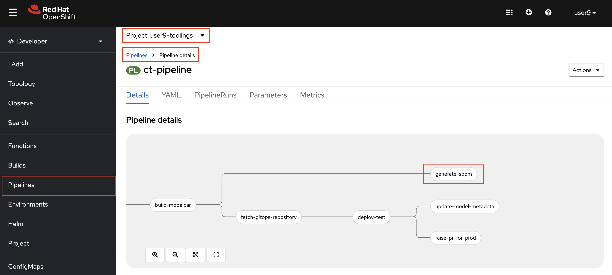
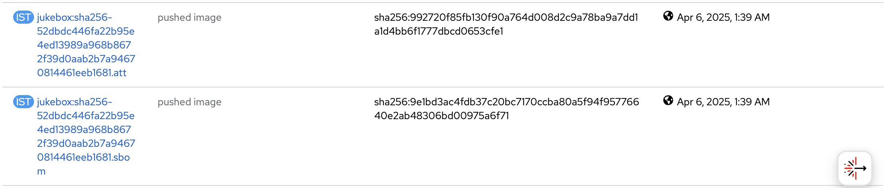

# Generate and Attest SBOM

> SBOM refers to the Software Bill of Materials. An SBOM reflects what is in a particular build. It provides transparency and visibility into the produced components of the software organizations market and use. Basically it's the list of components that software contains. It allows you to keep track of the security vulnerabilities of each component of the application to make sure everything is up-to-date and secure.

SBOM doesn’t hold much value without an attestation or assurance that the code you received is the code that was released. An attestation is cryptographically-signed metadata used to verify the integrity of an event or artifact, known as a predicate. In this case, the SBOM is the predicate, and the attestation is the metadata that verifies the code within an SBOM. An attestation with an SBOM should be generated as part of the build process, to assure that the SBOM hasn’t been tampered with before being attached to an image. <a href="https://next.redhat.com/2022/10/27/establishing-a-secure-pipeline/"><sup>[1]</sup></a>

In this exercise, we'll use [Syft](https://github.com/anchore/syft) to generate SBOM. Then, we use `cosign` to attach the produced SBOM document to the image metadata and store the signature and certificate in  public [Rekor Server](https://rekor.sigstore.dev) transparency log _so please do not use any personal data🫣_ 


## Before starting, generate your keys


1. Let's try and see what is an SBOM:

    ```bash
    syft quay.io/rhoai-mlops/jukebox:latest
    ```
    You should get a long list output like this one:
    <div class="highlight" style="background: #f7f7f7">
    <pre><code class="language-bash">
    $ syft quay.io/rhoai-mlops/jukebox:latest
    ✔ Loaded image  quay.io/rhoai-mlops/jukebox:latest
    ✔ Parsed image  sha256:da60a37da67b030e5b67613c2f2085563e34176a6ce38ebd921ce9600d12f862
    ✔ Cataloged contents   9baf2da7474a4fca9ae4d48093ca39e46f7e9b709dc27b85a5de8b36b5213dab
    ├── ✔ Packages                        [106 packages]  
    ├── ✔ File digests                    [1,221 files]  
    ├── ✔ File metadata                   [1,221 locations]  
    └── ✔ Executables                     [262 executables]  
    NAME                    VERSION                        TYPE   
    alternatives            1.24-1.el9                     rpm     
    audit-libs              3.1.2-2.el9                    rpm     
    basesystem              11-13.el9                      rpm     
    bash                    5.1.8-9.el9                    rpm     
    bzip2-libs              1.0.8-8.el9                    rpm     
    ca-certificates         2024.2.69_v8.0.303-91.4.el9_4  rpm   
    ....
    </code></pre></div>

3. And `cosign` has an all-in-one command to list known security related artifacts of an image. If we want to check this image:

    ```bash
    cosign tree quay.io/rhoai-mlops/jukebox:latest
    ```

    We'll see that this image has no security related artifacts attached to it:
    <div class="slider" style="background: #f7f7f7">
    <pre><code class="slide">
    <pre><code class="language-bash">
    📦 Supply Chain Security Related artifacts for an image: quay.io/rhoai-mlops/jukebox:latest
    No Supply Chain Security Related Artifacts artifacts found for image quay.io/rhoai-mlops/jukebox:latest
    </pre></code>
    </code></pre></div>

Now let's proceed to extend the pipelines with generate and attest SBOM step.

_This step makes more sense when you use an external image registry and share images across clusters or publicly._

4. Let's open up `mlops-gitops/toolings/ct-pipeline/config.yaml` and add `generate_sboms: true` flag to introduce [the task](https://<GIT_SERVER>/<USER_NAME>/mlops-helmcharts/src/branch/main/charts/pipelines/templates/tasks/generate-sboms.yaml).

    ```yaml
    chart_path: charts/pipelines
    USER_NAME: <USER_NAME>
    cluster_domain: <CLUSTER_DOMAIN>
    git_server: <GIT_SERVER> 
    alert_trigger: true 
    apply_feature_changes: true
    unit_tests: true
    linting: true 
    static_code_analysis: true
    model_scanning: true
    image_scan: true
    image_signing: true
    generate_sboms: true # 👈 add this
    ```

5. Commit the changes to the repo:

    ```bash
    git pull
    cd /opt/app-root/src/mlops-gitops
    git add .
    git commit -m "🦤 ADD - generate SBOMs step 🦤"
    git push
    ```
6. Go to OpenShift Console > Pipelines in `<USER_NAME>-toolings` namespace > verify that the task is included in the Pipeline.

    

7. Kick off a pipeline with an empty commit to see the changes on the pipeline:

    ```bash
    cd /opt/app-root/src/jukebox
    git commit --allow-empty -m "🦖 trigger pipeline for SBOM generation 🦖"
    git push
    ```

8. After the task successfully finish, go to `OpenShift UI` > `Builds` > `ImageStreams` and `jukebox`. You'll see a tag ending with `.sbom` and `.att` which shows you that an attestation for the SBOM predicate attached. With this, the SBOM is signed (and therefore tamper-proof) as it is within an attestation, and consumers can validate its authenticity.

    

9. Let's verify the signed image with the public key. Make sure you use the right `VERSION` for the image. (`c6575637d8` in this case)

    ```bash
    export REGISTRY_AUTH_FILE=~/.docker/auth.json
    oc registry login
    cosign tree default-route-openshift-image-registry.<CLUSTER_DOMAIN>/<USER_NAME>-test/jukebox:c6575637d8 
    ```

    The output should be like:

    <div class="slider" style="background: #f7f7f7">
    <pre><code class="slide">
    <pre><code class="language-bash">
    📦 Supply Chain Security Related artifacts for an image: default-route-openshift-image-registry.<CLUSTER_DOMAIN>/<USER_NAME>-test/jukebox:c6575637d8
    └── 💾 Attestations for an image tag: default-route-openshift-image-registry.<CLUSTER_DOMAIN>/<USER_NAME>-test/jukebox:sha256-52dbdc446fa22b95e4ed13989a968b8672f39d0aab2b7a94670814461eeb1681.att
    └── 🍒 sha256:786d4e2aaa457b8218f68988d95d3ebb6d01d8bac160b7d98b733e73ec0b14e4
    └── 📦 SBOMs for an image tag: default-route-openshift-image-registry.<CLUSTER_DOMAIN>/<USER_NAME>-test/jukebox:sha256-52dbdc446fa22b95e4ed13989a968b8672f39d0aab2b7a94670814461eeb1681.sbom
    └── 🍒 sha256:a43e16448b9568717051d2da079e7f9e2ce9d0d6af0afb181fda27793f1d459e
    </pre></code>
    </code></pre></div>