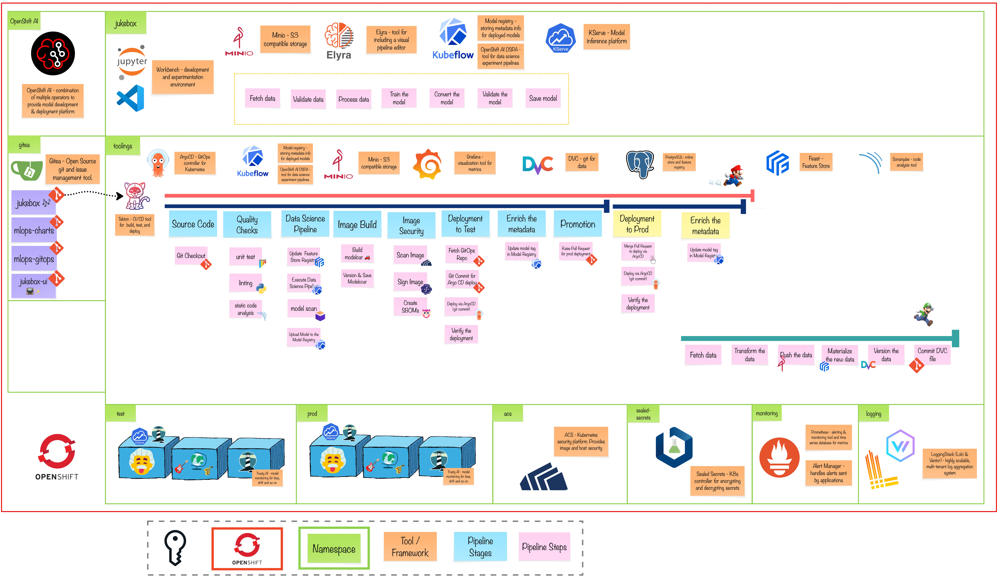

# Exercise 8 - The Supporting Acts
>  Continuous Delivery needs rapid and reliable feedback. Investing in continuous testing is a worthwhile activity.

## 👨‍🍳 Exercise Intro
In this exercise, we’ll enhance the reliability and security of our continuous training pipeline by incorporating essential quality assurance practices. You’ll add unit tests to validate code functionality, introduce linting and static code analysis to maintain code quality, and scan both the trained model and its container image for known vulnerabilities.

## 🖼️ Big Picture

## 🔮 Learning Outcomes
- [ ] Add security gates to pipeline
- [ ] Add testing gates to pipeline
- [ ] Add static code analysis gates to pipeline
- [ ] Store secrets in Git securely
- [ ] Scan the modelcar images
- [ ] Add image signing to the pipeline
- [ ] Generate and store SBOMs

## 🔨 Tools used in this exercise
 * [Sonarqube](https://www.sonarqube.org/) - Add static code analysis to the pipelines.
* Code Linting - [black](https://github.com/psf/black) , [flake8](https://flake8.pycqa.org/en/latest/) , [pylint](https://pypi.org/project/pylint/)  - Static code linter.
* Kube Linting - [kube-linter](https://docs.kubelinter.io/#/) , [helm lint](https://helm.sh/docs/helm/helm_lint/)  Validate K8s YAMLs against best practices.
* Image Security - [Stackrox](https://www.redhat.com/en/technologies/cloud-computing/openshift/advanced-cluster-security-kubernetes) - Finding vulnerabilities inside the images and hosts with StackRox
* ModelScan - [modelscan](https://github.com/protectai/modelscan) - scans models to determine if they contain unsafe code.
* SealedSecrets - [sealed-secrets](https://github.com/bitnami-labs/sealed-secrets) - encrypt your Secret into a SealedSecret, which is safe to store.
* Image Signing - [sigstore](https://www.sigstore.dev/) - Sign your images with cosign.
* SBOMs - [Syft](https://github.com/anchore/syft) - Generate a Software Bill of Materials (SBOM) from container images.
