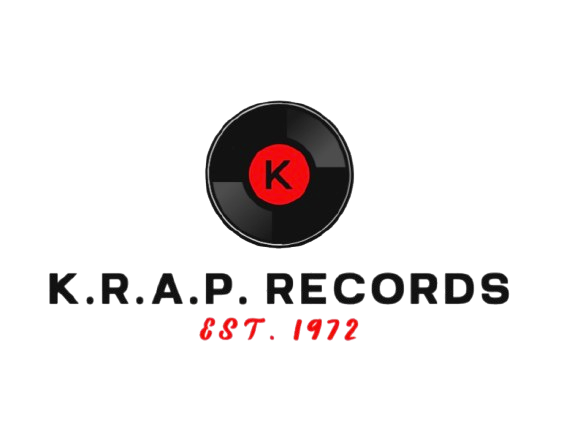
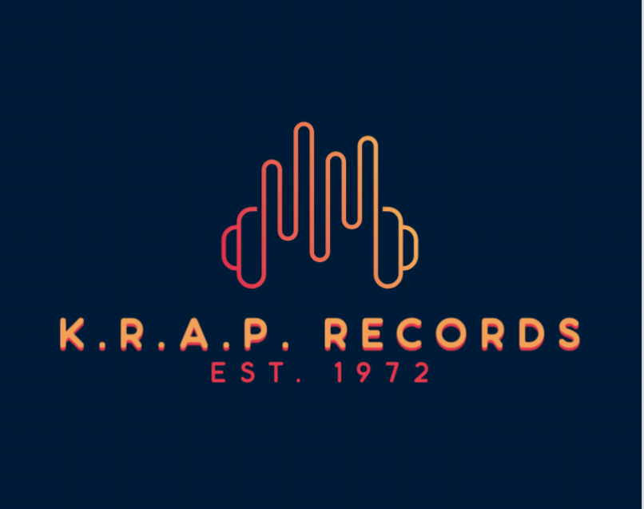
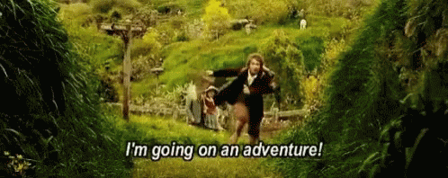
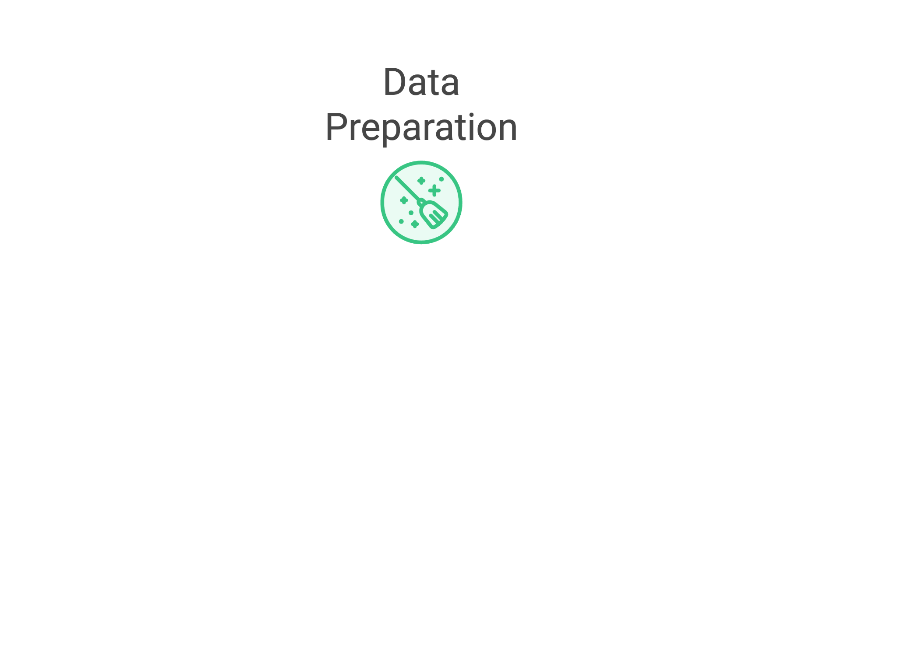
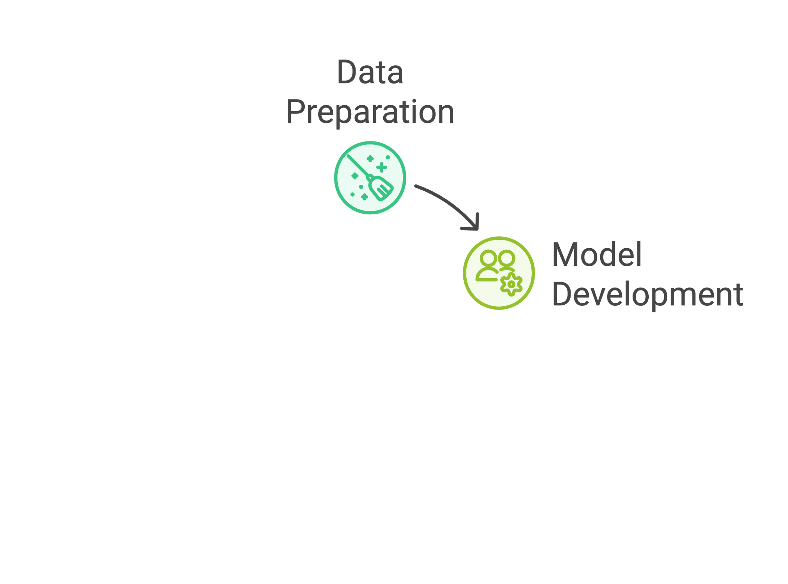
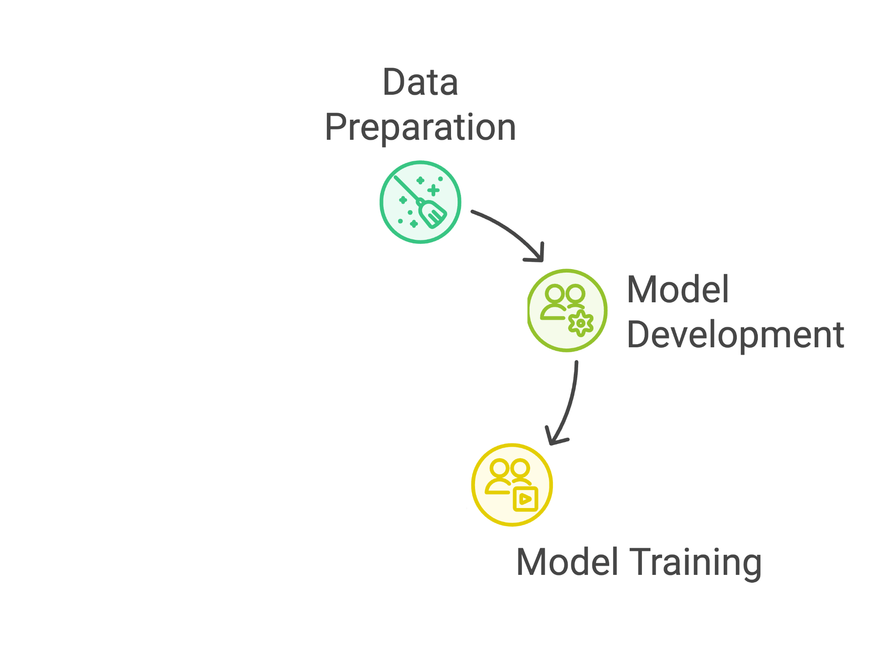
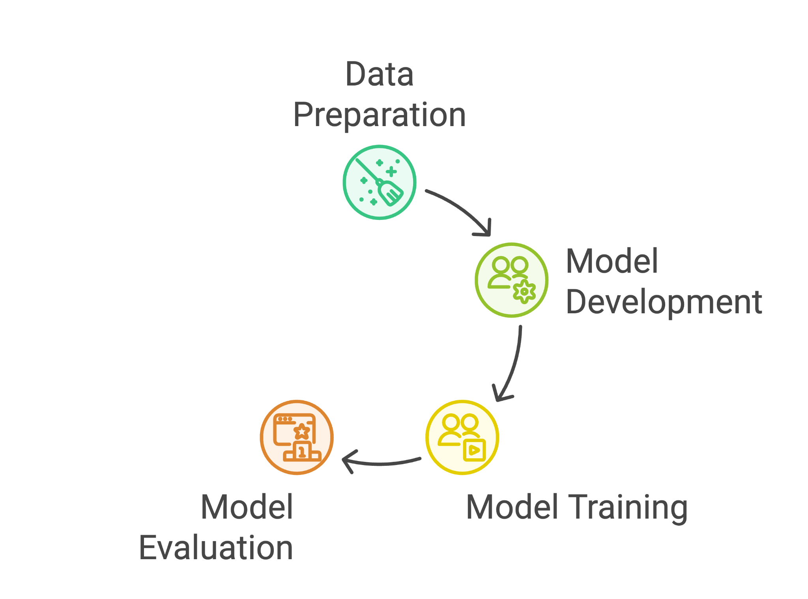
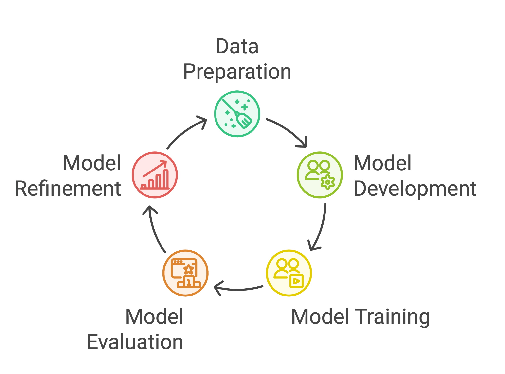
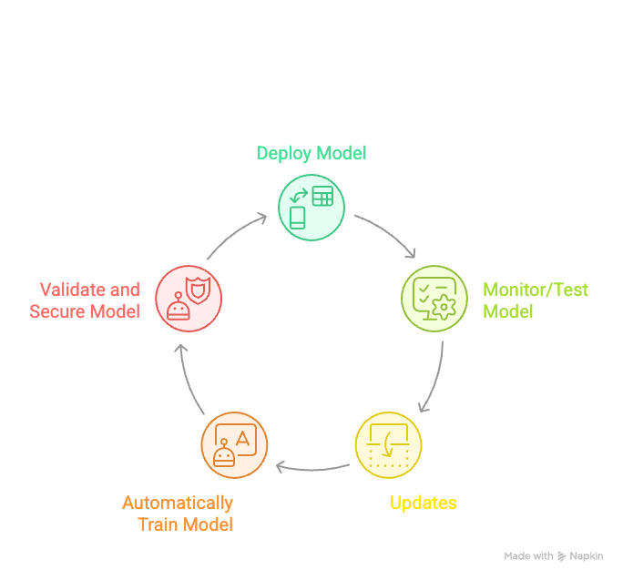

<!-- .slide: data-background-image="images/RH_NewBrand_Background.png" -->
## 0-K.R.A.P <!-- {.element: class="course-title"} -->
### ML500 <!-- {.element: class="title-color"} -->

## K.R.A.P Records

- ML500

## The Story Begins

- BY VISIONARY BROTHERS KARL AND RALPH PETERS, WAS ONCE A POWERHOUSE IN THE MUSIC INDUSTRY, LAUNCHING LEGENDARY ARTISTS, SHAPING MUSICAL TRENDS.

 <!-- {.element: class="image-no-shadow"} -->

Note:
Chart-topping hits that defined a generation. Pioneered new music genres before they became mainstream. Artists signed under KRAP Records sold millions of records. Known for its ability to predict and shape the industry.

## What Made K.R.A.P. Records Awesome

- 🪇 Released chart-topping hits that defined the 70s. 👨‍🎤 Pioneered emerging genres before they became mainstream. 💰 Artists signed under KRAP sold millions of records worldwide. 😎 Famous for being able to predict and shape music trends.

## Time passes though…

- 🤳 The rise of streaming platforms and social media disrupted old models.
- 🌏 Listeners' tastes became more niche and regionally diverse.
- 🤘 Struggled to attract emerging talents in the digital age.
- 😶‍🌫️ Intuition was no longer enough to navigate complex markets.

## A Legacy in Decline

- 📉 Chart success slowed.
- 🫠 Missed the wave of new genres like bedroom pop, Afrobeats, and hyperpop.
- 🤷 Couldn't identify the right markets for new releases.
- 🪿 Competitors began to surge ahead.

## The New Generation

- NOW MANAGED BY THEIR GRANDCHILDREN, THE LABEL RECOGNIZES THE POWER OF DATA AND LOOKING TO ANALYZE MUSIC AND MARKET TRENDS TO OPTIMIZE THEIR RELEASE STRATEGY.
  
_Karl and Ralph's grandchildren take the reins. Grew up on streaming, analytics, and agile thinking. Passionate about music—but powered by data. Believed AI could bring KRAP Records back to its glory days._

 <!-- {.element: class="image-no-shadow"} -->

## Embracing AI and Machine Learning

- 🤓 Decision to invest in Machine Learning to analyze music trends.
- 💚 Building an AI-driven system to predict:
  - What types of music are trending in different countries.
  - Where to market artists and songs first for maximum impact.
  - How musical elements influence success in specific regions.

## A Brilliant Idea, But a Slow Start

- 🌟 The idea was golden, but execution was challenging.
- ⏳ It took too long to move the model from development to production.
- 😓 Manually retraining the model was time-consuming and inefficient.
- 📦 Making updates or releasing new features required significant effort.

## That’s where your MLOps journey begins!

 <!-- {.element: class="image-no-shadow"} -->

## What are we going to do next 5 days?

 <!-- {.element: class="image-no-shadow"} -->

## 🔁 Data Science Inner Loop the iterative work done to experiment, develop, and refine models

## Data Science Pipeline Overview

 <!-- {.element: class="image-no-shadow"} -->

## Experiment & Develop

 <!-- {.element: class="image-no-shadow"} -->

## Build & Train

 <!-- {.element: class="image-no-shadow"} -->

## Validate & Test

 <!-- {.element: class="image-no-shadow"} -->

## Deploy & Monitor

 <!-- {.element: class="image-no-shadow"} -->

## 🔄 Data Science Outer Loop taking the Data Science process out of a Jupyter Notebook tand take it to production

## Production Pipeline

 <!-- {.element: class="image-no-shadow"} -->

## CI/CD for ML

 <!-- {.element: class="image-no-shadow"} -->

## Model Governance

 <!-- {.element: class="image-no-shadow"} -->

## Monitoring & Alerting

 <!-- {.element: class="image-no-shadow"} -->

## Feature Engineering

 <!-- {.element: class="image-no-shadow"} -->

## ✨ Team work makes dream work ✨

 <!-- {.element: class="image-no-shadow"} -->

## Let's Get Started!

- 🥰 In table groups, work together to:
- Choose a team name
- Discuss how you want to work together this week
- Record your team button