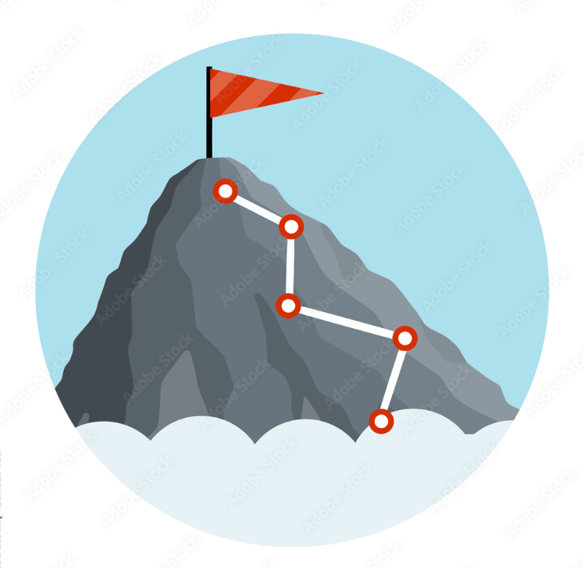

<!-- .slide: data-background-image="images/RH_NewBrand_Background.png" -->
## MLOps Introduction <!-- {.element: class="course-title"} -->
### Machine Learning Operations Fundamentals <!-- {.element: class="title-color"} -->
AI500 <!-- {.element: class="title-color"} -->

## What is MLOps?

Understanding the fundamentals of Machine Learning Operations

## How to climb a mountain?

 <!-- {.element: class="image-medium"} -->

Note:
There are many potential pains in climbing a mountain, and they can change depending on where you are. You need to plan a path and be well prepared.

## MountainOps

Essential elements for successful mountain climbing:

- **Determination** - Mental fortitude and persistence
- **Equipment** - Right tools for the job
- **Preparation** - Planning and practice

 <!-- {.element: class="image-small"} -->

## MLOps

Essential elements for successful ML deployment:

- **Culture** - Collaborative mindset and practices
- **Tools** - Right technology stack
- **Practices** - Proven methodologies and processes

 <!-- {.element: class="image-small"} -->

## MLOps Definition

> **The practices, culture, and tools** to reliably and efficiently **deploy and maintain** AI models in production.

Note:
This may seem familiar, if you are familiar with DevOps, it's the same idea but applied to models and data as well as the application lifecycle.

## MLOps vs DevOps

### DevOps
- Focuses on the overall **software development process**

### MLOps
- Focuses on **machine learning models** and their deployment

 <!-- {.element: class="image-medium"} -->

## Focus Areas Comparison

### DevOps
- Overall **application performance** and reliability

### MLOps
- **Model performance** in production and monitoring

 <!-- {.element: class="image-medium"} -->

## Automation Levels

### Both DevOps and MLOps
- **Highly automated** processes
- Continuous integration and deployment
- Infrastructure as code

 <!-- {.element: class="image-medium"} -->

## Monitoring & Feedback

### Both practices emphasize:
- **High level of monitoring** and feedback
- Real-time observability
- Continuous improvement loops
- Data-driven decisions

 <!-- {.element: class="image-medium"} -->

## K.R.A.P. NorthStar ⭐️

> **Every model in production is seamlessly and automatically updated in response to relevant changes** — in code, data, or performance — **within a system that is observable, reproducible, scalable, and secure by design.**

This is our goal for K.R.A.P Records' ML transformation!