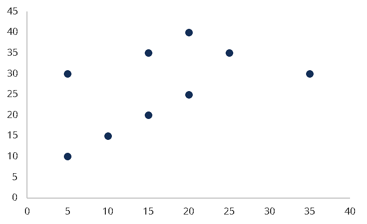
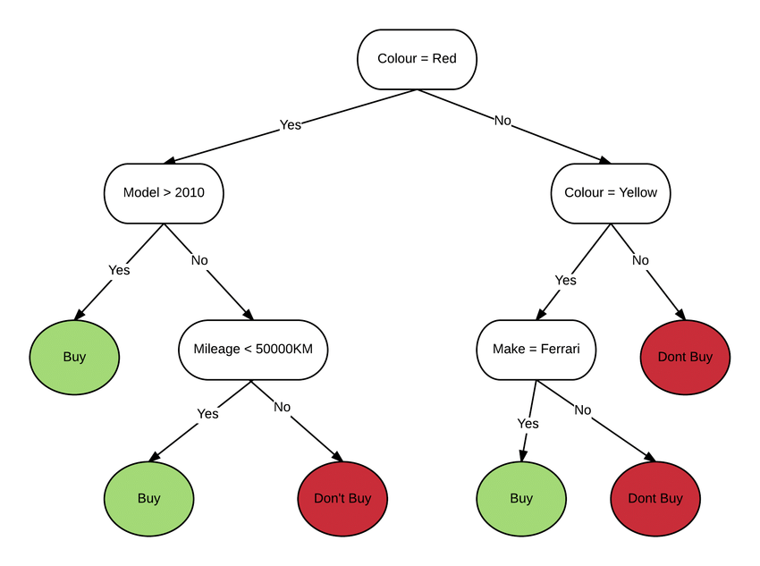

<!-- .slide: data-background-image="images/RH_NewBrand_Background.png" -->
## When the Music Starts <!-- {.element: class="course-title"} -->
### Introduction to Data Science and ML <!-- {.element: class="title-color"} -->
AI500 <!-- {.element: class="title-color"} -->

## 😣 Pain Point 😣

- K.R.A.P is very excited to start the project, but how…?
- The model seemed to behave in weird ways they didn't quite understand.
- They were also running everything locally on their laptops, this made it hard to share and collaborate on their work.

## Before we can do any AI we need data

### Data Engineer
- Designing, building, and maintaining
- the infrastructure that allows data to be stored, processed, and accessed efficiently.

### Data Scientist
- Analyzing data, building predictive models
- Extracting insights to solve business problems.

 <!-- {.element: class="image-no-shadow image-medium"} -->

## What is data?

### Structured data:
- Numerical
- Categorical

### Unstructured data:
- Images, Text, Sound
- 3D point clouds, Video
- Geo, Graphs

 <!-- {.element: class="image-no-shadow image-medium"} -->

Note:
Data is anything we can measure and collect. It can be anything from financial numbers to 3d maps of houses. We typically show data as points on a map, but there are many other ways to show it as we will see later in the EDA section.

## What is a feature?

> "A feature is an individual measurable property or characteristic of a phenomenon."
>
> *Bishop, Christopher (2006). Pattern recognition and machine learning.*

## Let's do an example!

We want to predict if someone might have **Diabetes**.

### What columns should we NOT use as features?
- **Identifiers** (Patient ID, Social Security Numbers, etc.)

### What do we want to input and get out?
- **Input features**: Age, BMI, Blood pressure, etc.
- **Output feature**: Diabetes diagnosis (Yes/No)

## We don't just work with raw data

### Pre-processing
- Clean and prepare data for the model

### Post-processing
- Interpret and format model outputs

 <!-- {.element: class="image-no-shadow image-medium"} -->

## What types of AI are there?

### Predictive AI
- Focus on outputting accurate answers
- Examples: Detecting dogs, anomaly detection, weather prediction

### Generative AI
- Focus on finding patterns to generate new content
- Examples: Music, images, videos, text

 <!-- {.element: class="image-no-shadow image-medium"} -->

## Predictive AI Examples

- Detecting dogs
- Anomaly detection
- Predicting the weather, or other time series
- Finding and highlighting lumps in medical imagery
- Masking and segmenting

 <!-- {.element: class="image-no-shadow image-medium"} -->

## Generative AI Examples

- Music and speech
- Images
- Videos
- Text

 <!-- {.element: class="image-no-shadow image-medium"} -->

## How can an AI learn?

### Two main approaches:
- **Unsupervised**: Looking at data and trying to figure out patterns
- **Supervised**: Getting inputs and the correct answers (labels)

 <!-- {.element: class="image-no-shadow image-medium"} -->

## Clustering

Grouping similar data points together

 <!-- {.element: class="image-no-shadow image-small"} -->

Note:
Cluster different songs, similar songs are close to each other

## Decision Trees

Rule-based models that make decisions through a series of questions

 <!-- {.element: class="image-no-shadow image-small"} -->

## Neural Networks

Complex models inspired by the human brain

 <!-- {.element: class="image-no-shadow image-medium"} -->

## When do we use what?

### Clustering
- When you don't have any labels

### Trees
- When the problem is simple enough and you want transparency

### Neural Networks
- When you have complex problems and need an arbitrary function approximator

 <!-- {.element: class="image-no-shadow image-medium"} -->

## So how do we train one?

### Data Split Strategy:
- **Training set** (60%): Teach the model
- **Validation set** (20%): Tune the model
- **Testing set** (20%): Final evaluation

 <!-- {.element: class="image-no-shadow image-medium"} -->

## Model Serving

Why serve a model?

 <!-- {.element: class="image-no-shadow image-medium"} -->

Note:
A model sitting in an environment or on a laptop by itself does little good. Sure, you can run some files through it, but you need to manually run them and no-one else can use the model. To get the model up and running so other people can use it, we deploy it with a runtime server that contains that model.

## Models can be stored in different ways

- **S3 storage**: Cloud object storage
- **OCI artifact**: Container registry
- **PVC**: Persistent volume claims

 <!-- {.element: class="image-no-shadow image-medium"} -->

## ❓ Quiz ❓

**Why should we serve a model?**

1. To make the trained model available for real-world usecases
2. Because AI models get hungry and need three meals a day
3. To impress the AI overlords before they take over
4. Because if we don't, the model will feel unappreciated

<!-- .element: class="fragment" -->**Answer: 1** - To make the trained model available for real-world usecases, allowing it to generate predictions from new data.

## 😌 Pain Point Solved 😌

The model is served and everyone who needs it can now access it!

## 😣 New Pain Point 😣

Lisa is great at what she does, so great that we now have a **myriad of models** she has created...

A myriad of models that **no-one can navigate**, probably not even she...

## Without a Model Registry

- **Accuracy**: ?
- **Location**: 🤷
- **Training data**: What's data?
- **Deployed**: Maybe...?
- **Model type**: The one that predicts

 <!-- {.element: class="image-no-shadow image-medium"} -->

## With a Model Registry

- **Accuracy**: 0.97
- **Location**: oci://...
- **Training data**:
  - Location: S3://...
  - Features: acousticness, ...
- **Deployed**: In Test environment
- **Model type**: Created by this pipeline

 <!-- {.element: class="image-no-shadow image-medium"} -->

## ❓ Quiz ❓

**What kind of info do we store in the Model Registry?**

1. A daily horoscope for the model
2. A playlist of songs the model listens to when stuck in overfitting
3. A list of revenge plots against data scientists
4. Version, metrics, location, and training details

<!-- .element: class="fragment" -->**Answer: 4** - Version, metrics, location, and training details – everything to track and reuse the model.

## 😌 Pain Point Solved 😌

Now we have organized, trackable, and reusable models!

**Ready to dive into the technical implementation?**
