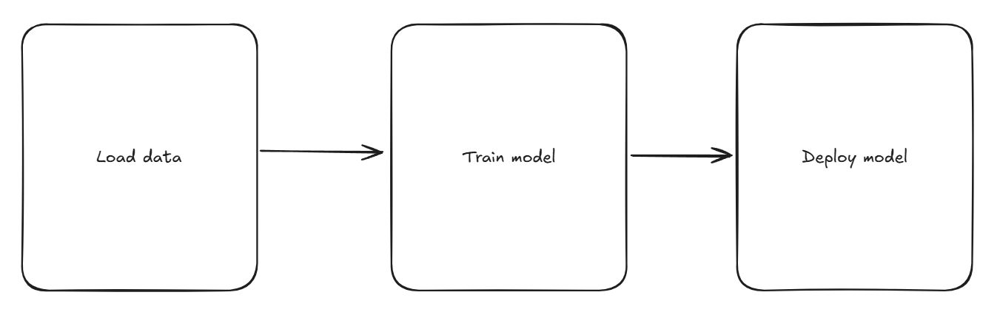

<!-- .slide: data-background-image="images/RH_NewBrand_Background.png" -->
## In the Rhythm of Data <!-- {.element: class="course-title"} -->
### AI500 <!-- {.element: class="title-color"} -->

## 🥅What our goal is🥅

- We want to find out if a song will be a hit…
- by sending in some song characteristics…
- and getting a probability for each of the 72 countries where it most likely will be popular

## 😣 Pain Point 😣

- Heureka! We have a model up and serving.
- But… that was quite a lot of work, and if anyone else besides Jim tries to do it, it likely won’t end too well…
- How do we make sure this process is reproducible by anyone?

## Why pipeline instead of a long script?

 <!-- {.element: class="image-no-shadow image-medium"} -->

## Composable, reusable steps

 <!-- {.element: class="image-no-shadow image-medium"} -->
 <!-- {.element: class="image-no-shadow image-medium"} -->
 <!-- {.element: class="image-no-shadow image-medium"} -->
 <!-- {.element: class="image-no-shadow image-medium"} -->
 <!-- {.element: class="image-no-shadow image-medium"} -->
 <!-- {.element: class="image-no-shadow image-medium"} -->
 <!-- {.element: class="image-no-shadow image-medium"} -->

## Checks and caching

 <!-- {.element: class="image-no-shadow image-medium"} -->
 <!-- {.element: class="image-no-shadow image-medium"} -->
 <!-- {.element: class="image-no-shadow image-medium"} -->
 <!-- {.element: class="image-no-shadow image-medium"} -->
 <!-- {.element: class="image-no-shadow image-medium"} -->
 <!-- {.element: class="image-no-shadow image-medium"} -->

## Our training pipeline

 <!-- {.element: class="image-no-shadow image-medium"} -->

## ❓ Quiz ❓

- Using a training pipeline instead of a standalone script makes the process more __________ and easier to reproduce.

Note:
available

## ❓ Quiz ❓

- Using a training pipeline instead of a standalone script makes the process more automated and easier to reproduce.

Note:
available

## Remember to update your MLOps Venn Diagram 🤗

- New task:
- Training Pipeline

 <!-- {.element: class="image-no-shadow image-medium"} -->