<!-- .slide: data-background-image="images/RH_NewBrand_Background.png" -->
## From Studio to Stage <!-- {.element: class="course-title"} -->
### Model Deployment & Production <!-- {.element: class="title-color"} -->
AI500 <!-- {.element: class="title-color"} -->

## 🥅What our goal is🥅

- We want to find out if a song will be a hit…
- by sending in some song characteristics…
- and getting a probability for each of the 72 countries where it most likely will be popular

## 😣 Pain Point 😣

- Someone went in and changed the production pipeline, which caused all new runs to fail and the new model never made it to production…

## Prototyping vs Production

- During the prototyping phase, velocity is key:
- try out different things
- explore, try, etc…
- "inner" loop
- GUI-driven
- When things get closer to production, stability will become key:
- reproducibility
- validation tests (confirm assumptions hold true)
- stability
- code-driven

## GitOps Principles

- Every artifacts created by the RHOAI user interface has a YAML representation

 <!-- {.element: class="image-no-shadow image-medium"} -->
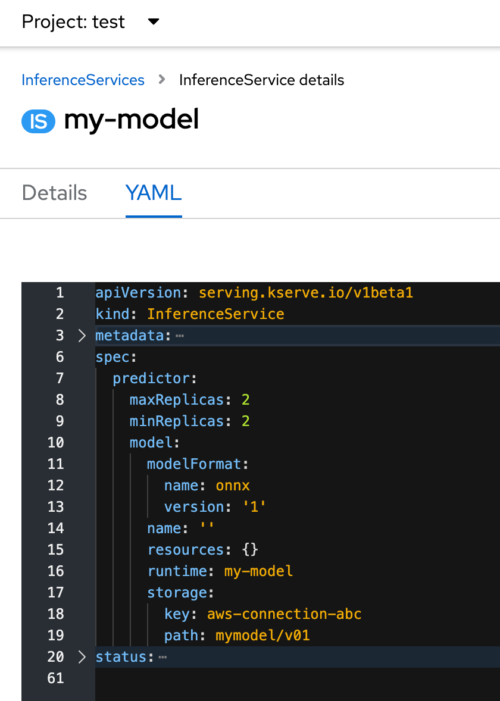 <!-- {.element: class="image-no-shadow image-medium"} -->

## GitOps Principles

- This can be very useful:
- Large scale:
- Script the creation of a large number of artifacts
- (instead of having to manually create them in the GUI)
- Maintain State:
- GitOps Principles

## GitOps Principles

- sync
- sync

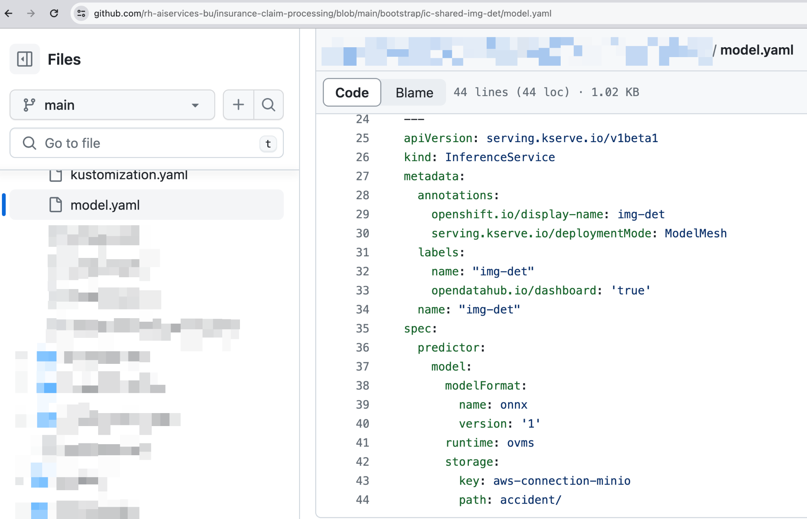 <!-- {.element: class="image-no-shadow image-medium"} -->
 <!-- {.element: class="image-no-shadow image-medium"} -->
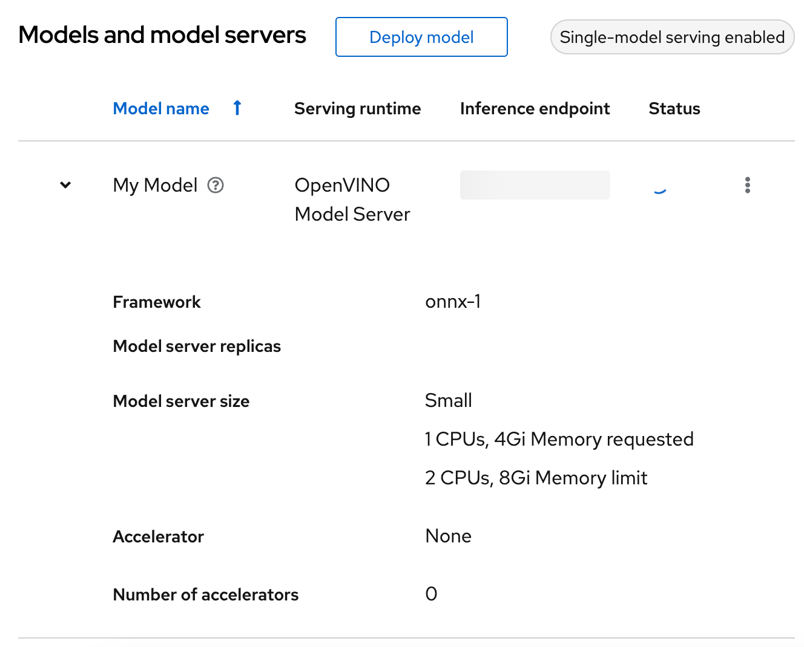 <!-- {.element: class="image-no-shadow image-medium"} -->

## GitOps Principles

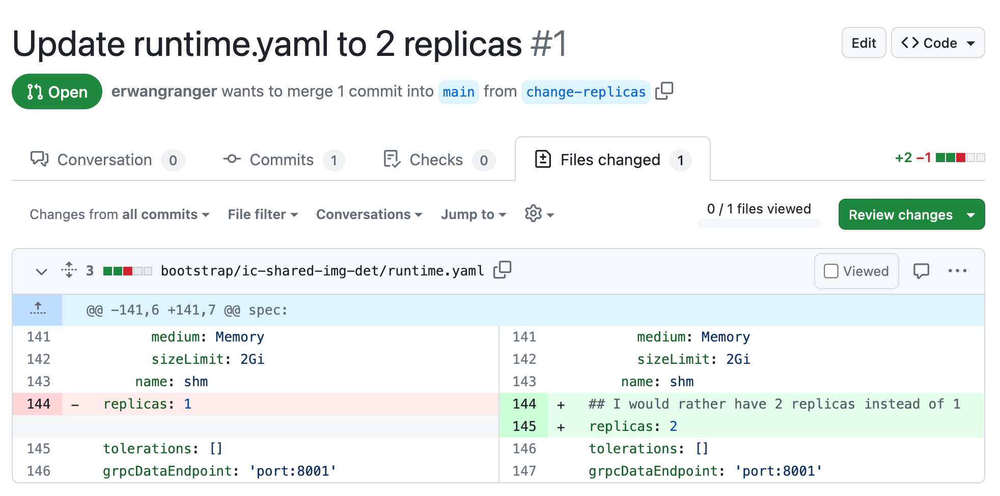 <!-- {.element: class="image-no-shadow image-medium"} -->
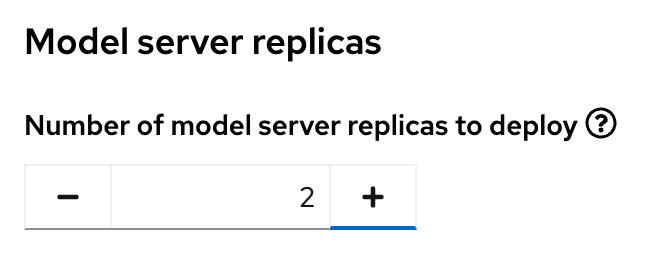 <!-- {.element: class="image-no-shadow image-medium"} -->

## GitOps Principles

- Main Principle:
- instead of relying on evolving user interactions (imperative)
- rely on a declarative description of state
- to ensure environment matches with declared state

## ❓ Quiz ❓

- Why do teams adopt GitOps practices?
- To make their deployment process more manual and mysterious
- To ensure consistent, auditable, and automated deployments using Git as the single source of truth
- To replace all engineers with robots that push random code to prod

Note:
available

## 😣 Pain Point 😣

- Someone - cough cough - uploaded a new model to S3 using the same name/path as the old one, overwriting the existing model.
- Now we can’t revert to the old model and the second deployment we did of the same model differs from the first…

## Modelcar = Sidecar with model inside it

- Since the model is packaged in an image, we can version, scan, cache, and treat it like any other image in our platform.
- Serving pod
- Sidecar with the model getting attached

 <!-- {.element: class="image-no-shadow image-medium"} -->

## 😣 Pain Point 😣

- With the training pipeline we managed to start producing a lot more iterations of our model 🎉
- But… operations is now complaining that there is too much manual work in deploying, maintaining and iterating on these models.
- And to be honest, there have been a few times they haven’t properly deployed them and we have noticed too late that it was using things such as an old runtime, causing prediction issues…

## Spot the difference

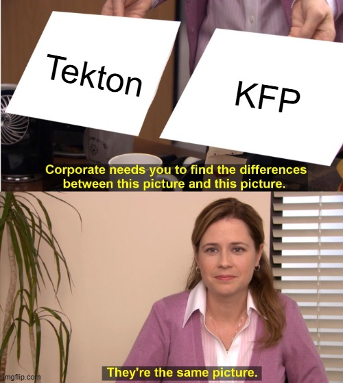 <!-- {.element: class="image-no-shadow image-medium"} -->

## What pipelines do we have?

- DS Pipelines
- KFP Server
- KFP SDK
- Elyra
- Argo Workflows
- OpenShift Pipelines
- Tekton
- Between here we convert into yaml

 <!-- {.element: class="image-no-shadow image-medium"} -->
 <!-- {.element: class="image-no-shadow image-medium"} -->
 <!-- {.element: class="image-no-shadow image-medium"} -->
 <!-- {.element: class="image-no-shadow image-medium"} -->
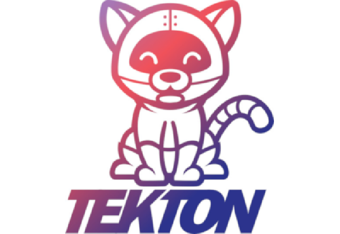 <!-- {.element: class="image-no-shadow image-medium"} -->
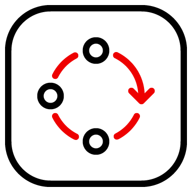 <!-- {.element: class="image-no-shadow image-medium"} -->

## Slide 19

 <!-- {.element: class="image-no-shadow image-medium"} -->
 <!-- {.element: class="image-no-shadow image-medium"} -->
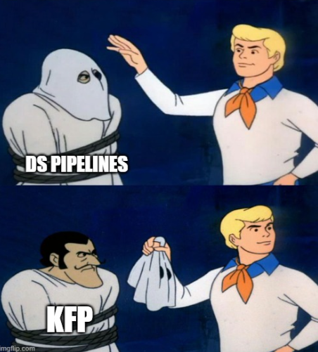 <!-- {.element: class="image-no-shadow image-medium"} -->

## How do we use them?

- Elyra:
- Similar to your notebooks
- Useful when experimenting or automating inner loop workflows
- Easy drag-and-drop interface
- Based in json files
- Tekton:
- Similar to your bash scripts
- For automating operations tasks
- Based in yaml files
- KFP SDK:
- Similar to your Python code
- For automating Data Science or Data Engineering tasks
- Based in code

 <!-- {.element: class="image-no-shadow image-medium"} -->
 <!-- {.element: class="image-no-shadow image-medium"} -->
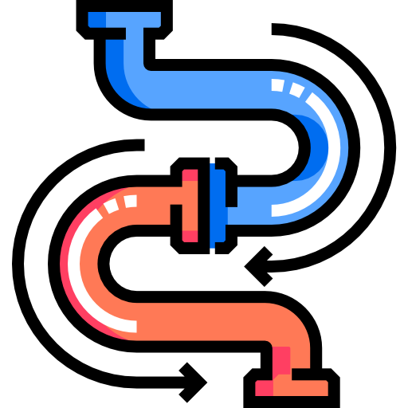 <!-- {.element: class="image-no-shadow image-medium"} -->

## Example of all used together

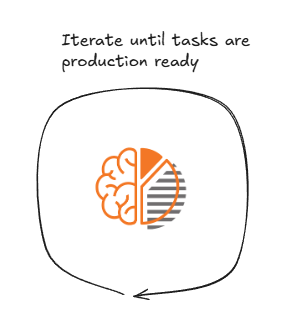 <!-- {.element: class="image-no-shadow image-medium"} -->
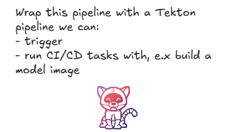 <!-- {.element: class="image-no-shadow image-medium"} -->
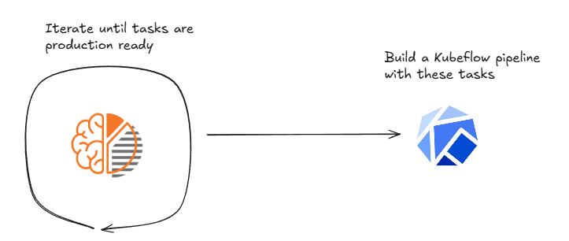 <!-- {.element: class="image-no-shadow image-medium"} -->

## ❓ Quiz ❓

- What different pipelines do we have and why?

 <!-- {.element: class="image-no-shadow image-medium"} -->

Note:
available

## ❓ Quiz ❓

- ML pipelines automate steps like data preprocessing, training, and ____________ to ensure reproducibility and scalability.

Note:
available

## ❓ Quiz ❓

- ML pipelines automate steps like data preprocessing, training, and deployment to ensure reproducibility and scalability.

Note:
available

## Remember to update your MLOps Venn Diagram 🤗

- New tasks:
- Set up production environment
- Automate deployments and training

 <!-- {.element: class="image-no-shadow image-medium"} -->