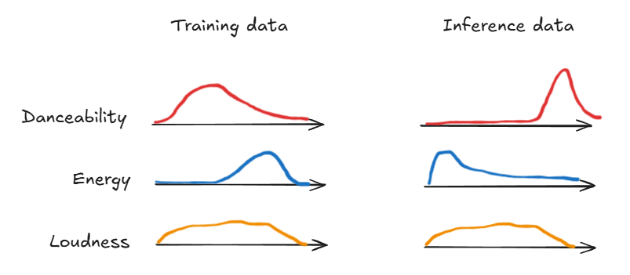
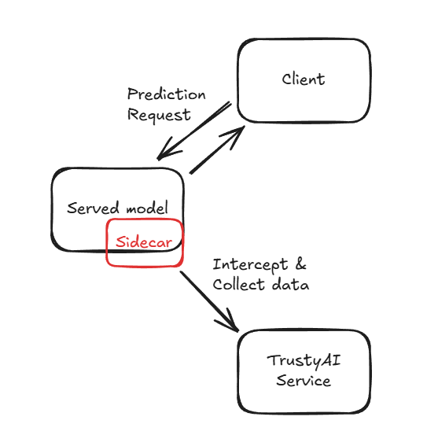
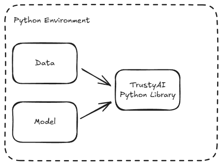

<!-- .slide: data-background-image="images/RH_NewBrand_Background.png" -->
## The Sound Check <!-- {.element: class="course-title"} -->
### Monitoring & Observability <!-- {.element: class="title-color"} -->
AI500 <!-- {.element: class="title-color"} -->

## 🥅What our goal is🥅

- We want to find out if a song will be a hit…
- by sending in some song characteristics…
- and getting a probability for each of the 72 countries where it most likely will be popular

## 😣 Pain Point 😣

- Peter just logged into our user-facing UI and noticed that our model didn’t work half the time (the users just got an error) and other times it was making weird predictions.
- Why has no-one looked at it until now?!

## What are our models doing when we are not looking?

- Operational monitoring:
- Resource utilization
- Failed requests
- Pod errors
- Response times
- Queue length
- …
- Performance monitoring:
- Bias
- Drift
- Average values
- …
- ogging:
- Requests
- Intermediate steps
- Response
- …

 <!-- {.element: class="image-no-shadow image-medium"} -->
 <!-- {.element: class="image-no-shadow image-medium"} -->
 <!-- {.element: class="image-no-shadow image-medium"} -->

## Bias Detection

- Protected Attribute
- Privileged Attribute
- Unprivileged Attribute
- Favorable Outcome
- Privileged Attribute = The group that is suspected to be favored
- Unprivileged Attribute = The group that is suspected to be disadvantaged

## Drift Detection

 <!-- {.element: class="image-no-shadow image-medium"} -->

## ⚠️ Alerts ⚠️

- Wheee!
- Create and deploy new model

 <!-- {.element: class="image-no-shadow image-medium"} -->
 <!-- {.element: class="image-no-shadow image-medium"} -->
 <!-- {.element: class="image-no-shadow image-medium"} -->
 <!-- {.element: class="image-no-shadow image-medium"} -->
 <!-- {.element: class="image-no-shadow image-medium"} -->
 <!-- {.element: class="image-no-shadow image-medium"} -->

## Debugging - Replay

- Input data:
- …
- …
- Predictions:
- …
- …
- Jukebot v2
- Input data
- Predictions
- Jukebot v1
- New Predictions
- Compare

 <!-- {.element: class="image-no-shadow image-medium"} -->
 <!-- {.element: class="image-no-shadow image-medium"} -->
 <!-- {.element: class="image-no-shadow image-medium"} -->

## ❓ Quiz ❓

- TrustyAI helps build trust in AI by detecting _________ in model predictions.

## ❓ Quiz ❓

- TrustyAI helps build trust in AI by detecting bias/drift in model predictions.

## Explainability

- How can we debug a model?

## 😣 Pain Point 😣

- Okay… we took care of some of the issues with the model, but it still predicts weirdly for some specific data, and we don’t really know how to explain why it makes those predictions…

## TrustyAI Service vs Python Client

- TrustyAI Service
- TrustyAI Python Library

 <!-- {.element: class="image-no-shadow image-medium"} -->
 <!-- {.element: class="image-no-shadow image-medium"} -->

## Brainstorming session - How can we explain a models response?

- 2 ways:
- How would an input have to look like to get a different result?
- What in the input contributed most to the result?

## SHAP values

- Video: https://www.youtube.com/watch?v=VB9uV-x0gtg

 <!-- {.element: class="image-no-shadow image-medium"} -->

## Counterfactuals

- Cat

 <!-- {.element: class="image-no-shadow image-medium"} -->
 <!-- {.element: class="image-no-shadow image-medium"} -->

## Counterfactuals

- Dog
- What do we need to change with Benji to make the AI think he’s a Dog?

 <!-- {.element: class="image-no-shadow image-medium"} -->
 <!-- {.element: class="image-no-shadow image-medium"} -->

## SHAP

- Cat

 <!-- {.element: class="image-no-shadow image-medium"} -->
 <!-- {.element: class="image-no-shadow image-medium"} -->
 <!-- {.element: class="image-no-shadow image-medium"} -->

## ❓ Quiz ❓

- Which approach best reflects how TrustyAI explainability methods help users understand AI decisions?
- They retrain the model with different colors.
- They hide complex logic to make the AI seem smarter.
- They show how changing input features would change the prediction.

## Remember to update your MLOps Venn Diagram 🤗

- New tasks:
- Enable monitoring and logging
- Debug/explain the model

 <!-- {.element: class="image-no-shadow image-medium"} -->