<!-- .slide: data-background-image="images/RH_NewBrand_Background.png" -->
## The Data Tracks <!-- {.element: class="course-title"} -->
### Data Management & Versioning <!-- {.element: class="title-color"} -->
AI500 <!-- {.element: class="title-color"} -->

## 🥅What our goal is🥅

- We want to find out if a song will be a hit…
- by sending in some song characteristics…
- and getting a probability for each of the 72 countries where it most likely will be popular

## 😣 Pain Point 😣

- Another day, another problem.
- Remember the model that someone accidentally overwrote a couple of days before?
- Well, if memory serves right, it predicted pretty well for some of the cases our current model doesn’t, and we really need to compare the two models to figure out what makes it tic.
- We have all the code and runtimes etc that was used to train that model, but the data… no-one thought of storing a backup of that specific data…

## Data Versions

 <!-- {.element: class="image-no-shadow image-medium"} -->

Note:
As data continuously comes in, we use different versions of the dataset to train different models (or run different analytics). It becomes important to keep track of when we used what data, and to be able to revert in case something happens to our database.

## DVC - how it works

- song_properties.parquet.dvc
- md5: baeb4a22e23f26c343ee974da0880f56
- frozen: true
- deps:
- …

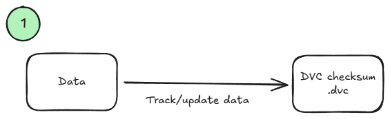 <!-- {.element: class="image-no-shadow image-medium"} -->
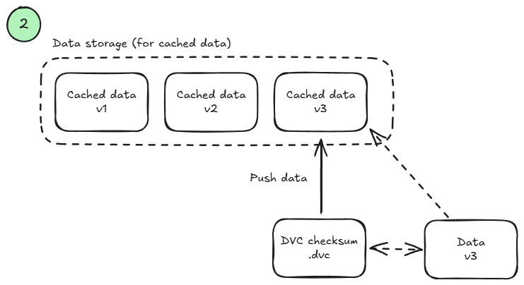 <!-- {.element: class="image-no-shadow image-medium"} -->
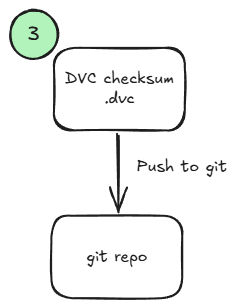 <!-- {.element: class="image-no-shadow image-medium"} -->
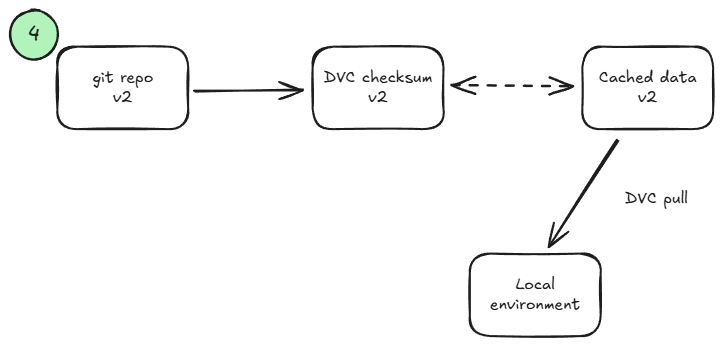 <!-- {.element: class="image-no-shadow image-medium"} -->

## Slide 7

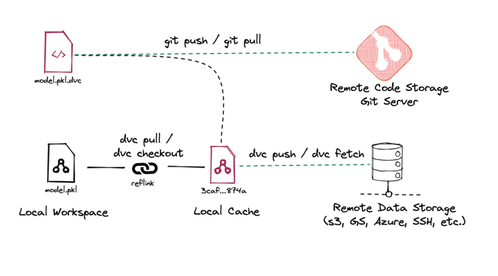 <!-- {.element: class="image-no-shadow image-medium"} -->

## Slide 8

- A Storage, New Data version, and a Git repo walked into a bar…

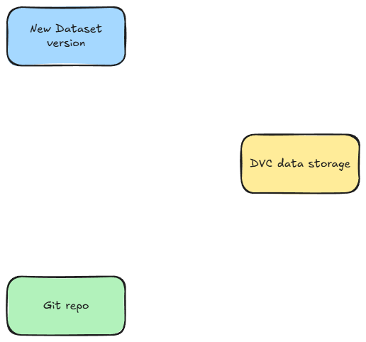 <!-- {.element: class="image-no-shadow image-medium"} -->

## Slide 9

- # dvc add
- Track the data
- song_properties.parquet.dvc
- md5: baeb4a22e23f26c343ee974da0880f56
- frozen: true
- deps:
- …

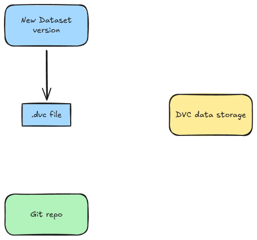 <!-- {.element: class="image-no-shadow image-medium"} -->

## Slide 10

- # dvc push (or update)
- Push the data

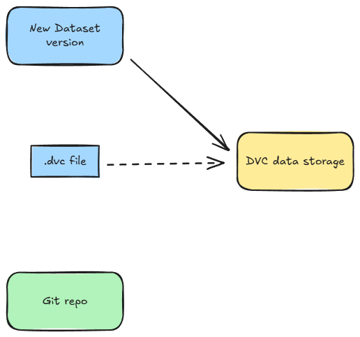 <!-- {.element: class="image-no-shadow image-medium"} -->

## Slide 11

- # dvc push (or update)
- Push the data

 <!-- {.element: class="image-no-shadow image-medium"} -->

## Slide 12

- # git add; commit; push
- We want to keep track of our .dvc file

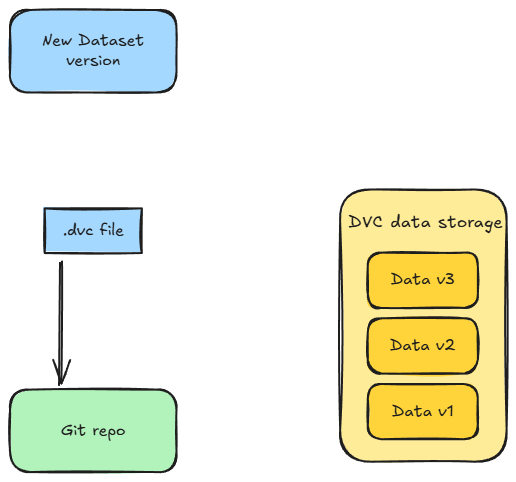 <!-- {.element: class="image-no-shadow image-medium"} -->

## Slide 13

- # git checkout; pull
- We can now fetch any .dvc file from a previous git hash

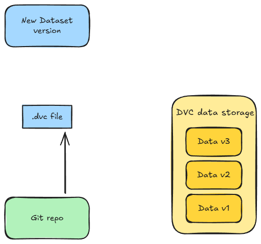 <!-- {.element: class="image-no-shadow image-medium"} -->

## Slide 14

- # dvc pull
- Finally, we can fetch data using the .dvc file

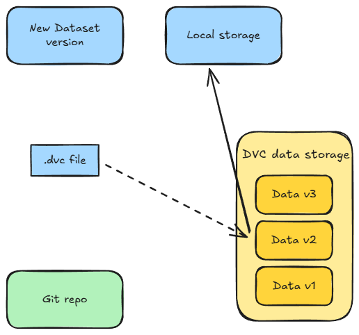 <!-- {.element: class="image-no-shadow image-medium"} -->

## ❓ Quiz ❓

- Why do we want data versioning?

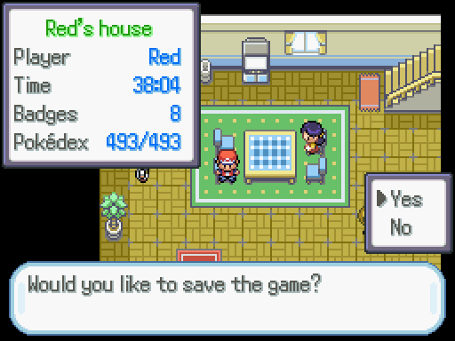 <!-- {.element: class="image-no-shadow image-medium"} -->

## Remember to update your MLOps Venn Diagram 🤗

- New task:
- Manage data versions

 <!-- {.element: class="image-no-shadow image-medium"} -->