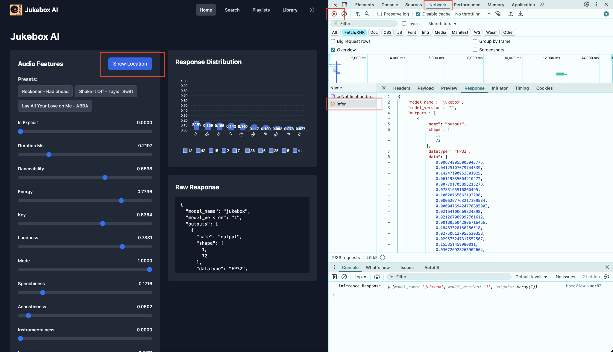
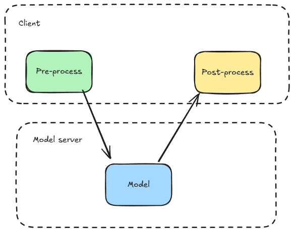
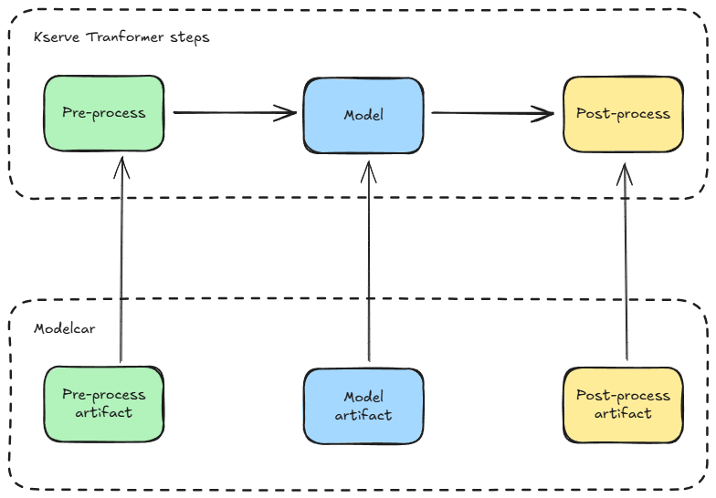

<!-- .slide: data-background-image="images/RH_NewBrand_Background.png" -->
## The Headliner <!-- {.element: class="course-title"} -->
### Advanced ML Operations <!-- {.element: class="title-color"} -->
AI500 <!-- {.element: class="title-color"} -->

## 🥅What our goal is🥅

- We want to find out if a song will be a hit…
- by sending in some song characteristics…
- and getting a probability for each of the 72 countries where it most likely will be popular

## 😣 Pain Point 😣

- Some users are complaining that the inputs for seeing where a song will be popular are not intuitive, and that they don’t understand the output.
- What’s so hard with just looking in our index at https://jukebox-records.com/jukebot/info/tools/details/countries/indexes and seeing what country #51 is….?
- But, the boss says the user is always right so I guess we have to fix it…
- We briefly added the pre-and-post processing steps in our client, but John updated the model 15 minutes after that and now the predictions make no sense at all.

## Slide 5

 <!-- {.element: class="image-no-shadow image-medium"} -->

## ❓ Quiz ❓

- Why do we want to use pre-and-post processing?
- Because AI models get stage fright and need a warm-up and cool-down routine.
- To clean and transform data before training/serving, and to ensure model outputs are properly formatted for real-world use.
- To make the AI feel special, like a spa day before and after hard work.
- Because without it, the AI might start speaking only in riddles and ancient prophecies.

## We don’t just work with raw data

- Pre-processing
- Post-processing
- 15
- AI predicting dogs name
- Benji
- AI predicting dogs name

 <!-- {.element: class="image-no-shadow image-medium"} -->
 <!-- {.element: class="image-no-shadow image-medium"} -->
 <!-- {.element: class="image-no-shadow image-medium"} -->
 <!-- {.element: class="image-no-shadow image-medium"} -->
 <!-- {.element: class="image-no-shadow image-medium"} -->
 <!-- {.element: class="image-no-shadow image-medium"} -->
 <!-- {.element: class="image-no-shadow image-medium"} -->
 <!-- {.element: class="image-no-shadow image-medium"} -->
 <!-- {.element: class="image-no-shadow image-medium"} -->
 <!-- {.element: class="image-no-shadow image-medium"} -->
 <!-- {.element: class="image-no-shadow image-medium"} -->
 <!-- {.element: class="image-no-shadow image-medium"} -->
 <!-- {.element: class="image-no-shadow image-medium"} -->
 <!-- {.element: class="image-no-shadow image-medium"} -->
 <!-- {.element: class="image-no-shadow image-medium"} -->

## KServe Transformers

- Processing not packaged with the model
- Processing packaged with the model
- This we can do with our modelcar.
- But we still need to use the artifacts somehow.

 <!-- {.element: class="image-no-shadow image-medium"} -->
 <!-- {.element: class="image-no-shadow image-medium"} -->

## KServe Transformers

- Kserve allows you to custom-define pre-and-post steps to your model

 <!-- {.element: class="image-no-shadow image-medium"} -->

Note:
The pre-and-post steps are defined in Python with KServe SDK. The pre-and-post steps can be inside the same pod as the model runtime or in a separate pod.

## 😣 Pain Point 😣

- I think… I think we are popping off!
- We are getting so much traffic!
- Wait… we are getting so much traffic…?
- “PETER HOW IS THE MODEL DOING??”

## Models as stateless microservices

- MODEL
- MODEL SERVICE
- MODEL
- MODEL
- APP
- SCALE HORIZONTALLY
- PHASED ROLLOUTS
- MODEL
- MODEL*
- MODEL1
- MODEL2
- MODEL3
- MULTIPLE TRIALS
- APP
- APP

Note:
ML model stateless microservice called through an API, returns prediction on sample wrapped by container orchestrated by OpenShift built-in load balancing automatic scaling rolling updates to prevent downtime service mesh for A/B testing & shadow scoring

## Remember to update your MLOps Venn Diagram 🤗

- New tasks:
- Pre-and-post process data
- Manage deployments

 <!-- {.element: class="image-no-shadow image-medium"} -->