<!-- .slide: data-background-image="images/RH_NewBrand_Background.png" -->
## The Feature Playlist <!-- {.element: class="course-title"} -->
### Feature Engineering & Management <!-- {.element: class="title-color"} -->
AI500 <!-- {.element: class="title-color"} -->

## 🥅What our goal is🥅

- We want to find out if a song will be a hit…
- by sending in some song characteristics…
- and getting a probability for each of the 72 countries where it most likely will be popular

## 😣 Pain Point 😣

- Everything was working great, until someone added a new feature to the model…
- All of a sudden, no requests were going through and all returning errors.

## ❓ Quiz ❓

- What is a feature?
- This?
- A:
- C:
- B:
- This?
- This?
- What is a (data) feature?

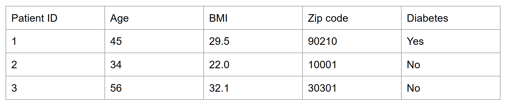 <!-- {.element: class="image-no-shadow image-medium"} -->
 <!-- {.element: class="image-no-shadow image-medium"} -->
 <!-- {.element: class="image-no-shadow image-medium"} -->

## Data processing so far

- Do you see any problem here?

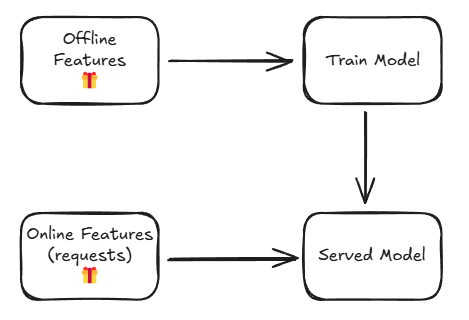 <!-- {.element: class="image-no-shadow image-medium"} -->

## There are a few more steps…

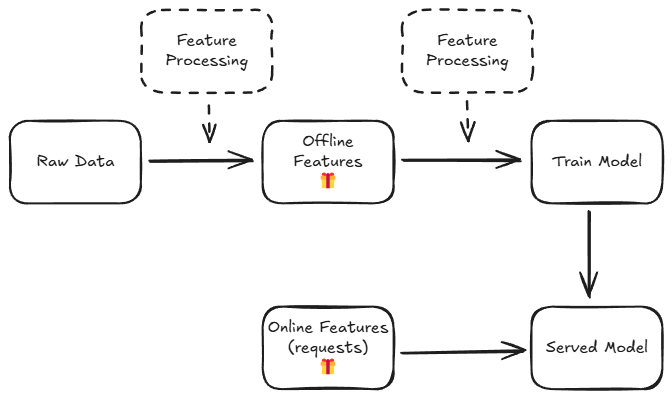 <!-- {.element: class="image-no-shadow image-medium"} -->

Note:
What happens if serving and training processing gets out of synch?

## And someone might want to use your features

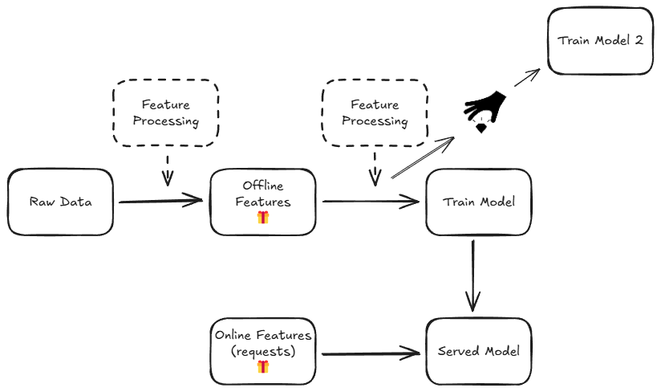 <!-- {.element: class="image-no-shadow image-medium"} -->

Note:
How do we deal with this?

## 🥙What is Feast? 🍔

- Centralized Feature Store
- It allows you to:
- Track and Collaborate across features
- Use same features (feature definitions) in training as in serving

## New inference flow

 <!-- {.element: class="image-no-shadow image-medium"} -->

## New inference flow

 <!-- {.element: class="image-no-shadow image-medium"} -->

## New inference flow

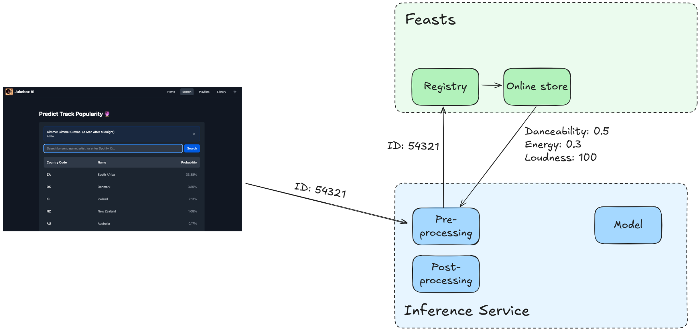 <!-- {.element: class="image-no-shadow image-medium"} -->

## New inference flow

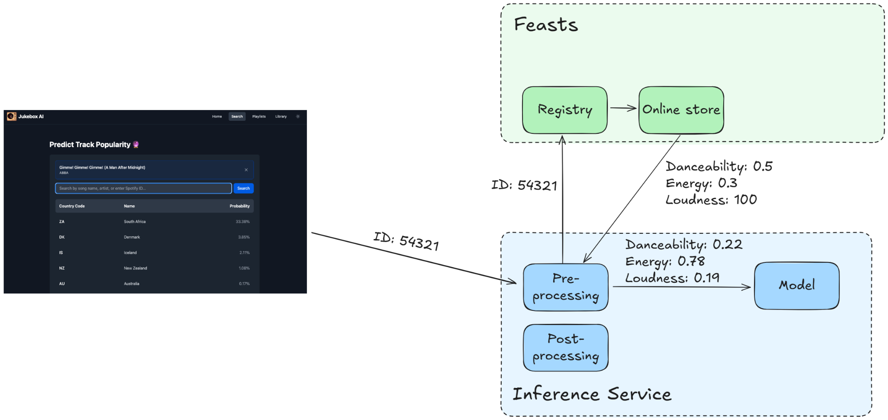 <!-- {.element: class="image-no-shadow image-medium"} -->

## New inference flow

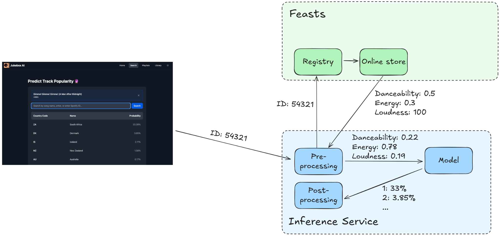 <!-- {.element: class="image-no-shadow image-medium"} -->

## New inference flow

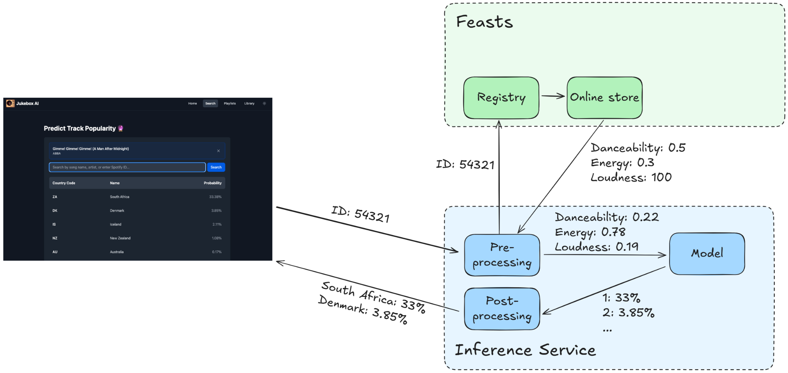 <!-- {.element: class="image-no-shadow image-medium"} -->

## All the data features become available through Feast

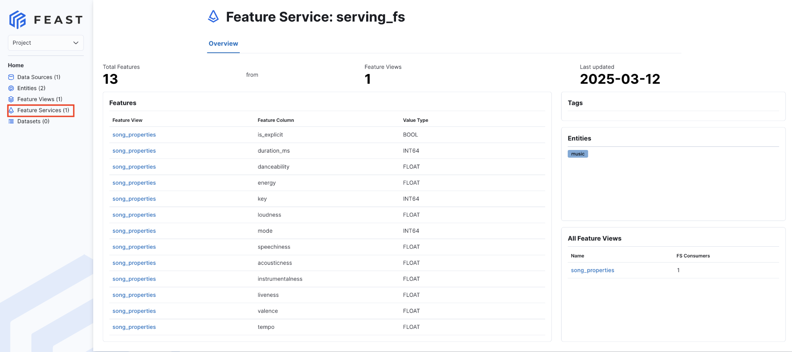 <!-- {.element: class="image-no-shadow image-medium"} -->

## Slide 19

- Example 1 - We want to be able to iterate on features without breaking our app
- Features sent:
- Danceability
- Energy
- Loudness
- Model 1
- Expects features:
- Danceability
- Energy
- Loudness

 <!-- {.element: class="image-no-shadow image-medium"} -->
 <!-- {.element: class="image-no-shadow image-medium"} -->
 <!-- {.element: class="image-no-shadow image-medium"} -->

## Slide 20

- Example 1 - We want to be able to iterate on features without breaking our app
- Features from our song:
- Danceability
- Energy
- Loudness
- Model 2
- New features:
- Average Danceability
- Average TTP (Time to popular)
- We build a new Model 2 that has new features

 <!-- {.element: class="image-no-shadow image-medium"} -->

## Slide 21

- Example 1 - We want to be able to iterate on features without breaking our app
- Features sent:
- Danceability
- Energy
- Loudness
- Model 2
- Expects features:
- Danceability
- Energy
- Loudness
- Average Danceability
- Average TTP (Time to popular)

 <!-- {.element: class="image-no-shadow image-medium"} -->
 <!-- {.element: class="image-no-shadow image-medium"} -->
 <!-- {.element: class="image-no-shadow image-medium"} -->

## Slide 22

- Example 1 - We want to be able to iterate on features without breaking our app
- Features sent:
- Danceability
- Energy
- Loudness
- Model 2
- Expects features:
- Danceability
- Energy
- Loudness
- Average Danceability
- Average TTP (Time to popular)
- But… we want to avoid updating the application for each feature iteration.

 <!-- {.element: class="image-no-shadow image-medium"} -->
 <!-- {.element: class="image-no-shadow image-medium"} -->

## Slide 23

- Example 1 - We want to be able to iterate on features without breaking our app
- Features sent:
- Danceability
- Energy
- Loudness
- SongID
- Model 2
- Expects features:
- Danceability
- Energy
- Loudness
- Average Danceability
- Average TTP (Time to popular)
- Feast helps us add these new features without changing the request, as long as we have the lookup reference (SongID)

 <!-- {.element: class="image-no-shadow image-medium"} -->
 <!-- {.element: class="image-no-shadow image-medium"} -->
 <!-- {.element: class="image-no-shadow image-medium"} -->
 <!-- {.element: class="image-no-shadow image-medium"} -->

## Slide 24

- Features:
- Danceability
- Energy
- Loudness
- Example 2 - We want to use features that take too long to calculate on the fly
- New features:
- Average Danceability
- Average TTP (Time to popular)
- Calculated over all data, can take hours
- We get these from our request, have them instantly

 <!-- {.element: class="image-no-shadow image-medium"} -->

## Slide 25

- Example 2 - We want to use features that take too long to calculate on the fly
- Let’s store them:
- Once per week
- Only the latest values
- Somewhere fast
- New features:
- Average Danceability
- Average TTP (Time to popular)
- Calculated over all data, can take hours

## Slide 26

- Example 2 - We want to use features that take too long to calculate on the fly
- Let’s store them:
- Once per week
- Only the latest values
- Somewhere fast
- New features:
- Average Danceability
- Average TTP (Time to popular)
- Calculated over all data, can take hours
- Feast takes care of this

## We can now get the values whenever we need

 <!-- {.element: class="image-no-shadow image-medium"} -->

## Slide 28

- Example 2 - We want to use features that take too long to calculate on the fly
- Let’s store them:
- Once per week
- Only the latest values
- Somewhere fast
- New features:
- Average Danceability
- Average TTP (Time to popular)
- Calculated over all data, can take hours
- Online Store
- Offline Store
- For training we may need historical data, so let’s not just keep the latest values.
- These we can store in our slow storage (the Offline Store)

## Slide 29

- Example 2 - We want to use features that take too long to calculate on the fly
- Average Danceability
- Average TTP (Time to popular)
- Online Store
- Offline Store
- Typical Data Flow
- This is called “Materialize”
- Danceability
- Energy
- Loudness

 <!-- {.element: class="image-no-shadow image-medium"} -->

## Slide 30

- Example 3 - We created a new feature based on some others that everyone should be able to use
- Features from our song:
- Danceability
- Energy
- Loudness
- Model 1
- Model 2
- New feature:
- Slow dancing ratio = Danceability / Energy
- Feast helps us calculate this new feature on the fly and for others to re-use it, as it will show up as one of the available features.

 <!-- {.element: class="image-no-shadow image-medium"} -->
 <!-- {.element: class="image-no-shadow image-medium"} -->

## In other words…

- During inference - Feast is like a middleware for our requests to the model with access to the feature data.
- During training - Feast is an easy way to get the features we need (remember the list of features in Feast from before, we can get all of them to train on).
- Combined - On top of this, it also makes sure that training and inference are using the same features.

## What is Feast?

- Feast is NOT:
- A database
- A general purpose ETL/ELT system
- Although it supports some transformations
- A data orchestration tool
- Does not manage complex data pipelines

## What is Feast?

- Feast provides:
- A Python SDK and CLI tool
- To get training and inference data
- To move data from offline store to online store
- To update the data inside the online and offline store
- A UI
- To see all your features
- A feature serve
- Which can do the same as the SDK/CLI through REST requests

## What is Feast?

 <!-- {.element: class="image-no-shadow image-medium"} -->

## Before we jump into the details…

- All Feast is, is an easy way to interact with a slow (training) and a fast (inference) database, so that we can get features for training and serving.

## Data processing with Feast

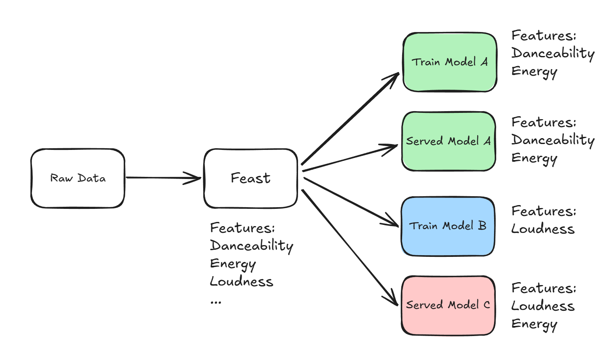 <!-- {.element: class="image-no-shadow image-medium"} -->

## Some more words you need to know

- Offline store - This is where your training data is stored, this is the slow storage
- Online store - This is where your inference data is stored, this is the fast storage
- Materialize - This means to move data from your offline store to online store

## Materialize

 <!-- {.element: class="image-no-shadow image-medium"} -->

## Materialize

 <!-- {.element: class="image-no-shadow image-medium"} -->

## Materialize

 <!-- {.element: class="image-no-shadow image-medium"} -->

## Materialize

- feast materialize $date

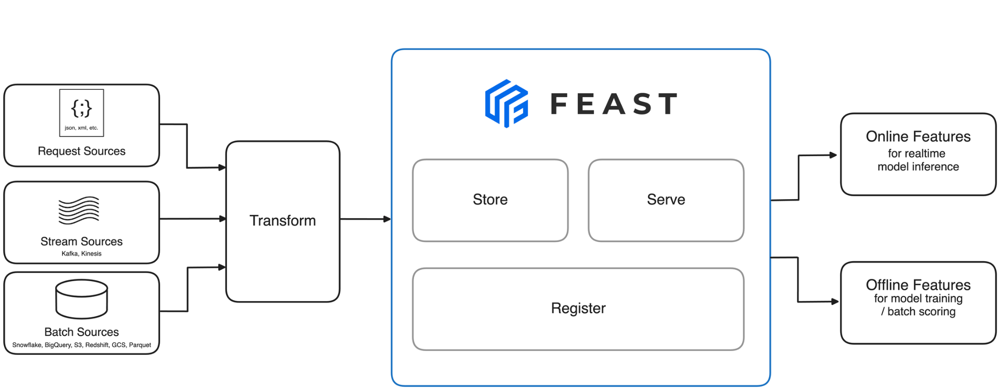 <!-- {.element: class="image-no-shadow image-medium"} -->

## Full data workflow with DVC and Feast

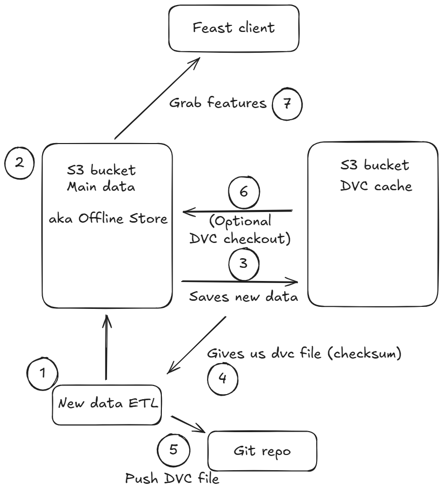 <!-- {.element: class="image-no-shadow image-medium"} -->

## Remember to update your MLOps Venn Diagram 🤗

- New task:
- Feature engineering

 <!-- {.element: class="image-no-shadow image-medium"} -->