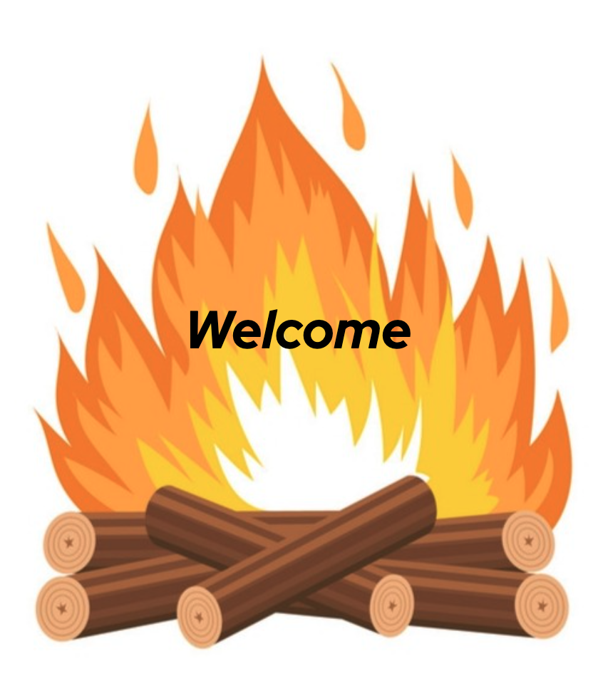
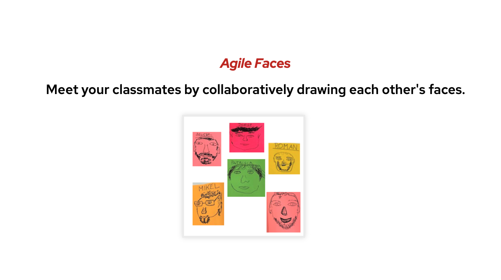
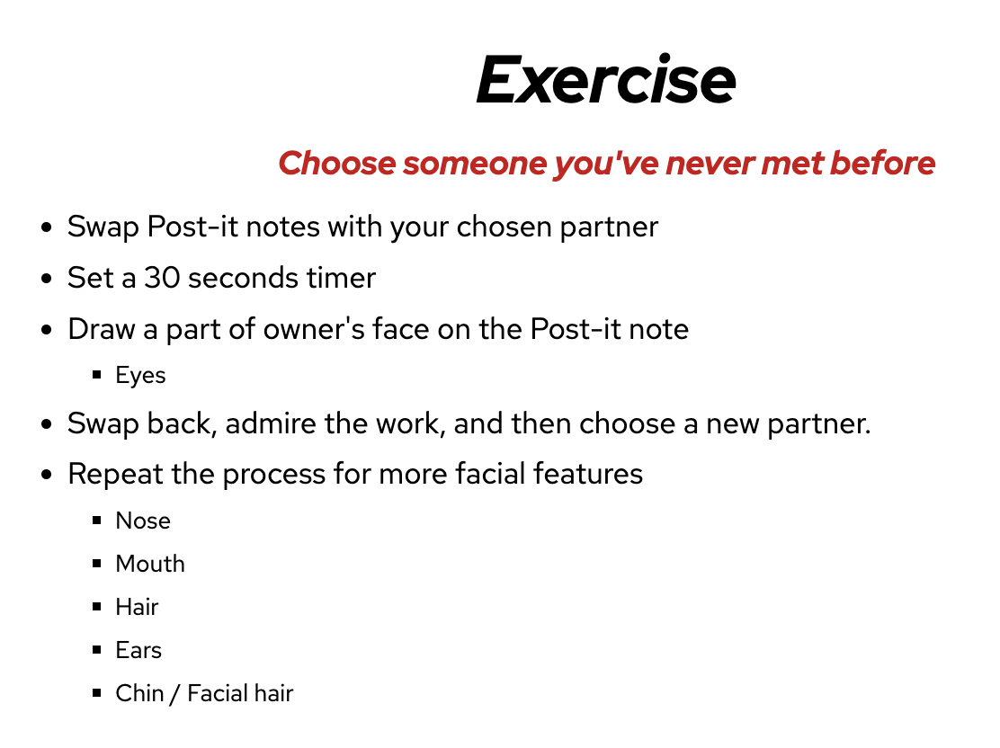
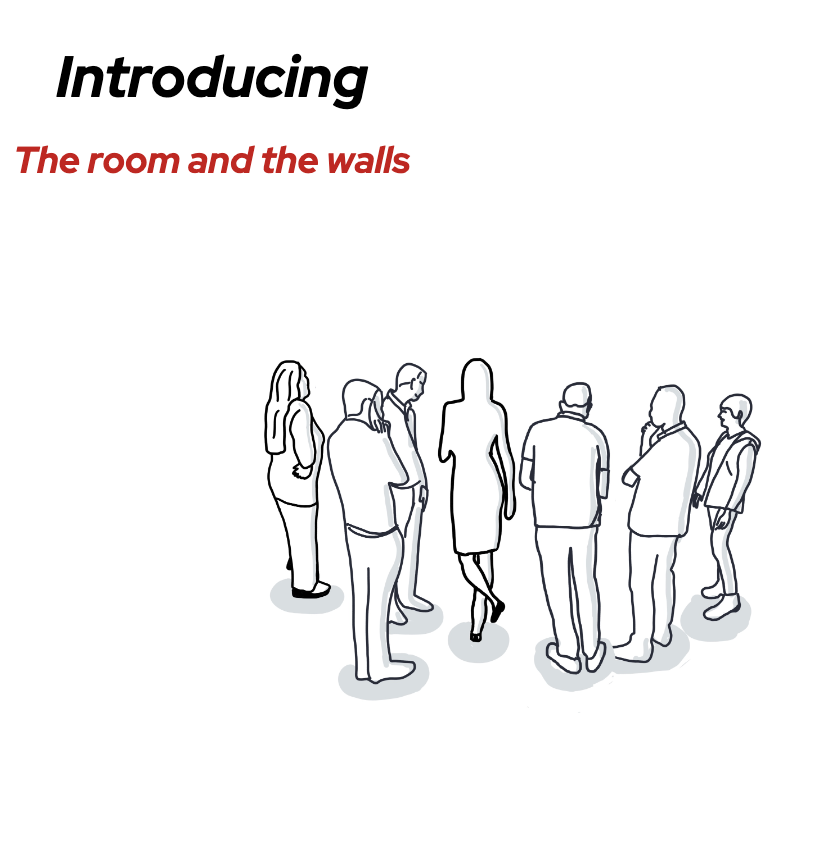
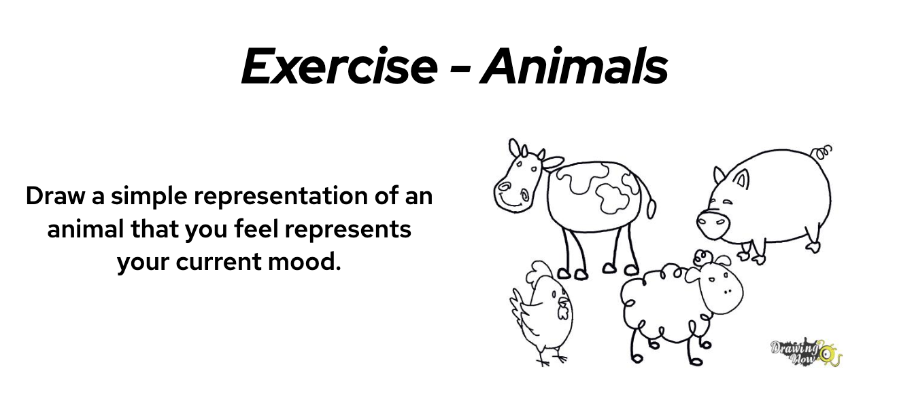
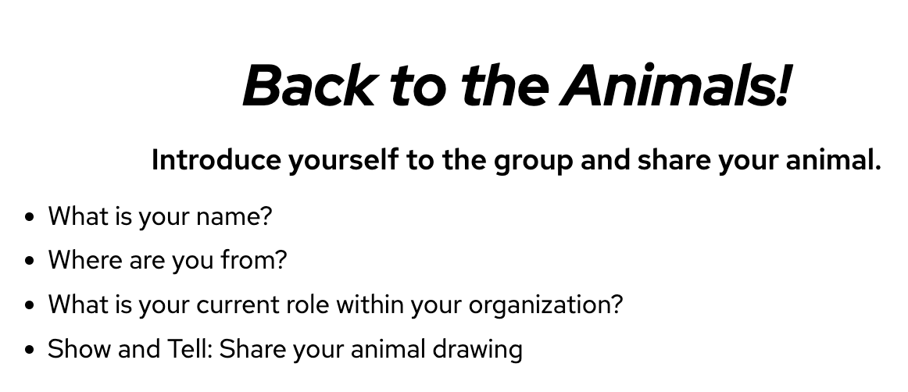
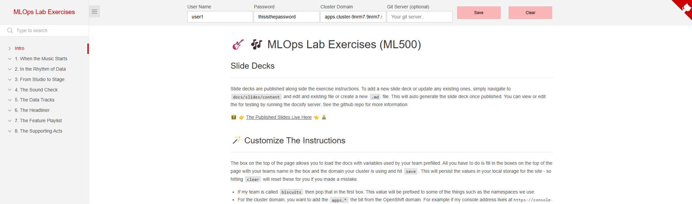
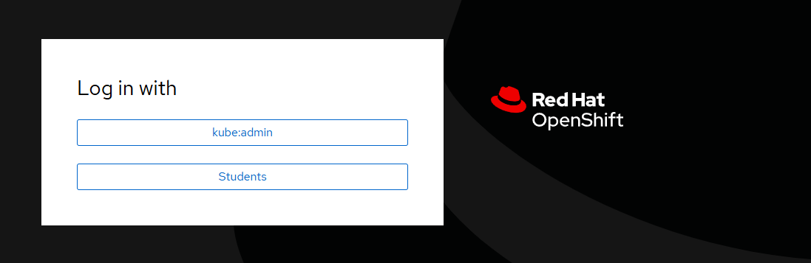

<!-- .slide: data-background-image="images/RH_NewBrand_Background.png" -->
## AI500 Kick Off <!-- {.element: class="course-title"} -->
### Machine Learning Operations <!-- {.element: class="title-color"} -->
Welcome to AI500! <!-- {.element: class="title-color"} -->

## Welcome to AI500!

 <!-- {.element: class="image-medium"} -->

## Course Overview

 <!-- {.element: class="image-medium"} -->

## Learning Journey

 <!-- {.element: class="image-medium"} -->

## Week Structure

 <!-- {.element: class="image-medium"} -->

## Daily Schedule

 <!-- {.element: class="image-medium"} -->

## Lab Environment

 <!-- {.element: class="image-medium"} -->

## Tools & Technologies

 <!-- {.element: class="image-medium"} -->

## Course Resources

 <!-- {.element: class="image-medium"} -->

## Assessment & Certification

 <!-- {.element: class="image-medium"} -->

## Information Radiators

We'll be using various information radiators throughout the week:

- **Backlog** - Track progress and tasks
- **Work Visualization** - See what everyone is working on
- **Definition of Done** - Clear completion criteria
- **Team Sentiment** - How are we feeling?
- **Real Time Retro** - Continuous improvement
- **Big Picture** - Keep the end goal in sight
- **Parking Lot (or Car Park?)** - Questions and ideas for later
- **Quote Wall** - Memorable moments and insights
- **Stop the World** - When we need to pause and address issues

 <!-- {.element: class="image-small"} -->

## Communication Guidelines

 <!-- {.element: class="image-medium"} -->

## Support & Help

 <!-- {.element: class="image-medium"} -->

## Learners' Outcomes

By the end of this course, you will be able to:

- Implement end-to-end MLOps pipelines
- Deploy and manage ML models in production
- Monitor and maintain ML systems
- Apply DevOps practices to ML workflows
- Collaborate effectively in ML teams

## Exercise: Expectations Setting

### What are your expectations for the week?

**Instructions:**
1. Everyone grab a pen and a few sticky notes
2. Individually write your expectations (one per sticky note)
3. Add them to a class board named "Expectations"
4. Group the sticky notes by affinity
5. Discuss expectations by comparing them to the course's Learning Outcomes

## Exercise: Team Formation

### Move to the area that best represents your focus:

- **Data Science & Data Engineer**
- **Platform & Infrastructure**
- **Engineering, Product & Business**

**Formation Process:**
- Each group should stand in a straight line, parallel to the other groups
- Each line will then form a table group

## Team Dynamics

 <!-- {.element: class="image-medium"} -->

## Let's Begin Our AI500 Journey!

 <!-- {.element: class="image-medium"} -->

**Ready to transform your ML operations skills?**